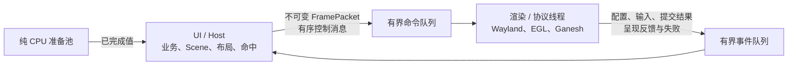

# 客户端 UI 与渲染线程迁移设计

日期：2026-09-29。状态：**第二步已切换生产代码：UI/Host 线程发布不可变帧，独立渲染线程独占 Wayland、EGL、Ganesh、GPU 图片及损伤历史；Pi 功能回归通过，动画性能对照尚未开始**。本文件细化[动画与渲染优化假设清单](ANIMATION_RENDERING_HYPOTHESES.md)第 8 节和[原始架构第 26 节](Wayland_DSL_Skia_Rendering_Engine_Architecture_Detailed.md#26-多线程)。拆线程是已选架构方向；Pi 的性能测量用于验收与调优，不决定是否实施。第 1 节和第 6 节中标注的先前阶段记录保留作迁移对照，当前生产链以「第二步线程切换实现记录」为准。

本设计不改变 WM 与客户端边界：WM 只接收 Wayland surface、damage 与通用材料，不接收 DSL、Scene 或 DisplayList。业务模块继续通过 Host ABI 更新绑定；测试夹具留在 `tests/`，不进入生产包。第 3 节的结构体是概念示意，生产消息和帧字段分别以 [render_command.hpp](../prism/include/prism/runtime/render_command.hpp)、[render_event.hpp](../prism/include/prism/runtime/render_event.hpp) 和 [frame_packet.hpp](../prism/include/prism/runtime/frame_packet.hpp) 为准。

## 1. 迁移前生产调用链（对照记录）

本节保留 2026-09-29 线程切换前的调用链作为对照；链接中的旧函数可能已拆分或删除，行号不代表当前生产入口。

| 阶段 | 迁移前调用与事实 |
| --- | --- |
| Host 绑定 | [AppHost::Bind](../prism/host/app_host.cpp#L124) 配置同一个 `ClientApplication`；有 Preview 时同步安装并打开窗口。首次 Preview 像素提交触发纯 Master 准备，见 [UiSubmitted](../prism/host/app_host_loading.cpp#L21)。 |
| Host 事件轮次 | [AppHost::Pump](../prism/host/app_host.cpp#L200) 处理资源、Master/区域完成、业务 tick、外部 FD，窗口已打开时调用 [ClientApplication::Pump](../prism/host/app_host.cpp#L270)。 |
| UI 安装门槛 | [InstallMaster](../prism/host/app_host_loading.cpp#L56) 等对应 Preview `presented` 才安装 Master；[CommitScene](../prism/runtime/client_application_install_commit.cpp#L4) 替换 Scene、记录 `UiLoadId` 并使旧损伤历史失效。 |
| Scene 更新 | [SetBinding](../prism/runtime/client_application.cpp#L298)、[ApplyTheme](../prism/runtime/client_application.cpp#L312) 在同一线程修改 Scene，并请求下一次更新。 |
| 输入和业务 | [QueueWindowEvent/ProcessWindowEvents](../prism/runtime/client_application_render.cpp) 将 Wayland 输入按序放入有界队列，并在 UI 的 `Pump` 轮次更新 Scene；按键/按钮动作随后调用 `on_action`，再进入 [ModuleSession::Action 所在 Host 路径](../prism/host/app_host_business.cpp#L69)。 |
| UI 绘制 | [PublishFramePacket](../prism/runtime/client_application_frame.cpp) 在 UI 的 `Pump` 轮次调用 `Scene::Build` 并发布只读包；[PrepareSubmit](../prism/runtime/client_application_render.cpp) 只读已发布包，比较最近成功列表、查询 buffer age、规划 repair、设置 surface 效果/输入区域，并调用 Ganesh Render。 |
| 协议提交 | [WaylandWindow::TrySubmit](../prism/platform/wayland_client/wayland_window.cpp#L188) 检查单个待回调像素帧及反馈容量；Pixels 在 Swap 前申请 frame callback 与 presentation feedback。旧像素 callback 未返回时仍允许 State 单独提交。 |
| 像素成功边界 | [CommitPixels](../prism/runtime/client_application_render.cpp#L153) 调用 EGL Swap，成功后发布损伤历史；[Submitted](../prism/runtime/client_application_render.cpp#L180) 才记录成功像素版本、DisplayList、提交 ID 和 UI 身份。 |
| 呈现归属 | [UiPresentationTracker](../prism/include/prism/sdk/ui_presentation.hpp#L16) 按 `PixelSubmissionId` 匹配 UI load，旧 Preview 的迟到反馈不能算到 Master；[Host::Observe](../prism/host/app_host_state.cpp#L32) 据此记录里程碑。 |
| Wayland 等待 | [WaylandWindow::Pump](../prism/platform/wayland_client/wayland_window.cpp#L381) 独占 prepare-read/flush/poll/read 或 cancel-read，收到回调后可能再次 TrySubmit。当时 [ClientApplication::Pump](../prism/runtime/client_application.cpp#L225) 直接嵌套此等待。 |
| 图像与字体 | [ShapeText](../prism/runtime/client_application_scene.cpp#L49) 使用 UI 侧 `runtime::TextShaper` 的 FreeType/HarfBuzz 字体状态；[PNG codec](../prism/runtime/png_codec.cpp) 在 CPU 准备层。`GlesRenderer` 与 CPU 回放/损伤分析用的 `RasterRenderer` 分别持有资源表；图片版本、强租约及登记/释放命令已接入，但 [GPU 上传](../prism/runtime/client_application_upload.cpp#L23) 和损伤分析当时仍在同一所有者线程。 |
| 清理 | [CloseGpu](../prism/runtime/client_application.cpp#L173) 在创建它的 EGL 上下文中析构 Ganesh；[Close](../prism/runtime/client_application.cpp#L427) 先释放 GPU/EGL，再关闭 Wayland、Scene 和图像。 |

迁移前 `ClientApplication::Impl` 同时持有 Scene、WaylandWindow、EGL 和 Ganesh；准备线程只做 DSL/资源的纯 CPU 工作，不是渲染线程。当前 `wp_presentation` 仍只保留 presented/discarded 结果，[时钟 ID](../prism/platform/wayland_client/wayland_window_events.cpp)和呈现时间戳尚未进入 SDK 统计。

## 2. 线程所有权与调用方向



| 所有者 | 独占对象与职责 |
| --- | --- |
| UI/Host | `AppHost`、业务模块的 create/action/tick/destroy、live Scene、绑定、主题预检、布局、文字 shaping、输入命中、UI load/安装事务、动画目标；根据当前配置构造不可变帧。 |
| 渲染/协议线程 | 一个客户端实例的 `wl_display`、`WaylandWindow`、全部 Wayland 代理、configure ACK、EGL display/context/surface、Ganesh、GPU 图像与字体资源、buffer age/损伤历史、Swap、frame callback 和 presentation feedback。由此线程创建并销毁这些活对象，UI 不直接调用 `wl_*`/`egl*`/GL。 |
| 准备池 | 读取、解析、校验、图片 CPU 解码等已有纯准备；结果经所有者安装。不持有 live Scene、FT_Face、Wayland、EGL 或 Ganesh。 |

`ClientApplication` 的公开 Host/业务入口仍在 UI 线程，内部由 UI 状态、一次性的 `ClientRenderBridge` 和独立的 `ClientRenderOwner` 组成。`RasterRenderer` 的 shaping 与 PNG 解码职责已拆出，`GlesRenderer` 不借用其可变字体/图片资源表；GLES 资源表和 Ganesh 均在渲染所有者线程创建、使用、销毁。当前字体路径在 Open 前固定，两侧用同一配置初始化字体 ID；图片用 `(ResourceId, generation)` 与强租约跨线程交接，不能仅凭整数 ID 假定内容相同。GPU 上传只由渲染所有者执行；UI 消费同版本 `ImageUploadedEvent` 后才把图片视为可呈现。首次窗口打开前，待命 Worker 仍只准备 CPU 前端，不提前创建 Wayland/EGL。

Wayland 输入由渲染线程转成值事件，在 UI 队列按协议顺序交付；UI 执行命中与业务动作。Configure 同时在渲染线程完成协议 ACK，在 UI 线程更新 Scene viewport；渲染线程不得在等待 UI 新布局时提交旧尺寸像素。第二步后 `AppHost::Pump` 仍调用公开的 `ClientApplication::Pump`，但后者轮询渲染事件 FD 与资源/Host FD；渲染线程单独调用 `WaylandWindow::Pump`，并把命令通知 FD 交给它的等待集合。正常运行的两线程均不等待对方持锁完成；Open/Close 的一次性握手可以有有界等待。两条队列均用可轮询通知唤醒现有事件等待，不引入固定刷新轮询。

## 3. 不可变帧与有序消息

以下是语义草案，不把示例字段名当作已发布 ABI：

```cpp
struct FramePacket {
    FrameId frame;
    UiLoadId ui;
    SurfaceEpoch surface;
    ViewportEpoch viewport;
    ThemeGeneration theme;
    ResourceEpoch resources;
    PixelsRevision pixels;
    BufferSize buffer_size;
    double scale;
    std::shared_ptr<const DisplayList> display_list;
    ResourceUseSet resource_uses;
    DamageRegion candidate_damage;
    std::vector<SurfaceEffectRegion> effects;
    std::vector<SurfaceInputRegion> input_regions;
};
```

生产类型应使用已有带类型 ID；此处示意字段关系，并非当前 `FramePacket` 的逐字段声明。`FramePacket` 自身不持有 live Scene、Node、AST、FT_Face、`wl_*`、EGL/GL 指针，也不引用 UI 栈内存。帧封包前完成 DSL/主题解析、布局、文字 shaping、区域求交、效果与输入区域校验；封包后只读。当前包记录实际引用的图片版本，正向登记命令和渲染侧资源表持有 CPU 图片强租约，Release 经渲染侧确认；成功帧不长期额外持有全部解码图片。字体路径在 Open 前固定，运行期更换字体仍需单独的身份/版本协议。

第一步已将 `Scene::Build` 得到的 DisplayList **移动**进不可变存储，未变时复用同一对象；准备包、上一成功提交和 GPU 回放共享只读引用。改造前每次 Pixels 复制整张 `last_list` 的做法已移除。第二步又把 `Scene::Build` 移出 Wayland 提交回调：现在 UI 线程发布包，独立渲染线程只读取包内列表、metadata 与版本，不访问 live Scene。

`FrameId` 标识 UI 创建的候选，`PixelSubmissionId` 只在 Pixels 真正成功提交后由 Wayland 所有者分配。两者必须显式映射，不能以 FrameId 代替成功提交计数。同一 surface 上旧于已接受版本的普通帧不能逆序提交，特殊首帧/事务里程碑通过有序控制消息保存。UI load、主题、surface、viewport 和资源代数分别比较：主题身份变化但解析样式相同时可以不产生新像素；旧 UI 的呈现反馈仍归旧 load。Resize 或 surface 重建使旧尺寸快照失效，并重置该 surface 的 buffer age/repair 可信度；不可把旧包改标新代继续提交。

**控制消息与视觉帧分开。** 当前 UI 安装、候选失效、资源注册/释放、更新/重绘请求与输入处理确认走不可合并的有序命令；Open/Close 使用独立握手和终态信号，不依赖普通满帧队列。首版动画的采样开关与帧机会应答也走有序控制命令；更高级的 clip/显式触发属于后续阶段。普通未提交帧仅在连续、同 UI load 且没有控制屏障时可被队尾新帧替换；损伤必须相对最后成功像素提交计算，不能相对被跳过的候选帧。Preview 首次提交、与之关联的 Master 准备、Master 安装和呈现里程碑不能被视觉帧合并吞掉。

命令队列与事件队列均有显式容量和非阻塞入队结果。视觉队列满时合并可替代的未提交帧，记录 skipped；关键有序消息满时返回 Busy 或进入有界的终态失败清理，绝不静默丢弃，也不在 UI/协议线程上无限等待。输入队列仅可合并同 seat、同 surface、无按键/配置/焦点等屏障之间的连续指针移动；按下、释放、键盘、configure、提交结果、反馈和关闭不可丢。通知 FD 的入队、唤醒与 drain 在同一锁/原子协议下完成，避免检查空队列到等待之间丢唤醒。线程间用具名方法处理消息，不把存储 lambda 当回调管线。

## 4. 提交、背压与反馈

渲染线程延续现有 `None / State / Pixels / Failed` 四种终态；资源尚未就绪的 `Deferred` 只表示本轮准备延后；UI 包尚未到达的 `AwaitFrame` 保留请求并等待事件/命令 FD，不确认像素提交。`None` 不 Render/Swap/commit，已检查且完全相同的 metadata 仍可确认 Composite；`State` 仅提交 configure ACK、效果或输入 metadata，可越过未返回的旧像素 frame callback，不申请新的 callback/feedback；`Pixels` 才进入 GPU 绘制与 Swap。像素请求继续受单个待回调帧及 presentation feedback 容量共同约束，[现行门槛](../prism/platform/wayland_client/wayland_window.cpp#L199)已经区分两者。新增 UI→render 队列不能绕过 Wayland 背压，也不能用永久 60/90 Hz timer 填满队列。

像素顺序保持：校验包/资源/尺寸 → 取得正确 EGL context → 查询 buffer age → 计算内容损伤与 repair → 按能力 SetDamage → Render → 申请 frame callback/feedback → Swap(content damage) → 发布成功提交。生产实现位于 [ClientRenderOwner::PrepareSubmit/CommitPixels](../prism/runtime/client_render_owner_submit.cpp) 和 [WaylandWindow::TrySubmit](../prism/platform/wayland_client/wayland_window.cpp)。同代效果和输入区域应与可见像素保持一致且按序提交；纯 metadata 仍可单独 State 提交。失败不能确认像素版本、buffer 历史或 UI 里程碑；Swap 失败为终态，不能在不确定 buffer 边界重试。

渲染线程向 UI 发送 `Submitted(frame, ui, submission, outcome=Pixels)`，必须先于同一 submission 的 `Presented/Discarded` 事件入队，即使底层反馈在提交调用中重入。UI 线程据此更新 `UiPresentationTracker`，并在其自己的 Host 轮次触发 `OnUiSubmitted` 和 Master 纯准备，不从渲染线程直接调用 Host 回调。`wp_presentation` 的反馈按 ID 归属；frame callback 仅放开下一次像素提交，绝不冒充已呈现。Preview 真正 presented 后才允许安装 Master；Master-only 应用仍沿用自己的安装路径。反馈被 discarded 的首帧只在当前 UI load/提交仍有效时重新请求，不让旧反馈撤销新 callback。

渲染线程应记录 `wp_presentation.clock_id`、呈现时间戳、refresh/seq/flags，并检查与 UI 事件时间戳的时钟域；未验证同域或换算前，只报告反馈到达时间和 presented/discarded，不能计算真实输入到呈现延迟。Headless 的 feedback 仍不代表物理 HDMI 扫描或 Windows Viewer 收帧。活动动画在 frame callback/可提交机会之后采样；若量化后无可见变化，按下次有意义变化的单次 deadline 唤醒，不提交空白像素帧。稳定内容的 transform/opacity 要在保留层和命中代数契约完成后才允许由渲染线程采样。

## 5. 损伤与资源生命周期

`FramePacket.candidate_damage` 只表示 UI 当时所知的变化，不是最终 EGL repair。渲染所有者使用**最后一次成功提交的** DisplayList、资源版本与当前包比较，得到 `content damage`；被跳过的候选变更因此仍被覆盖。当前 [CompareDamage](../prism/render_skia/raster_renderer.cpp#L353)和[BufferDamageHistory::Plan](../prism/runtime/buffer_damage.cpp#L375)的语义应保留。随后 buffer age 历史只对成功像素提交前进，`repair` 是本次内容变化加目标 buffer 缺少的历史；State/None/失败不推进。首帧、未知或越界 age、资源/尺寸/scale 不可靠、超出损伤上限时全量回退。内容损伤和扩大后的 repair 必须分别交给 Swap 与 Render，[现有区域契约](../prism/include/prism/contracts/damage.hpp#L13)不变。

当前线程链按图片版本持有 CPU 字节租约，排队命令和渲染侧表都能保持数据有效；GPU 资源只在渲染线程创建/释放。UI 安装新 Scene 或卸载旧图片时发有序 Release 请求，渲染线程处理同代资源并回传确认。`eglSwapBuffers` 返回和 presentation feedback 单独都不是 GPU 完成或 WSI buffer 释放证明；需要后端/WSI 的同步或释放证据才能声明更强的回收保证。未完成上传不被当作可用纹理；资源完成产生有界工作通知。退出时先停止新帧与业务投递，取消未安装 UI，丢弃可替代包，在渲染线程当前上下文内释放 Ganesh/EGL，再关闭 Wayland，最后 UI 释放 Scene 与 CPU 资源。上下文不可用时沿用 abandon 路径。

## 6. 分步实施与验收

**第一步（已完成的单 owner 过渡阶段）。** 在 `ClientApplication` 的真实 `OpenPrepared`/`Pump`/提交链中引入不可变 `FramePacket`：UI/Scene 构造 DisplayList、surface metadata、版本与 `UiLoadId`，提交阶段只消费包。该阶段所有已安装应用走同线程直接消费路径，没有独立渲染线程或旧的 live Scene 直绘分支。DisplayList 移动到共享只读存储、无变化时复用，避免因封包增加整表复制；验证了 Preview 首帧、Master-only 首帧、主题/输入、`None/State/Pixels`、resize、资源和失败回退。这是已结束的迁移阶段，不是生产可选模式。

**第一步实现记录。** [CaptureFramePacket](../prism/runtime/client_application_frame.cpp) 在现有 owner 线程构造只读包，Scene 有实际 Paint/Layout 变化时移动新 DisplayList，其他像素提交复用同一只读列表；包保留 `UiLoadId`、像素/主题/资源版本、配置尺寸和效果/输入区域。[PrepareSubmit/Submitted](../prism/runtime/client_application_render.cpp) 只从包读取这些提交值，并以最后成功的包为损伤基线；只有成功 Pixels 才替换该基线。实际 WaylandWindow、EGL、Ganesh、图片注册与上传仍在同一 owner 线程。此步不提供帧队列、独立渲染线程、跨线程资源租约或动画采样。

**第二步（已切换生产线程所有权，验收进行中）。** `FramePacket` 经有界命令队列交给独立渲染/协议线程，WaylandWindow、EGL、Ganesh、GPU 上传、buffer age 和反馈由该线程独占；业务动作在 UI 线程处理。反向有序事件队列交付 configure、输入、提交结果、资源确认和反馈。生产代码只保留这套线程所有权，不保留旧直连提交路径。仍按本节门槛检查同实例 UI 替换、deferred 区域、主题事务、上传、resize、关闭与错误恢复，以及 `UiLoadId`/`PixelSubmissionId` 归属、反馈容量和安装预算。

**第三步接入活动动画与时间测量（进行中）。** [动画运行时与 DSL 契约](ANIMATION_RUNTIME_SPEC.md)的首版通用时间核心、属性呈现覆盖层、帧机会应答和停帧已进入代码；下一阶段验证静态命中范围的小横线，再考虑保留层的独立采样。按 [A01–A12](ANIMATION_RENDERING_HYPOTHESES.md)对照静态、Paint、布局和合成负载。记录 UI 构建、队列等待、Render/Swap、WM 提交、真实反馈及 CPU/PSS；只有保存 presentation 时钟且确认时钟域后报告输入到呈现 p50/p95/p99。Pi headless/VNC 与将来物理输出分别报告，不互相代替。

第一步的代码检查确认 `DisplayList` 由 `std::move` 进入共享只读存储，复用和提交只复制 `shared_ptr`。2026-09-29 在 Pi 上增量构建后，9 项相关 CTest 全部通过；隔离 V3D headless WM 下的 `prepared_ui_probe.py` 两项门槛、`async_master_probe.py --mode all` 的 18 个真实 Host 场景全部通过。它们覆盖 Preview/Master、Master-only、资源/主题失败、静置/重复值、State-only、旧 callback、resize 和提交 ID；`skia_damage_test` 覆盖局部修复对照。`python3 tools/check-code-style.py` 与 `git diff --check` 通过。可用上述 `tests/probes/` 脚本重跑，局部运行证据在忽略的 `dist/validation/client-render-thread-step1/`。这些是正确性证据，不代表物理显示 FPS 或独立渲染线程性能。第二步再增加线程归属断言、队列饱和/逆序/失败注入和跨线程资源生命周期门槛；性能对照不阻止架构迁移。

### 第二步前置：资源边界拆分（历史记录）

[TextShaper](../prism/include/prism/runtime/text_shaper.hpp) 独占 UI 侧 FreeType/HarfBuzz 状态，Scene 和分阶段安装均使用它生成 glyph ID/位置；[RasterRenderer](../prism/include/prism/render_skia/raster_renderer.hpp) 不再提供 `Shape` 或持有 FT face，只保留 SkTypeface、CPU 图片和命令回放/损伤分析。PNG 检查/解码位于 [runtime codec](../prism/include/prism/runtime/png_codec.hpp)，以独立目标链接，不再通过 `RasterRenderer` 静态方法调用。[GlesRenderer](../prism/include/prism/render_skia/gles_renderer.hpp) 持有自己的 Skia 字体、图片与上传代数，不借用 Raster 的表；同一张已解码图片的不可变 RGBA 数据由两表共享资源租约。在此前置阶段，两表仍由同一 `ClientApplication::Impl` 在一个线程登记，以相同 `ClientConfig::font_path` 和 `ResourceId` 对齐；线程切换后由各自所有者登记，固定字体路径仍在 Open 前共享。

此子阶段在 Pi 上通过 `skia_raster_test` 的字体 ID 一致性、字形位置和尺寸变化约束，以及 `skia_gles_parity_test`、`skia_damage_test`、`image_resources_test`；隔离 V3D headless WM 的 SDK prepared/submission 两项门槛和 18 个真实 Host Preview/Master 场景也通过。代码风格检查通过；本地探针证据位于忽略的 `dist/validation/client-render-thread-step2/`。当时图片登记/上传、Wayland/EGL 与损伤历史仍在同一 owner 线程，尚无队列或独立渲染线程。这些验证没有测量动画帧率，也不说明线程所有权迁移已完成。

### 第二步前置：UI 帧发布与待帧协议（历史记录）

[PublishFramePacket](../prism/runtime/client_application_frame.cpp) 只在 UI 的 `Pump` 轮次捕获 Scene：Wayland 等待前发布已有变更，事件派发后再发布 configure、输入或资源造成的新变更。每个已发布包均带只读 DisplayList 和 Scene 事务版本；Composite-only 包复用前一列表，相同事务和资源版本不重复封包。Scene 在 UI 事件处理或业务 API 中变化会立即使旧候选失效；同批 configure 后先更新布局，再处理后续输入命中。[PrepareSubmit](../prism/runtime/client_application_render.cpp) 在输入队列未排空时暂缓旧帧，只读已发布包，核对包的 configure 次数、尺寸和 scale，然后相对最后成功的像素包计算损伤；不再读 live Scene 或调用 `CaptureFramePacket`。

[WaylandWindow::TrySubmit](../prism/platform/wayland_client/wayland_window.cpp) 新增 `AwaitFrame`：无兼容包时不分配提交 ID、callback 或 feedback，也不误报 Failed；待提交的 configure ACK 仍可走 State，而强制像素请求保留。它与为本轮有预算准备而立即让出的 `Deferred` 分开，正常等待不会固定 `poll(0)`。[PollableQueue](../prism/include/prism/runtime/pollable_queue.hpp) 提供有界 eventfd 通知、满队列返回 Busy、关闭唤醒和仅队尾替换原语。当时首次 configure 使同线程 `WaylandWindow::Pump` 返回，SDK 随即发布包；现在正向命令 FD 已交给独立渲染线程等待。

Pi 上 Host 构建、7 项相关 CTest、隔离 V3D headless WM 的 Prepared UI 两项门槛和 Async Master 18 场景通过；Wayland 单测还覆盖首帧等待时的 State ACK、异步 FD 唤醒、像素提交 ID，以及同批 resize 后点击必须使用新布局。证据见忽略的 `dist/validation/client-render-thread-step2/`。这些是调用边界与协议正确性检查，不是并发渲染或 FPS 数据。

### 第二步前置：双向消息与图片租约（历史记录）

[RenderCommand](../prism/include/prism/runtime/render_command.hpp) 在此前置阶段定义 UI 到提交侧的单一有序队列：`Frame`、`RegisterImage` 与 `ReleaseImage` 共享顺序，只有队尾同 UI load 的连续帧可被替换，资源控制消息是屏障。[PublishFramePacket](../prism/runtime/client_application_frame.cpp) 入队后由当时的同线程 `DrainRenderCommands` 更新提交侧帧和图片表，随后 `PrepareSubmit` 才绘制。每帧列出实际 DisplayList 引用的 `(ResourceId, UI generation)`；提交侧必须同时找到匹配版本且已 GPU 上传的图片，不能以 Skia 本地 `ResourceEpoch` 充当跨侧身份。当时两端仍由同一线程依次运行；当前消费端是独立 `ClientRenderOwner`。

[ImageResources::Retain](../prism/runtime/image_resources.cpp) 返回别名化的 `shared_ptr<const DecodedImage>`，持有解码结果及其任务预算生命期。Register 命令携带这份强租约，提交侧资源表也持有它；Release 后 UI 可以移除本地条目，但队列和资源表结束引用前像素字节不会悬空。成功提交的 `FramePacket` 只保留图片版本列表，不额外强持有全部字节。提交侧实际完成当前版本的纹理上传后，才发送 `ImageUploadedEvent`；处理同代 Release 并不再持有该版本后，发送 `ImageReleasedEvent`。UI 按 `(ResourceId, generation)` 核对并消费确认，迟到的旧 Release 不删除新代纹理。上传确认只说明后端接受并提交了上传，**不是 GPU 完成栅栏**；跨线程的 GPU/WSI 安全回收仍需单独完成。

[RenderEvent](../prism/include/prism/runtime/render_event.hpp) 将 configure/输入、成功 `None/State/Pixels` 结果、presentation feedback 与图片确认放入同一反向有序队列。渲染侧在成功 Pixels 时立即更新损伤基线，UI 侧按队列顺序更新 `UiPresentationTracker` 并触发 Host 里程碑；旧提交结果只有版本仍匹配时才确认 Composite。`WaylandWindow::Pump` 监听反向通知 FD，防止本轮同步提交后无限等待。窗口终止时只清空未交付事件，不再执行点击或业务回调。

[TerminalSignal](../prism/include/prism/runtime/terminal_signal.hpp) 与普通有界队列分开，原子锁存首次失败原因和独立停止请求，并以持续可读的 eventfd 唤醒等待者；事件或命令队列已满时，终态仍可记录。通知写入异常时原因仍锁存，不能假设通知一定成功。当时 SDK 的失败清理和 `Close` 仍在同一线程调用，`TerminalSignal` 本身不代表渲染线程关闭确认；当前另由 `RenderWorkerLifecycle` 完成确认。此前 `ClientPlatformStatus` 由同线程 Wayland `Pump` 采样，现在由渲染线程发布值事件、UI 消费后更新公开 getter 快照。

Pi 上 Host 构建、10 项相关 CTest、隔离 V3D headless WM 的 Prepared UI 两项门槛和 Async Master 18 场景通过；新测试覆盖队列屏障、强租约、图片版本与提交/反馈顺序。证据见忽略的 `dist/validation/client-render-thread-step2/ordered-bridge-*`。这些验证尚不代表独立线程运行或动画 FPS。

本轮补齐确认、终态和平台快照后，Pi 上完整增量构建通过；16 项相关 CTest、隔离 V3D 的 Prepared UI 与 SDK 提交两项门槛，以及 Async Master 18 个 Host 场景均通过。新增真实 SDK 用例覆盖分阶段安装在上传确认前保持 Pending、重复推进不重复上传、释放后同 URI 新请求再上传一次；`terminal_signal_test` 验证满队列不能掩盖终态，`wayland_submit_test` 验证状态快照与窗口 getter 一致。代码规范和差异空白检查通过。证据保存在忽略的 `dist/validation/client-render-thread-step3/final-resource-ack-prepared/` 与 `dist/validation/client-render-thread-step3/final-resource-ack-host/`。这些结果验证当前同线程桥接的正确性，尚不说明跨线程安全或动画 FPS。

### 第二步前置：打开／关闭与 configure 顺序（历史记录）

[WaylandWindow::Open](../prism/platform/wayland_client/wayland_window.cpp) 的两次 registry 同步已由 `wl_display_sync` 加 `prepare_read/poll/read` 实现，接受停止 FD 与绝对期限；旧入口默认 10 秒期限，SDK 入口传入独立终态通知 FD。超时、取消或协议失败会清理已创建的 Wayland 对象，同一个窗口对象可再次尝试打开。这使两个原本无期限的 roundtrip 等待可取消；本地 `wl_display_connect` 及驱动调用仍不能宣称有硬中断保证。

[RenderWorkerLifecycle](../prism/include/prism/runtime/render_worker_lifecycle.hpp) 定义带请求代数的 Open 结果、独立停止请求与 Close 确认。`WaitOpen/WaitClose` 有期限；Open 等待超时或取消不冒充 worker 已退出，只有 worker 完成 Ganesh、EGL、Wayland 清理后调用 `CompleteClose` 才能让 UI 释放桥接状态。此前置阶段仅编译和单测验证该原语；当前已接入实际 worker。一次失败的 worker incarnation 使用新桥接实例重试，原 SDK 实例和有效 `UiLoadId` 可保留。

`ConfigureEvent` 现在携带 Wayland 递增的 `configure_count` 和对应尺寸、scale。UI 侧先按事件顺序更新自己的配置视图，再做布局、命中和帧封包；`ClientPlatformStatus` 保留最近完成的窗口状态供公开 getter 使用，但不能拿最新快照解释队列中较早的 configure 或输入。这样同批 resize 后的点击仍按它前面的配置计算。

本切口在 Pi 上构建后，7 项相关 CTest（含取消、超时、失败后重试、满队列关闭确认及双 configure 后点击）通过；隔离 V3D 的 Prepared UI/SDK 提交两项门槛通过。Async Master 全 18 场景首次运行在一项业务反馈等待上超时，随后该组单跑、完整重跑和三次完整重复均通过；保留首次失败日志，不把一次重跑视为故障原因已查明。`python3 tools/check-code-style.py` 与 `git diff --check` 通过；证据位于忽略的 `dist/validation/client-render-thread-step3/cancellable-open-*`。这些仍是同线程正确性检查，不是 worker 或动画性能数据。

以上是线程切换前的实现与验证记录；当前生产路径及尚待完成的验收以以下小节为准。

### 第二步线程切换实现记录

生产 `ClientApplication` 现只拥有 Scene、文字整形、CPU 图片资源、安装事务、UI 配置视图和候选只读 `FramePacket`。`ClientRenderOwner` 的具名线程独占 `WaylandWindow`、EGL、Ganesh、渲染侧图片表和上传队列、损伤历史及最后成功像素帧。`ClientApplication::Pump` 用 `poll` 等待资源、反向事件、终态与 Host FD；正向命令 FD 只交给渲染线程的 `WaylandWindow::Pump`。旧的 `Impl::PrepareSubmit/CommitPixels/DrainRenderCommands/AdvanceImageUploads` 同线程生产分支已移除。

UI 安装发送不可合并的 `InstallUiCommand`，普通 `FrameCommand` 仅在连续、同 UI load 且无控制屏障时合并。帧携带单调发布序号、UI load、configure 计数、只读 DisplayList、图片版本及效果/输入区域。成功提交事件同时带实际提交包和序号；UI 只在 `Pixels` 成功后更新自己的提交基线与呈现归属。Configure 后旧尺寸包无效，新 UI 安装屏障清空旧包及损伤历史。

同一 UI 轮次连续调用 `SetBinding`、收到图片资源变化或接受主题时，Scene 变化后、重新发布帧前，若已有 `queued_frame`，UI 发送不可合并的 `InvalidateFrameCommand{UiLoadId}`，使已经发往 worker、但尚未提交的该 UI 候选失效。重复的相同绑定值不改变 Scene，也不触发失效；主题即使只改变已接受的身份，仍可使旧候选失效，但不会因此强制新像素。UI 清除本地 `queued_frame`，在本次或下一次 `Pump` 集中构造更新后的包，再通过有序命令队列发布。区域安装替换旧图片时，即使 UI 已清除本地候选，也先无条件发送失效屏障，再发送旧版本的 `ReleaseImageCommand`；worker 必须按此顺序退休可能引用旧图片的候选。worker 收到失效命令只清对应 UI 的 `render_frame` 候选；它保留 `committed_frame`、损伤历史和成功像素版本，对尚无兼容包的像素请求返回 `AwaitFrame`。新包的内容损伤仍相对**最后成功提交**计算，覆盖被失效或合并的中间变化。该屏障只能阻止尚未提交的候选，不能撤回已经成功 Swap 的帧；UI 安装屏障才会重置成功基线。

Wayland 的 configure/输入以 `SequencedWindowEvent` 保序发给 UI。UI 处理并发布由该批事件产生的帧后才发送 `UiEventsProcessedCommand`；渲染侧在最新事件序号尚未被确认时返回 `AwaitFrame`，避免仅凭反向队列暂时为空就提交旧帧。渲染线程只在配置、提交、callback、呈现、上传等有意义状态变化时发布 `RenderStatusEvent`，纯等待时间更新只写线程安全快照，避免高频鼠标移动被状态事件切断合并。UI 的公开统计与平台 getter 只读已处理的值，不访问 Wayland 活对象。

提交回执可能晚于后续 UI 安装到达。UI 保留当前与前一个安装身份的提交/呈现状态；如果连续安装使更早的身份退出该窗口，它的有效像素回执只作为已退休事件消费，不能写入当前 UI 的提交基线、触发 Host 提交回调或被误判为协议失败。未知身份、当前或前一身份的非法提交仍按错误处理；已退出身份的迟到 presentation feedback 继续忽略。真实 SDK 的三次快速替换门槛覆盖这一顺序。

图片解码仍在 CPU 准备层；正向登记命令携带解码结果强租约和精确版本。渲染线程创建纹理、按预算上传，并发送同代 `ImageUploadedEvent`；UI 的分阶段安装等到该确认才提交。Release 在渲染线程移除同代资源后确认，旧代释放不误删新代。字体路径在 Open 前固定并分别初始化 UI 整形与渲染字体表，当前不支持运行期换字体；若后续开放可变字体，须增加跨线程字体身份/版本控制。

一次 worker incarnation 使用一次性的队列、终态信号与 Open/Close 生命周期。打开采用可取消的 Wayland 同步等待及有界握手；关闭绕过有界命令队列，worker 在自己的线程依次释放 Ganesh、EGL、Wayland 后发 Close 确认，UI Join 后才销毁队列。首次 Open 失败仍允许原 SDK 实例使用同一 `UiLoadId` 修正连接参数后重试，新尝试使用全新的桥接实例。`WaitClose` 超时只能记录故障，不能安全强行销毁仍可能访问桥接内存的线程；本地驱动永久阻塞仍需进程级故障策略，不能将等待期限写成硬停止保证。

### 第二步线程切换验收记录

2026-09-29 在 Pi 上完整构建与串行 `ctest --test-dir build-gles --output-on-failure -j1` 通过，56/56。隔离 V3D headless WM 的 `prepared_ui_probe.py` 三项真实门槛（Prepared UI、SDK 提交、SDK 损伤）通过，WM 正常回收；新用例覆盖三次快速 UI 替换后旧提交回执迟到。损伤门槛中连续 24 轮双绑定更新恰好增加 24 次像素 Swap，静置后不再增加；自动局部修复在该轮中记录 23 次 partial repair。`async_master_probe.py --mode all` 的 18 个 Host 场景通过，涵盖 Preview/Master、延迟区域与资源安装。`python3 tools/check-code-style.py` 与 `git diff --check` 通过。证据存于忽略的 `dist/validation/client-render-thread-step4/final-native-retired/` 和 `dist/validation/client-render-thread-step4/final-async-retired/`，测试探针仅留在 `tests/`。

首次并行 `ctest -j4` 在该 Pi 上出现多项超时/断言，随后串行全套通过；其中 `wayland_submit_test` 又连续单独运行 100 次通过。该次并行失败没有可复现的单一根因，不能据此宣称高并发压力已通过。上述门槛验证的是线程所有权、提交顺序与渲染正确性；并未测量物理屏幕 FPS、动画流畅度、输入到呈现延迟或 GPU 完成时间。

### 必需门槛

| 范围 | 验收要点 |
| --- | --- |
| 提交与背压 | 静态零周期提交；重复值 None；效果/输入 State 在扣留旧像素 callback 时仍能提交；Pixels 最多一个待回调，反馈槽满时有界等待；失败清理 pending 请求而不误提交。 |
| 像素和损伤 | 1/2/3 buffer 轮转、跳过多个候选帧、移动/删除、透明、阴影、字形、图片替换、resize/scale 回退；与同后端完整参考图比较，沿用 [第四阶段的像素门槛](RENDER_SCHEDULING_AND_INVALIDATION.md#11-第四阶段规范与执行顺序)。 |
| 顺序与生命周期 | Preview 已提交但未呈现时 Master 只能准备；迟到或 discarded 反馈不能错归当前 UI；主题事务、configure、按钮/键盘、取消、窗口关闭、GPU 资源延迟释放和 Host/launcher 回收均通过。 |
| 线程与包 | 线程所有权断言和竞态/故障注入覆盖双向队列；CPU 准备线程不碰 live Scene/GPU；风格检查、相关 CTest 与真实 Pi V3D 协议门槛通过；`tests/` 探针不安装进 deb。 |

性能对照记录固定主题、窗口数、输出、输入和频率条件；先看输入事件年龄、UI 队列等待与活动动画 presented 间隔，再看 CPU、PSS、GPU 资源、discarded 和温度。若线程迁移增加开销，就优化队列、批处理和缓存，并记录代价；不以旧版单线程路径作为长期可选生产模式。具体视觉能力只有在语义和正确性门槛通过后才进入 DSL 与第三方应用 Skill。
