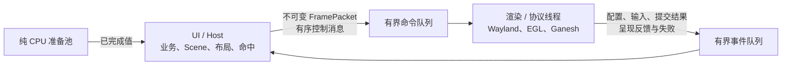

# 客户端 UI 与渲染线程迁移设计

日期：2026-09-29。状态：**第一步已实现，独立渲染线程尚未接入**。本文件细化[动画与渲染优化假设清单](ANIMATION_RENDERING_HYPOTHESES.md)第 8 节和[原始架构第 26 节](Wayland_DSL_Skia_Rendering_Engine_Architecture_Detailed.md#26-多线程)。目标是由 UI/Host 线程发布不可变帧，独立渲染线程持有 Wayland、EGL 和 Ganesh。拆线程是已选架构方向；Pi 的性能测量用于验收与调优，不决定是否实施。

本设计不改变 WM 与客户端边界：WM 只接收 Wayland surface、damage 与通用材料，不接收 DSL、Scene 或 DisplayList。业务模块继续通过 Host ABI 更新绑定；测试夹具留在 `tests/`，不进入生产包。下文的队列、线程与示意字段仍是目标契约；当前已实现的帧类型见 [frame_packet.hpp](../prism/include/prism/runtime/frame_packet.hpp)。

## 1. 当前生产调用链

以下链接指向 2026-09-29 的源码行。后续重构以函数和语义为准，行号仅供定位。

| 阶段 | 当前调用与事实 |
| --- | --- |
| Host 绑定 | [AppHost::Bind](../prism/host/app_host.cpp#L124) 配置同一个 `ClientApplication`；有 Preview 时同步安装并打开窗口。首次 Preview 像素提交触发纯 Master 准备，见 [UiSubmitted](../prism/host/app_host_loading.cpp#L21)。 |
| Host 事件轮次 | [AppHost::Pump](../prism/host/app_host.cpp#L200) 处理资源、Master/区域完成、业务 tick、外部 FD，窗口已打开时调用 [ClientApplication::Pump](../prism/host/app_host.cpp#L270)。 |
| UI 安装门槛 | [InstallMaster](../prism/host/app_host_loading.cpp#L56) 等对应 Preview `presented` 才安装 Master；[CommitScene](../prism/runtime/client_application_install_commit.cpp#L4) 替换 Scene、记录 `UiLoadId` 并使旧损伤历史失效。 |
| Scene 更新 | [SetBinding](../prism/runtime/client_application.cpp#L298)、[ApplyTheme](../prism/runtime/client_application.cpp#L312) 在同一线程修改 Scene，并请求下一次更新。 |
| 输入和业务 | [HandleWindowEvent](../prism/runtime/client_application_render.cpp#L4) 直接访问 Scene；按键/按钮动作同步调用 `on_action`，再进入 [ModuleSession::Action 所在 Host 路径](../prism/host/app_host_business.cpp#L69)。 |
| UI 绘制 | [Scene::Build](../prism/runtime/scene.cpp#L230) 生成完整 DisplayList；[PrepareSubmit](../prism/runtime/client_application_render.cpp#L33) 比较最近成功列表、查询 buffer age、规划 repair、设置 surface 效果/输入区域，并调用 Ganesh Render。 |
| 协议提交 | [WaylandWindow::TrySubmit](../prism/platform/wayland_client/wayland_window.cpp#L188) 检查单个待回调像素帧及反馈容量；Pixels 在 Swap 前申请 frame callback 与 presentation feedback。旧像素 callback 未返回时仍允许 State 单独提交。 |
| 像素成功边界 | [CommitPixels](../prism/runtime/client_application_render.cpp#L153) 调用 EGL Swap，成功后发布损伤历史；[Submitted](../prism/runtime/client_application_render.cpp#L180) 才记录成功像素版本、DisplayList、提交 ID 和 UI 身份。 |
| 呈现归属 | [UiPresentationTracker](../prism/include/prism/sdk/ui_presentation.hpp#L16) 按 `PixelSubmissionId` 匹配 UI load，旧 Preview 的迟到反馈不能算到 Master；[Host::Observe](../prism/host/app_host_state.cpp#L32) 据此记录里程碑。 |
| Wayland 等待 | [WaylandWindow::Pump](../prism/platform/wayland_client/wayland_window.cpp#L381) 独占 prepare-read/flush/poll/read 或 cancel-read，收到回调后可能再次 TrySubmit。当前 [ClientApplication::Pump](../prism/runtime/client_application.cpp#L225) 直接嵌套此等待。 |
| 图像与字体 | [ShapeText](../prism/runtime/client_application_scene.cpp#L49) 使用当前 `RasterRenderer` 的可变字体状态；[RegisterImage/AdvanceImageUploads](../prism/runtime/client_application_upload.cpp#L23) 将 CPU 注册和 GPU 上传放在同一所有者线程。不能把这个对象原封不动跨线程共享。 |
| 清理 | [CloseGpu](../prism/runtime/client_application.cpp#L173) 在创建它的 EGL 上下文中析构 Ganesh；[Close](../prism/runtime/client_application.cpp#L427) 先释放 GPU/EGL，再关闭 Wayland、Scene 和图像。 |

现有 `ClientApplication` 把 Scene、字体/图片命令表、WaylandWindow、EGL 和 Ganesh 放在一个 `Impl` 中，见 [client_application_p.hpp](../prism/runtime/client_application_p.hpp#L131)。现有准备线程只做 DSL/资源的纯 CPU 工作；它不是渲染线程。当前 `wp_presentation` 只保留 presented/discarded 结果，[时钟 ID](../prism/platform/wayland_client/wayland_window_events.cpp#L438)和[呈现时间戳](../prism/platform/wayland_client/wayland_window_events.cpp#L497)尚未记录。

## 2. 目标所有权与调用方向



| 所有者 | 独占对象与职责 |
| --- | --- |
| UI/Host | `AppHost`、业务模块的 create/action/tick/destroy、live Scene、绑定、主题预检、布局、文字 shaping、输入命中、UI load/安装事务、动画目标；根据当前配置构造不可变帧。 |
| 渲染/协议线程 | 一个客户端实例的 `wl_display`、`WaylandWindow`、全部 Wayland 代理、configure ACK、EGL display/context/surface、Ganesh、GPU 图像与字体资源、buffer age/损伤历史、Swap、frame callback 和 presentation feedback。由此线程创建并销毁这些活对象，UI 不直接调用 `wl_*`/`egl*`/GL。 |
| 准备池 | 读取、解析、校验、图片 CPU 解码等已有纯准备；结果经所有者安装。不持有 live Scene、FT_Face、Wayland、EGL 或 Ganesh。 |

`ClientApplication` 的公开 Host/业务入口仍在 UI 线程；内部变为 UI state 与 `RenderBridge`。现有 `RasterRenderer` 同时承担 shaping、可变资源登记和命令比较，`GlesRenderer` 又借用它的资源表，见 [GlesRenderer 构造接口](../prism/include/prism/render_skia/gles_renderer.hpp#L24)。第二步必须按职责拆开：UI 侧持有独立字体整形状态与不可变资源说明，渲染侧持有自身的命令资源表和 Ganesh。Glyph ID、字体文件身份和图片版本必须随帧交接，不能仅凭相同整数 `ResourceId` 假定两线程看到相同内容。GPU 上传只能由渲染所有者执行；UI 收到上传完成事件后才把相应资源视为可呈现。首次窗口打开前，待命 Worker 仍只准备 CPU 前端，不提前创建 Wayland/EGL。

Wayland 输入由渲染线程转成值事件，在 UI 队列按协议顺序交付；UI 执行命中与业务动作。Configure 同时在渲染线程完成协议 ACK，在 UI 线程更新 Scene viewport；渲染线程不得在等待 UI 新布局时提交旧尺寸像素。第二步后 `AppHost::Pump` 仍调用公开的 `ClientApplication::Pump`，但后者轮询渲染事件 FD 与资源/Host FD；渲染线程单独调用 `WaylandWindow::Pump`，并把命令通知 FD 交给它的等待集合。正常运行的两线程均不等待对方持锁完成；Open/Close 的一次性握手可以有有界等待。两条队列均用可轮询通知唤醒现有事件等待，不引入固定刷新轮询。

## 3. 不可变帧与有序消息

以下是语义草案，不把示例字段名当作已发布 ABI：

```cpp
struct FramePacket {
    FrameId frame;
    UiLoadId ui;
    SurfaceEpoch surface;
    ViewportEpoch viewport;
    ThemeGeneration theme;
    ResourceEpoch resources;
    PixelsRevision pixels;
    BufferSize buffer_size;
    double scale;
    std::shared_ptr<const DisplayList> display_list;
    ResourceUseSet resource_uses;
    DamageRegion candidate_damage;
    std::vector<SurfaceEffectRegion> effects;
    std::vector<SurfaceInputRegion> input_regions;
};
```

生产类型应使用已有带类型 ID；此处示意的是目标字段关系，并非当前 `FramePacket` 的逐字段声明。`FramePacket` 自身不持有 live Scene、Node、AST、FT_Face、`wl_*`、EGL/GL 指针，也不引用 UI 栈内存。帧封包前完成 DSL/主题解析、布局、文字 shaping、区域求交、效果与输入区域校验；封包后只读。第一步仍由原所有者管理资源，包只记录全局资源版本；第二步跨线程时必须补齐图片、字体的身份/版本与 CPU 数据强引用、渲染侧 GPU 资源表和释放确认，不能用裸指针代替所有权。当前 `RasterRenderer` 的资源所有权足以覆盖同线程回放；不应让成功帧长期额外持有所有解码图片并占用会话任务预算。

第一步的活动生产代码将 `Scene::Build` 得到的 DisplayList **移动**进不可变存储，未变时复用同一对象；准备包、上一成功提交和 GPU 回放共享只读引用。改造前 [PrepareSubmit](../prism/runtime/client_application_render.cpp#L34) 每次 Pixels 都复制 `last_list`，现在已经移除这次整表复制。提交绘制阶段只读取包内的列表、metadata 与版本，不再从 live Scene 临时取提交值。此步仍在原 owner 线程执行，既没有渲染线程，也没有跨线程资源释放。

`FrameId` 标识 UI 创建的候选，`PixelSubmissionId` 只在 Pixels 真正成功提交后由 Wayland 所有者分配。两者必须显式映射，不能以 FrameId 代替成功提交计数。同一 surface 上旧于已接受版本的普通帧不能逆序提交，特殊首帧/事务里程碑通过有序控制消息保存。UI load、主题、surface、viewport 和资源代数分别比较：主题身份变化但解析样式相同时可以不产生新像素；旧 UI 的呈现反馈仍归旧 load。Resize 或 surface 重建使旧尺寸快照失效，并重置该 surface 的 buffer age/repair 可信度；不可把旧包改标新代继续提交。

**控制消息与视觉帧分开。** 有序控制消息至少包括 Open/Close、资源注册或释放、UI load 安装/撤销、已接受主题/viewport 变更、强制首帧/resize、动画开始/取消及终态失败。它们带单调序号与相关代数，不允许 latest-only 覆盖。普通未提交的视觉帧可保留最新版本并合并唤醒；合并必须以最后成功像素提交为内容损伤基线，不能只取最新包的局部候选损伤。Preview 首次提交、与该提交关联的 Master 准备触发、Master 安装以及呈现里程碑不可被普通视觉合并吞掉。

命令队列与事件队列均有显式容量和非阻塞入队结果。视觉队列满时合并可替代的未提交帧，记录 skipped；关键有序消息满时返回 Busy 或进入有界的终态失败清理，绝不静默丢弃，也不在 UI/协议线程上无限等待。输入队列仅可合并同 seat、同 surface、无按键/配置/焦点等屏障之间的连续指针移动；按下、释放、键盘、configure、提交结果、反馈和关闭不可丢。通知 FD 的入队、唤醒与 drain 在同一锁/原子协议下完成，避免检查空队列到等待之间丢唤醒。线程间用具名方法处理消息，不把存储 lambda 当回调管线。

## 4. 提交、背压与反馈

渲染线程延续现有 `None / State / Pixels / Failed` 四种终态；资源尚未就绪的 `Deferred` 只表示本轮准备延后，不确认任何提交。`None` 不 Render/Swap/commit，已检查且完全相同的 metadata 仍可确认 Composite；`State` 仅提交 configure ACK、效果或输入 metadata，可越过未返回的旧像素 frame callback，不申请新的 callback/feedback；`Pixels` 才进入 GPU 绘制与 Swap。像素请求继续受单个待回调帧及 presentation feedback 容量共同约束，[现行门槛](../prism/platform/wayland_client/wayland_window.cpp#L199)已经区分两者。新增 UI→render 队列不能绕过 Wayland 背压，也不能用永久 60/90 Hz timer 填满队列。

像素顺序保持：校验包/资源/尺寸 → 取得正确 EGL context → 查询 buffer age → 计算内容损伤与 repair → 按能力 SetDamage → Render → 申请 frame callback/feedback → Swap(content damage) → 发布成功提交。对应当前 [PrepareSubmit](../prism/runtime/client_application_render.cpp#L71)、[TrySubmit](../prism/platform/wayland_client/wayland_window.cpp#L220) 与 [CommitPixels](../prism/runtime/client_application_render.cpp#L153)。同代效果和输入区域应与可见像素保持一致且按序提交；纯 metadata 仍可单独 State 提交。失败不能确认像素版本、buffer 历史或 UI 里程碑；Swap 失败为终态，不能在不确定 buffer 边界重试。

渲染线程向 UI 发送 `Submitted(frame, ui, submission, outcome=Pixels)`，必须先于同一 submission 的 `Presented/Discarded` 事件入队，即使底层反馈在提交调用中重入。UI 线程据此更新 `UiPresentationTracker`，并在其自己的 Host 轮次触发 `OnUiSubmitted` 和 Master 纯准备，不从渲染线程直接调用 Host 回调。`wp_presentation` 的反馈按 ID 归属；frame callback 仅放开下一次像素提交，绝不冒充已呈现。Preview 真正 presented 后才允许安装 Master；Master-only 应用仍沿用自己的安装路径。反馈被 discarded 的首帧只在当前 UI load/提交仍有效时重新请求，不让旧反馈撤销新 callback。

渲染线程应记录 `wp_presentation.clock_id`、呈现时间戳、refresh/seq/flags，并检查与 UI 事件时间戳的时钟域；未验证同域或换算前，只报告反馈到达时间和 presented/discarded，不能计算真实输入到呈现延迟。Headless 的 feedback 仍不代表物理 HDMI 扫描或 Windows Viewer 收帧。活动动画在 frame callback/可提交机会之后采样；若量化后无可见变化，按下次有意义变化的单次 deadline 唤醒，不提交空白像素帧。稳定内容的 transform/opacity 要在保留层和命中代数契约完成后才允许由渲染线程采样。

## 5. 损伤与资源生命周期

`FramePacket.candidate_damage` 只表示 UI 当时所知的变化，不是最终 EGL repair。渲染所有者使用**最后一次成功提交的** DisplayList、资源版本与当前包比较，得到 `content damage`；被跳过的候选变更因此仍被覆盖。当前 [CompareDamage](../prism/render_skia/raster_renderer.cpp#L353)和[BufferDamageHistory::Plan](../prism/runtime/buffer_damage.cpp#L375)的语义应保留。随后 buffer age 历史只对成功像素提交前进，`repair` 是本次内容变化加目标 buffer 缺少的历史；State/None/失败不推进。首帧、未知或越界 age、资源/尺寸/scale 不可靠、超出损伤上限时全量回退。内容损伤和扩大后的 repair 必须分别交给 Swap 与 Render，[现有区域契约](../prism/include/prism/contracts/damage.hpp#L13)不变。

第二步迁移到独立线程时，按 UI load 与资源版本持有 CPU 图片字节和字体来源，直到所有排队/提交帧不再引用；GPU 资源只在渲染线程创建/释放。UI 安装新 Scene 或卸载旧图片时发有序 Release 请求，渲染线程在最后使用安全结束后处理。`eglSwapBuffers` 返回和 presentation feedback 单独都不是 GPU 完成或 WSI buffer 释放证明；必要时依据后端/WSI 释放和同步结果延迟回收。未完成上传不被当作可用纹理；资源完成会产生新的有界工作通知。退出时先停止新帧与业务投递，取消未安装 UI，排空或丢弃可替代包，完成必要的有序清理，在渲染线程当前上下文内释放 Ganesh/EGL，然后关闭 Wayland，最后 UI 释放 Scene 与 CPU 资源。上下文不可用时沿用 abandon 路径。第一步仍使用现有同线程资源注册、上传和释放；不可把这一阶段写成已实现跨线程生命周期。

## 6. 分步实施与验收

**第一步是活跃生产路径改造，仍为单 owner 线程。** 在 `ClientApplication` 的真实 `OpenPrepared`/`Pump`/提交链中引入不可变 `FramePacket`：UI/Scene 构造 DisplayList、surface metadata、版本与 `UiLoadId`，提交阶段只消费包。所有已安装应用经这一条生产路径；同线程直接消费，不创建渲染线程或独立队列，不保留旧的从 live Scene 直接绘制分支。DisplayList 移动到共享只读存储、无变化时复用，不能因封包再增加整表复制。保持现有图像注册、GPU 上传和释放的同 owner 语义，并覆盖 Preview 首帧、Master-only 首帧、主题/输入、`None/State/Pixels`、resize、资源和失败回退。该阶段是迁移切口，不是长期保留的第二种渲染模式；无需先证明 Pi 帧率收益。

**第一步实现记录。** [CaptureFramePacket](../prism/runtime/client_application_frame.cpp) 在现有 owner 线程构造只读包，Scene 有实际 Paint/Layout 变化时移动新 DisplayList，其他像素提交复用同一只读列表；包保留 `UiLoadId`、像素/主题/资源版本、配置尺寸和效果/输入区域。[PrepareSubmit/Submitted](../prism/runtime/client_application_render.cpp) 只从包读取这些提交值，并以最后成功的包为损伤基线；只有成功 Pixels 才替换该基线。实际 WaylandWindow、EGL、Ganesh、图片注册与上传仍在同一 owner 线程。此步不提供帧队列、独立渲染线程、跨线程资源租约或动画采样。

**第二步才迁移线程所有权。** 先分离 `RasterRenderer` 当前混合的字体 shaping、可变 CPU 资源登记与命令比较职责，为 `GlesRenderer` 建立由渲染线程独占的资源表；再让第一步已有的 `FramePacket` 通过有界命令队列交给新的渲染/协议线程，同时迁移整个 WaylandWindow、EGL、Ganesh、GPU 上传、buffer age 和反馈所有权。建立反向有序事件队列，当前同步 `HandleWindowEvent` 的业务动作回到 UI 线程；增加跨线程资源强引用及延迟 Release。此步必须覆盖同一实例 UI 替换、deferred 区域、主题事务、资源解码/上传、resize、关闭及错误恢复，保持 `UiLoadId` 与 `PixelSubmissionId` 精确对应、最多八个反馈槽、callback-only/State-only 语义和受预算的安装工作。生产包只留这套线程所有权，不同时保留旧直连提交路径。

**第三步接入活动动画与时间测量。** 先做通用动画请求、单调时间、完成/取消和停帧；先用静态命中范围的小横线验证，再考虑保留层的独立采样。按 [A01–A12](ANIMATION_RENDERING_HYPOTHESES.md)对照静态、Paint、布局和合成负载。记录 UI 构建、队列等待、Render/Swap、WM 提交、真实反馈及 CPU/PSS；只有保存 presentation 时钟且确认时钟域后报告输入到呈现 p50/p95/p99。Pi headless/VNC 与将来物理输出分别报告，不互相代替。

第一步的代码检查确认 `DisplayList` 由 `std::move` 进入共享只读存储，复用和提交只复制 `shared_ptr`。2026-09-29 在 Pi 上增量构建后，9 项相关 CTest 全部通过；隔离 V3D headless WM 下的 `prepared_ui_probe.py` 两项门槛、`async_master_probe.py --mode all` 的 18 个真实 Host 场景全部通过。它们覆盖 Preview/Master、Master-only、资源/主题失败、静置/重复值、State-only、旧 callback、resize 和提交 ID；`skia_damage_test` 覆盖局部修复对照。`python3 tools/check-code-style.py` 与 `git diff --check` 通过。可用上述 `tests/probes/` 脚本重跑，局部运行证据在忽略的 `dist/validation/client-render-thread-step1/`。这些是正确性证据，不代表物理显示 FPS 或独立渲染线程性能。第二步再增加线程归属断言、队列饱和/逆序/失败注入和跨线程资源生命周期门槛；性能对照不阻止架构迁移。

### 必需门槛

| 范围 | 验收要点 |
| --- | --- |
| 提交与背压 | 静态零周期提交；重复值 None；效果/输入 State 在扣留旧像素 callback 时仍能提交；Pixels 最多一个待回调，反馈槽满时有界等待；失败清理 pending 请求而不误提交。 |
| 像素和损伤 | 1/2/3 buffer 轮转、跳过多个候选帧、移动/删除、透明、阴影、字形、图片替换、resize/scale 回退；与同后端完整参考图比较，沿用 [第四阶段的像素门槛](RENDER_SCHEDULING_AND_INVALIDATION.md#11-第四阶段规范与执行顺序)。 |
| 顺序与生命周期 | Preview 已提交但未呈现时 Master 只能准备；迟到或 discarded 反馈不能错归当前 UI；主题事务、configure、按钮/键盘、取消、窗口关闭、GPU 资源延迟释放和 Host/launcher 回收均通过。 |
| 线程与包 | 线程所有权断言和竞态/故障注入覆盖双向队列；CPU 准备线程不碰 live Scene/GPU；风格检查、相关 CTest 与真实 Pi V3D 协议门槛通过；`tests/` 探针不安装进 deb。 |

性能对照记录固定主题、窗口数、输出、输入和频率条件；先看输入事件年龄、UI 队列等待与活动动画 presented 间隔，再看 CPU、PSS、GPU 资源、discarded 和温度。若线程迁移增加开销，就优化队列、批处理和缓存，并记录代价；不以旧版单线程路径作为长期可选生产模式。具体视觉能力只有在语义和正确性门槛通过后才进入 DSL 与第三方应用 Skill。
