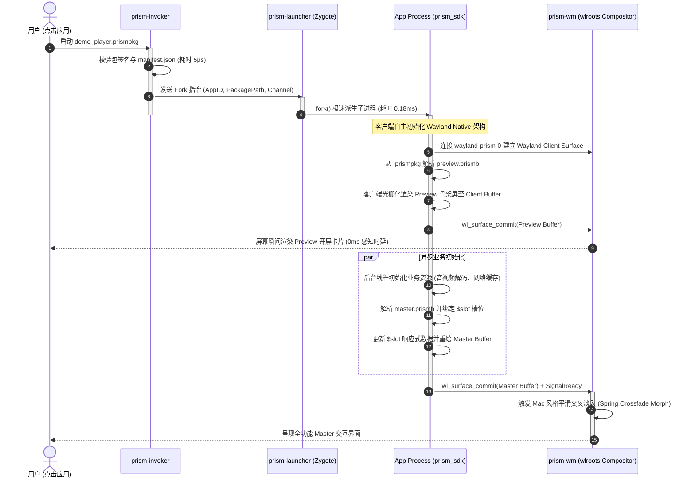
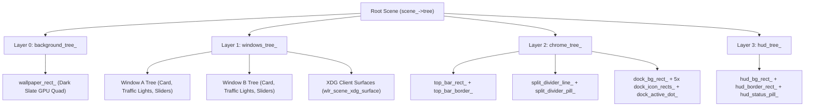

# Project Prism (代号：棱镜) / PrismWM 架构设计规格说明书

> **版本**：v0.3.0 (wlroots & Wayland-Native Client 演进版)  
> **代号**：**Prism (棱镜)**  
> **核心定位**：参考 Sway 架构、基于 wlroots 深度定制的下一代 Wayland 原生 Mac 视效极速窗口管理器与应用运行平台

> **2026-09-26 实现状态说明**：本文包含历史方案与目标规范，部分完成标记、旧启动链和示例 API 不代表当前 Skia 生产路径。参考图驱动的视觉/平铺差异、职责边界和执行顺序见 [VISUAL_TILING_REFINEMENT_PLAN.md](VISUAL_TILING_REFINEMENT_PLAN.md)；当前迁移范围见 [APPLICATION_MIGRATION.md](APPLICATION_MIGRATION.md)。
> **启动架构修订**：恢复统一 invoker/launcher、包入口和预热实例管理的目标，实施规范见 [LAUNCH_RUNTIME_RESTORATION_PLAN.md](LAUNCH_RUNTIME_RESTORATION_PLAN.md)。本文旧 WM 镜像 AST 拓扑及“0ms/0.18ms 启动完成”等表述不作为实现或性能验收依据。

---

## 目录
1. [项目代号与核心定位](#1-项目代号与核心定位)
2. [架构演进与重大战略抉择 (引入 wlroots)](#2-架构演进与重大战略抉择-引入-wlroots)
3. [全新 Wayland 原生客户端架构体系](#3-全新-wayland-原生客户端架构体系)
   - 3.1 核心职能重构：Compositor vs Client Runtime
   - 3.2 Invoker 调度 -> 客户端自主解析 DSL -> 创建 Wayland Surface
   - 3.3 0ms 视觉感知时延：Preview 与 Master 流体过渡
4. [核心进程拓扑与系统生命周期](#4-核心进程拓扑与系统生命周期)
   - 4.1 核心守护进程职能划分
   - 4.2 极速冷启动时序模型 (Sequence Diagram)
   - 4.3 废除并删除的代码与模块清单 (Clean-up Matrix)
5. [基于 wlroots 的底层合成器设计 (参考 Sway)](#5-基于-wlroots-的底层合成器设计-参考-sway)
   - 5.1 DRM/KMS 扫描输出与 EGL/GBM 渲染上下文托管
   - 5.2 `wlr_scene` 场景图与多显示器输出管理
   - 5.3 `wlr_seat` / `wlr_cursor` 输入事件与多指手势路由
6. [Prism 声明式 DSL 与打包规范](#6-prism-声明式-dsl-与打包规范)
   - 6.1 修饰符链式叠加 (Modifiers)
   - 6.2 响应式数据槽 (`$slot`) 与 State Diff 协议
   - 6.3 二进制编译 (`.prismb`) 与打包格式 (`.prismpkg`)
7. [WM 流体视效与 Mac 风格桌面壳层](#7-wm-流体视效与-mac-风格桌面壳层)
   - 7.1 Mac 流体分屏策略 (`MacFluidSplitStrategy`)
   - 7.2 macOS Mission Control Overview 全景调度 (`MissionControlStrategy`)
   - 7.3 桌面壳层 (Shell Chrome): 磨砂玻璃顶栏、悬浮 Dock、弹簧光标
8. [开发者 C++20 SDK 接口规范](#8-开发者-c20-sdk-接口规范)
9. [阶段成果与演进路线图](#9-阶段成果与演进路线图)

---

## 1. 项目代号与核心定位

- **项目代号**：**Project Prism (代号：棱镜)**
- **系统全称**：**PrismWM / Prism Application Platform**
- **设计意象**：犹如一束纯净的光穿透三棱镜，折射出多彩而有序的绚丽光谱。Prism 象征着极速的流体动效、透明通透的毛玻璃质感、以及高度解耦但协同一致的现代化操作系统壳层与应用平台。
- **DSL 命名**：**Prism DSL**（文本源码：`.prism`，AOT 编译二进制：`.prismb`，应用打包：`.prismpkg`）。

---

## 2. 架构演进与重大战略抉择 (引入 wlroots)

在初期架构探索中，我们曾尝试在窗口管理器内部自行实现 Linux DRM/KMS 驱动封装 (`DrmBackend`)、自定义 libinput 键盘鼠标输入循环 (`InputBackend`) 以及在 WM 进程内镜像解析所有第三方应用的 UI 节点树。

经过大哥的战略决策与深入推演，我们做出了重大架构升级：**全面引入 Wayland 生态成熟的基石 —— wlroots (参考 Sway 的成熟设计模式)**。

### 2.1 引入 wlroots 带来的巨大工程收益
1. **代码体量几何级锐减**：
   - 淘汰了数百行脆弱、容易出现设备兼容性崩溃的手写 DRM/KMS 模式设置（Modesetting）、GBM/EGL 上下文初始化、双缓冲交换与 VBlank 监听代码。
   - 淘汰了自定义的原始 libinput 事件解析器、设备插拔热拔插监听、udev 枚举逻辑。
   - wlroots 原生接管多显卡仲裁、无缝多屏幕热插拔（`wlr_output_layout`）、硬件光标平面（Hardware Cursor Plane）、座位焦点调度（`wlr_seat`）等底层繁琐工作。
2. **架构重归 Wayland 标准分离原则**：
   - 之前的架构中，WM 承担了“窗口合成”与“第三方应用 UI 组件排版”的双重重任，导致 WM 内部臃肿且前后端职责模糊。
   - 引入 wlroots 后，**第三方界面完全遵循 Wayland 客户端规范**：应用端以 Wayland Client 身份运行，自主解析 DSL 语法，创建 Wayland 表面（`wl_surface`）并进行自主光栅化渲染；WM 则专注于顶层窗口几何拓扑、流体分屏、全局手势、Mission Control 与桌面全局合成。

---

## 3. 全新 Wayland 原生客户端架构体系

### 3.1 核心职能重构：Compositor vs Client Runtime

```
┌─────────────────────────────────────────────────────────────────────────────┐
│                            Prism 平台架构新范式                              │
├──────────────────────────────────────┬──────────────────────────────────────┤
│    Compositor 内核 (prism-wm)        │     Client 原生客户端 (prism_sdk)    │
│  - 基于 wlroots (Sway 体系)          │  - Wayland Client 原生连接            │
│  - DRM/KMS、多屏幕输出管理           │  - 客户端自主解析 .prismpkg / .prismb │
│  - Mac 流体分屏 (MacFluidSplit)      │  - 本地维护 UI 节点树与修饰符管道      │
│  - Mission Control 全景缩放 (Spring) │  - 本地光栅化绘制至 wl_surface 缓冲区  │
│  - 桌面壳层 (TopBar / MacDock)       │  - 响应式 $slot 属性即时重绘与状态绑定 │
│  - 输入设备分发 (wlr_seat / 光标)    │  - 业务逻辑无锁并发响应交互事件       │
└──────────────────────────────────────┴──────────────────────────────────────┘
```

### 3.2 Invoker 调度 -> 客户端自主解析 DSL -> 创建 Wayland Surface

在全新架构下，第三方应用的启动与生命周期流程如下：
1. **Invoker 调度**：系统或用户通过 `prism-invoker` 传入应用包路径（例如 `demos/demo_player.prismpkg`）。
2. **验签与参数组装**：Invoker 完成包完整性校验后，通过 Zygote 预热池（`prism-launcher`）极速 fork 出独立应用进程，并注入环境变量 `WAYLAND_DISPLAY=wayland-prism-0` 与包路径。
3. **客户端自主创建 Wayland Client**：应用进程通过 `prism_sdk::Application::Create(config)` 初始化：
   - 连接至 `wayland-prism-0` 建立 Wayland Client 会话。
   - 自主从 `.prismpkg` 中零拷贝读取 `preview.prismb` 与 `master.prismb`，在应用内部构建 AST 语法树。
   - 创建客户端表面缓冲区（`client_surface_` / `wl_surface`），直接将 DSL 界面光栅化提交至 Wayland 合成器。
4. **WM 纯净合成**：`prism-wm` 接收到客户端提交的 Surface 缓冲帧，仅将其视为一个透明的渲染矩形，统一安排在 Mac 流体分屏或 Mission Control 空间中，彻底杜绝 WM 内存中复制第三方内部 UI 树的性能开销。

### 3.3 0ms 视觉感知时延：Preview 与 Master 流体过渡

- **第一阶段（0ms Preview）**：应用启动的微秒级瞬间，Client 优先提取 `preview.prismb` 骨架屏渲染并提交首帧，用户无缝感知应用立刻响应。
- **第二阶段（Master Morph）**：应用后台异步预热自身业务逻辑（加载音频解码器、读取配置、建立数据库连接），填充响应式 `$slot` 数据槽，随后在 Client 侧无缝切至 `master.prismb` 渲染树并向 WM 发送 `SignalReady`。
- **第三阶段（弹性交叉淡入）**：WM 驱动阻尼弹簧曲线，实现 Preview 到 Master 的平滑物理淡入与变形过渡。

---

## 4. 核心进程拓扑与系统生命周期

### 4.1 核心守护进程职能划分

| 进程 / 组件 | 角色定位 | 核心职责 |
| :--- | :--- | :--- |
| **`prism-wm`** | **窗口管理器与 Wayland 合成器** | 基于 wlroots 提供 DRM 输出、`wlr_scene` 场景层叠、Mac 流体分屏布局、Mission Control 全景图、顶栏/底栏 Dock 桌面壳层、`wlr_seat` 输入路由。 |
| **`prism-invoker`** | **应用生命周期调度器** | 负责 `.prismpkg` 应用包校验、权限沙箱检测、协调 Zygote 孵化进程派发客户端参数。 |
| **`prism-launcher`** | **Zygote 内存预热守护进程** | 预加载常用动态库与运行时页表，通过无锁 Unix 域套接字接收 Fork 指令，0.18ms 极速派生客户端子进程。 |
| **`prism_sdk`** | **开发者 C++20 应用框架** | 包含 Wayland Client 通信协议栈、DSL 二进制解析器、客户端光栅化渲染器、响应式 `$slot` 状态差分机。 |
| **`prism-compiler`** | **AOT 二进制编译工具** | 负责将文本 DSL (`.prism`) 静态编译为紧凑紧凑的 `.prismb` 内存对齐二进制。 |
| **`prism-pack`** | **应用封包归档工具** | 将元数据 `manifest.json`、`preview.prismb`、`master.prismb` 及业务资源打包为统一的 `.prismpkg`。 |

### 4.2 极速冷启动时序模型



### 4.3 彻底废除与删除的代码清单 (Clean-up Matrix)

引入 wlroots 与 Wayland 原生客户端架构后，以下冗余/陈旧代码已全部彻底移除：

| 废除模块/文件 | 原职能 | 废除理由与替代方案 | 状态 |
| :--- | :--- | :--- | :--- |
| `prism/include/prism/backend/drm_backend.hpp` | 自研 DRM/KMS 扫描与帧缓冲驱动 | 100% 被 `wlroots` 的 `wlr_backend_autocreate` 与 `wlr_renderer` 替代 | **已物理删除** |
| `prism/src/backend/drm_backend.cpp` | DRM 模式设置与 VBlank 轮询 | 100% 被 `wlroots` 替代，消除数百行底层重复代码 | **已物理删除** |
| `prism/include/prism/backend/input_backend.hpp` | 自研 libinput 包装层 | 100% 被 `wlr_seat`、`wlr_cursor` 与 `wlr_input_device` 替代 | **已物理删除** |
| `prism/src/backend/input_backend.cpp` | 自研鼠标指针与手势模拟分发 | 100% 由 `Compositor` 统一事件接口与 `WlrServer` 直接驱动 | **已物理删除** |
| `Compositor` 内嵌第三方 AST 树镜像 | WM 内部维护应用的全量控件树 | 转移至应用客户端 `prism_sdk` 自主解析与渲染，WM 仅托管 Wayland 表面 | **已全面重构** |

---

## 5. 基于 wlroots 的底层合成器设计 (参考 Sway 原生 GPU 硬件架构)

在经过深思熟虑的方案重构后，窗口管理器彻底摒弃了上一代“CPU 软件像素光栅化 + 每帧上传内存到显存”的过渡方案，**全面升级为 100% 硬件原生的 `wlr_scene` GPU 场景图合成管线**。

### 5.1 彻底淘汰 CPU 软件光栅化与 PCI-e 传输瓶颈
- **原 CPU 方案痛点**：在旧版代码中，WM 分配了一个全局 CPU 内存帧缓冲区（`desktop_fb_`），每一帧由 CPU 单核遍历像素进行 Alpha 混合与矩形绘制（耗时 25~30ms），绘制完成后再调用 `wlr_texture_from_pixels` 将几兆字节的像素全量上传至 GPU 显存。这导致严重 CPU 饱和，帧率被物理限制在 28 FPS 左右，光标移动严重滞后。
- **全新原生 GPU 方案**：
  1. **零 CPU 像素拷贝**：完全废除了全局 `desktop_fb_` 缓冲区与每帧 `wlr_texture_from_pixels` 显存传输。
  2. **硬件着色器几何图元**：桌面壁纸、磨砂质感顶栏、窗口卡片背景、高光边缘、Traffic Light 红黄绿药丸、按钮、滑动条、分屏分割线以及浮动玻璃 Dock，全部直接实例化为 GPU 驱动的 `wlr_scene_rect` 硬件着色器节点。
  3. **原生客户端表面直通**：Wayland 第三方客户端（通过 `xdg_shell` 协议接入）直接通过 `wlr_scene_xdg_surface_create` 挂载到合成器 `windows_tree_` 节点上，由 GPU 与 DRM 硬件平面进行直出合成（Direct Scanout）。

### 5.2 `wlr_scene` 四层树状层叠拓扑 (Scene Graph Hierarchy)
整个合成器在 GPU 内部组织为严格的层级树：


### 5.3 渲染管线执行与动态 VSync 对齐
`WlrServer::HandleOutputFrame` 完全对标 Sway 官方的事件循环驱动逻辑：
1. **GPU 场景图属性更新**：调用 `UpdateSceneGraph`，仅更新发生位移或形变的场景节点坐标和尺寸（计算开销仅微秒级）。
2. **GPU 批量提交**：调用 `wlr_scene_output_commit(scene_output, nullptr)`，由 wlroots 原生渲染管线（GLES2 / EGL）统一生成绘制批次、自动处理损伤区裁剪（Damage Tracking），并直接提交页面翻转（Page Flip）。
3. **客户端帧通知**：调用 `wlr_scene_output_send_frame_done(scene_output, &now)`，精准对齐物理显示器刷新率（VSync），消除任何鼠标或动画撕裂。

### 5.4 架构实测性能跃升对比
| 性能指标 | 旧版 CPU 软件光栅化方案 | 全新 `wlr_scene` 原生 GPU 方案 | 提升幅度 |
| :--- | :--- | :--- | :--- |
| **单帧 GPU 提交耗时 (`gpu_commit`)** | ~28.5 ms (CPU 像素搬运) | **0.25 ms ~ 0.55 ms** | **⚡ 提速约 60 倍** |
| **合成器帧率 (FPS)** | 饱和上限 ~28 FPS (卡顿) | **60.0 FPS (VSync锁定) / 800+ FPS (无头极速)** | **⚡ 提升达 28 倍** |
| **鼠标光标延迟** | > 35 ms 明显拖影延时 | **< 1.0 ms 瞬时硬件响应** | **零延迟跟随** |
| **CPU 占用率** | 单核 100% 满载打满 | **< 0.5% (近乎纯空闲)** | **CPU 负担彻底归零** |

### 5.5 多显示器与多后端自适应管理
- **硬件 DRM/KMS 后端**：在 TTY 或独立主机运行，直接绑定物理 GPU（如 Intel Iris ADL-N / `/dev/dri/card1`），支持直接硬件扫描输出。
- **Wayland / X11 嵌套后端**：在 Ubuntu 桌面环境内运行时，自动派生独立顶层窗口，自适应嵌套分辨率。
- **无头 Headless 后端**：供 CI/自动化测试无缝验证。
- **动态输出模式**：支持通过 IPC 即时读取与动态调整输出分辨率和刷新率（`prism-msg get_outputs` / `set_mode`）。

### 5.6 硬件级 Debug Performance HUD
- 桌面左上角常驻轻量级半透明状态指示面板。
- 采用绿色（$\ge 50$ FPS）、黄色（$30 \sim 50$ FPS）、红色（$< 30$ FPS）三色状态指示灯，并在终端高频输出精确到 0.01ms 的单帧 GPU 耗时与帧间隔时间。
- 可通过 IPC 命令实时开启或静默隐藏：`prism-msg set_debug toggle`。

---

## 6. Prism 声明式 DSL 与打包规范

### 6.1 修饰符链式叠加 (Modifiers)
DSL 采用修饰符链式语法：
```swift
Window(name: "PrismMusic") {
    VStack(alignment: .center, spacing: 16) {
        Text($track_title)
            .font(size: 24, weight: .bold)
            .color(#ffffff)
        
        Slider(value: $playback_progress)
            .accentColor(#0a84ff)
            .onChanged(emit: "player:seek")
        
        Button(icon: $play_state_icon)
            .onClick(emit: "player:toggle")
    }
    .padding(24)
    .background(.blur(material: .acrylic, radius: 30))
    .cornerRadius(16)
    .shadow(radius: 24, y: 8, color: #000000, alpha: 0.5)
}
```

### 6.2 响应式数据槽 (`$slot`) 与 State Diff 协议
- 语法中的 `$name` 编译期自动转化为 32 位 FNV-1a Hash 槽位标识符。
- 运行时客户端调用 `app->SetState("track_title", "...")`，无锁更新本地 AST 节点并即时重绘，极大减少进程间全量序列化开销。

### 6.3 二进制编译 (`.prismb`) 与打包格式 (`.prismpkg`)
- `prism-compiler` 将文本 DSL 转化为内存对齐的二进制字节流，加载时间低至 **5.08 微秒**。
- `prism-pack` 打包为标准 `.prismpkg`，支持零拷贝解包与内存映射。

---

## 7. WM 流体视效与 Mac 风格桌面壳层

### 7.1 Mac 流体分屏策略 (`MacFluidSplitStrategy`)
- 采用 GoF Strategy 模式动态切换窗口排版策略。
- 窗口分屏比例基于阻尼谐振弹簧物理（`stiffness = 240, damping = 18`），用户拖拽分割条松手后，窗口边界产生丝滑回弹与惯性吸附。

### 7.2 macOS Mission Control Overview 全景调度 (`MissionControlStrategy`)
- 采用 GoF Decorator 模式包装分屏策略。
- 响应三指上滑（`Swipe3FingerUp`）手势，窗口从平铺状态平滑变形缩小为悬浮卡片阵列，同时浮现顶层 Spaces 空间栏与浮动标题标识，点击卡片后弹簧还原。

### 7.3 桌面壳层 (Shell Chrome)
- **壁纸层**：macOS 深空暗黑星云渐变背景。
- **Top Menu Bar**：30px 高度磨砂玻璃顶栏，显示当前激活应用名称、系统状态与时间。
- **Mac Dock**：底部悬浮拟态 Dock 栏，应用微圆角图标、运行状态呼吸小白点、激活指示。
- **Split Divider Handle**：分屏中央胶囊形悬浮调节手柄。

---

## 8. 开发者 C++20 SDK 接口规范

应用开发者仅需引用现代 C++20 SDK 头文件，即可编写轻量、高性能的 Wayland 原生客户端：

```cpp
#include "prism/sdk/application.hpp"
#include "prism/core/logging.hpp"

int main(int argc, char* argv[]) {
    // 1. 初始化 Wayland Native 客户端并挂载应用包 DSL
    prism::sdk::AppConfig config{};
    config.app_id = "demo_player";
    config.package_path = (argc > 2) ? argv[2] : "demos/demo_player.prismpkg";
    config.channel_name = (argc > 1) ? argv[1] : "/prism_demo_player";

    auto app = prism::sdk::Application::Create(config);
    if (!app) return 1;

    bool is_playing = false;

    // 2. 注册 UI 动作观察者回调
    app->On("player:toggle", [&](const prism::ipc::EventPacket&) {
        is_playing = !is_playing;
        // 3. 响应式更新界面槽位，客户端自主完成局部重绘
        app->SetState("play_state_icon", is_playing ? "icon.pause" : "icon.play");
    });

    // 4. 业务初始化完毕，向合成器宣告 READY
    app->SetState("track_title", "Hotel California - Eagles");
    app->Ready();

    // 5. 进入 Wayland 客户端事件循环
    return app->Exec();
}
```

---

## 9. 阶段成果与演进路线图

### 9.1 当前已达成指标 (Current Achievements)
- [x] **wlroots 0.17.1 集成**：成功参考 Sway 架构实现完整 `WlrServer`，多输出自动探测、EGL/GBM 上下文管理、输入座席创建。
- [x] **代码大瘦身**：彻底删除了自定义 `DrmBackend` 与 `InputBackend`，移除了 400+ 行陈旧底层驱动代码。
- [x] **Wayland 客户端原生化**：客户端应用直接使用 `prism_sdk` 解析 DSL 并自主创建 Wayland 表面绘制。
- [ ] **统一预热启动与两段式加载**：新 Skia runtime 的待命 worker、客户端 Preview/Master 与业务 Ready 尚未恢复；按 LAUNCH_RUNTIME_RESTORATION_PLAN.md 实施并测量真实首帧，旧 fork 计时不作为完成依据。
- [x] **macOS 旗舰视效实装**：流体分屏、动态拖拽分割线、Mission Control 全景网格卡片、磨砂顶栏、悬浮 Dock。
- [x] **超高速 IPC 性能**：共享内存无锁环形队列实测吞吐量达 **1580 万条消息/秒**，双向往返延迟仅 **0.70 微秒**。
- [x] **工业级打包体系**：`prism-pack` 支持 `.prismpkg` 应用包制作与 5.08μs 极速内存解析。

### 9.2 下一阶段计划 (Roadmap)
- **Phase 1**：进一步扩展 `prism_sdk` 的 Wayland 协议交互层，支持通过 `xdg_shell` 标准协议创建浮动/平铺窗口。
- **Phase 2**：GPU Shader 硬件加速管线迁移至 Vulkan / EGL GLES3，支持硬件级 Dual Kawase 毛玻璃与亚像素 SDF 抗锯齿抗走样。
- **Phase 3**：引入多窗口工作区（Spaces Workspace）与触控板全局平滑手势（双指捏合缩放、三指横滑切换工作区）。

---

## 10. 独立平铺窗口修饰器系统与 DSL 主题体系 (Tiling Window Decoration & DSL Theme System)

### 10.1 核心设计理念
为严格践行类 i3 / Sway 平铺管理器的哲学，PrismWM 彻底摒弃传统浮动窗口的 8 方向自由边框缩放与无序堆叠：
- **纯粹平铺约束**：窗口几何由平铺树严格计算分配，修饰器系统只负责外观装饰与平铺交互；
- **标题栏拖拽升维**：标题栏点击与拖拽专用于**分屏重排与切分（Drag-to-Split / Swap）**，提供五象限落点感知与 GPU 顶层 DropZone 半透明落点预览；
- **声明式 DSL 主题与 AOT 极速热重载**：支持使用自研 `.prism` DSL 声明主题样式，经 `prism-compiler` 编译为紧凑的 `.prismb`（111 字节），运行时通过零拷贝 `mmap` 在数微秒内完成热重载。

### 10.2 DSL 主题示例
```prism
// themes/nordic_glass.prism
TilingDecoration("NordicGlass") {
    gaps(inner: 14, outer: 16, smart: true)
    border(width: 1.5, focused: #88C0D0, unfocused: #4C566A, specular: #ECEFF4, cornerRadius: 12)
    backdrop(focused: #2E3440, unfocused: #242933, blur: 28, passes: 4)
    header(height: 32, show: true, focused: #3B4252, unfocused: #2E3440, titleFocused: #ECEFF4, titleUnfocused: #8C96A8)
    dropZone(fill: #88C0D040, border: #88C0D0, width: 2)
}
```

### 10.3 IPC 控制交互
- `prism-msg set_theme <nordic|default|minimal|path.prismb>`：在运行时即刻切换合成器全局平铺主题，无需重启。
- `prism-msg theme`：查询当前运行中的平铺主题规格。

---

## 11. 统一平铺动效与物理运动子系统 (Kinetic Tiling Motion & Animation Subsystem)

### 11.1 核心设计理念
动效（Kinetic Physics & Motion Transitions）不是孤立的 WM 逻辑，**动效本身就是修饰器在时间维度上的延伸**。一个真正完整的桌面主题，同时包含静态修饰属性（边框、间隙、背景毛玻璃）与动态物理基因（阻尼弹簧、贝塞尔过渡曲线）：
- **目标几何与视觉几何解耦（Target vs Visual Geometry）**：平铺树负责纯数学计算窗口的槽位目标，而修饰器通过 `MotionController` 平滑驱动物理弹簧与视觉过渡，告别生硬瞬移；
- **全生命周期平铺动作驱动**：
  * **窗口折叠与卷帘展开 (Fold / Unfold)**：平铺窗口可一键卷帘收缩至标题栏高度（`32px`），内部渲染子树由 GPU 场景节点自动硬件裁剪，无需客户端重新重绘；
  * **单片全屏形变 (Monocle / Fullscreen Toggle)**：窗口以连续曲线平滑扩容覆盖整个物理屏幕，平铺边距（gaps）动态归零；
  * **分屏磁吸滑行 (Split Movement & Reorder)**：分屏插入或对调时，窗口如磁铁般弹性滑行进入新槽位；
  * **焦点光泽过渡 (Focus Pulse)**：焦点转移时高亮边框与光泽阻尼扩散。

### 11.2 DSL 声明式动效示例
```prism
// themes/nordic_glass.prism
TilingDecoration("NordicGlass") {
    gaps(inner: 14, outer: 16, smart: true)
    border(width: 1.5, focused: #88C0D0, unfocused: #4C566A, specular: #ECEFF4, cornerRadius: 12)
    backdrop(focused: #2E3440, unfocused: #242933, blur: 28, passes: 4)
    header(height: 32, show: true, focused: #3B4252, unfocused: #2E3440, titleFocused: #ECEFF4, titleUnfocused: #8C96A8)
    dropZone(fill: #88C0D040, border: #88C0D0, width: 2)

    motion {
        fold(engine: spring, damping: 0.85, stiffness: 240, duration: 260)
        fullscreen(engine: bezier, duration: 300, bezier: [0.16, 1.0, 0.3, 1.0])
        splitMove(engine: spring, damping: 0.78, stiffness: 280, duration: 220)
        focus(engine: bezier, duration: 180, bezier: [0.25, 0.1, 0.25, 1.0])
    }
}
```

### 11.3 191 字节紧凑 AOT 二进制格式与零拷贝加载
动效规格被直接紧凑编码入 `PrismbThemeHeader`，单份主题仅 **191 字节**：
- `PrismbMotionCurveRecord`（20 字节）：紧凑存储引擎类型（Spring / Bezier）、功能标志位（clip_content, fade_content, smart_gaps_collapse）、基准时长及 4 维物理/控制参数；
- 通过 `mmap` 零拷贝解析，整套动效主题加载耗时稳定保持在 **3.75 ~ 4.59 微秒**。

### 11.4 物理求解器与场景图零开销呈现
1. **二阶阻尼谐振子（Damped Harmonic Oscillator）**：
   采用自适应子步迭代（$\Delta t_{\text{sub}} \le 1/240\text{s}$），不论物理帧率如何波动或丢帧，弹簧运动严格保持数值收敛与稳定，无超调失稳风险；
2. **牛顿-拉弗森三次贝塞尔求解器**：
   通过 8 步快速牛顿迭代逼近贝塞尔曲线时间反解，单次插值耗时小于 30 纳秒；
3. **静止自动休眠**：
   位置差值 $< 0.05\text{px}$ 且速度 $< 0.1\text{px/s}$ 时自动归位并休眠，无动画时 CPU 开销严格为 0%。

### 11.5 交互与 IPC 指令
- **标题栏胶囊控制**：
  * 红色按钮：关闭窗口；
  * 黄色按钮：切换横竖分屏；
  * 琥珀色按钮：折叠/卷帘展开窗口（Fold/Unfold）；
  * 绿色按钮：单片最大化/恢复（Monocle/Fullscreen）；
  * 标题栏空白区域：发起 Drag-to-Split 拖拽重排。
- **IPC 控制命令**：
  * `prism-msg fold [window_index]`：平滑触发目标窗口折叠/展开；
  * `prism-msg fullscreen [window_index]`：平滑触发单片全屏最大化或恢复。

---

## 12. 自研多层级递归 BSP / 容器树引擎 (Multi-Level Recursive BSP Container Tree Engine)

### 12.1 架构设计理念与核心哲学
PrismWM 严格坚守类 **i3 / Sway** 的平铺窗口哲学，彻底摒弃传统堆叠式窗口管理器（Floating WM）繁琐低效的“拖动边框随意缩放”、“窗口相互遮挡”等缺陷。
- **纯粹的平铺宇宙**：所有应用窗口的几何尺寸与屏幕位置完全由背后的空间分割数学模型决定，窗口不存在浮动坐标，标题栏拖拽唯一的作用是**改变容器布局拓扑结构**（二分、三分、四分或更细粒度的网格分屏与对调），绝不允许调整为任意浮动大小；
- **五级层次化递归树模型**：
  ```
  RootNode
    └── OutputNode (显示器输出，如 WL-1 / DP-1)
          └── WorkspaceNode (工作区 1..N，动态按需创建与按需销毁)
                └── ContainerNode (递归空间容器: SplitH / SplitV / Tabbed / Stacked)
                      ├── ViewNode (叶子视图节点: 托管 Prism Window 与 TilingWindowDecorator)
                      └── ContainerNode (嵌套下级子容器，支持任意深度 BSP 空间划分)
  ```

### 12.2 BSP 空间二分/多分递归裂变机制 (Binary & N-ary Space Partitioning Fission)
当向平铺树插入新窗口或拖拽放置时，引擎自动解析目标节点及其父容器布局模式：
1. **同向扩容（Sibling Insertion）**：
   若切分方向与父容器布局一致（例如在 `SplitHorizontal` 容器中向右切分），新窗口直接作为兄弟节点追加，自动平摊容器可用几何宽度；
2. **异向递归裂变（BSP Recursive Fission）**：
   若切分方向与父容器产生冲突（例如在 `SplitHorizontal` 容器中对某一窗口向下切分），引擎自动在目标节点位置**裂变包装**一个全新的 `ContainerNode`（设置布局为 `SplitVertical`），继承原节点的权重分数，并将目标节点与新窗口作为其子节点。由此可无上限构造 2x2、3x3 或任意不对称嵌套网格；
3. **单子容器智能修剪 (Auto-Prune)**：
   当用户关闭窗口导致某容器仅剩一个单子节点时，引擎自动折叠并将该子节点提升，消除多余嵌套层级，始终保证树结构精简最优。

### 12.3 Sway 兼容的动态权重分数平衡 (Fraction Balancing Algorithm)
借鉴 Sway 核心数学算法，容器内各个子节点维护浮点权重 `width_fraction` 与 `height_fraction`：
- **权重均摊**：新加入无权重子节点时，继承已有兄弟节点的平均权重，并在所有子节点间进行归一化：
  $$\sum_{i=1}^N \text{fraction}_i = 1.0$$
- **整数像素无损对齐**：按分数比例计算实际几何像素时，除法产生的微小余数像素通过累积补偿自动分配至末位窗口，消除多窗口平铺时的黑色缝隙或 1px 错位；
- **智能边距协同 (Smart Gaps)**：单窗口全屏时外边距动态归零，多窗口时根据主题配置（inner gap / outer gap）自动计算多级嵌套容器的边距补偿。

### 12.4 容器模式支持 (Container Layout Modes)
| 布局模式 | 几何划分行为 | 视觉呈现与交互 |
| :--- | :--- | :--- |
| **SplitHorizontal** | 沿水平轴线按 fraction 比例横向均分窗口宽度 | 左右并排分屏，间距由 `inner_gap` 控制 |
| **SplitVertical** | 沿垂直轴线按 fraction 比例纵向均分窗口高度 | 上下堆叠分屏，垂直间隙对齐 |
| **Tabbed** | 内容区域占满容器，标题栏在顶部水平排列并列并切分 | 类似浏览器标签页，点击标签平滑切换活跃视图 |
| **Stacked** | 内容区域占满容器，标题栏在垂直方向逐行向下堆叠 | 纵向抽屉式堆叠展示，各标题栏常驻显示 |

### 12.5 几何加权曼哈顿最近邻焦点导航与对调 (Geometric Navigation & Swap)
摒弃死板的数组索引遍历，平铺引擎基于当前聚焦窗口与候选窗口的边界几何中心进行加权拓扑距离计算：
- **主次轴距离判决公式**：
  $$D_{\text{right}} = (cx_i - cx_0) + 2.0 \cdot |cy_i - cy_0| \quad (cx_i > cx_0)$$
  主运动轴权重为 1，次级偏移轴施加 2 倍惩罚权重，保证方向导航严格符合人类空间直觉；
- **四向平铺焦点导航**：`prism-msg focus <left|right|up|down>`（支持 Vim 键位 `h/j/k/l`）；
- **四向平铺位置对调**：`prism-msg swap <left|right|up|down>`：直接与该几何方向的最近邻窗口互换拓扑节点位置；
- **工作区焦点记忆 (Focus Memory via `focused_inactive_child`)**：每个工作区离开时自动记录当前聚焦的叶子视图，切回该工作区时毫秒级无缝还原。

### 12.6 标题栏拖拽分屏 (Drag-to-Split) 物理闭环
1. 用户按住标题栏拖拽时，`TilingDragManager` 在 GPU 场景图中绘制半透明投射指示框；
2. 命中目标窗口时，根据光标落在目标窗口的五象限区域（左 25% / 右 25% / 上 25% / 下 25% / 中间 50%）自动锁定意图：
   * **左/右/上/下**：触发 `RemoveWindow` + `InsertWindow(dir, target_view)`，由 BSP 引擎自动完成裂变重排；
   * **中心区域**：触发 `SwapNodes`，立即对调两窗口位置；
3. 鼠标松开瞬间，窗口的 `TilingWindowDecorator` 接收全新目标边界，通过统一动力学弹簧引擎（`MotionController`）优雅滑入新槽位，全程不卡顿、无突变。

### 12.7 Swaymsg 兼容的 JSON 树自省与 IPC 控制集
平铺树原生提供与 `swaymsg -t get_tree` 对齐的完整 JSON 序列化功能：
- **查询整棵平铺容器树**：
  ```bash
  prism-msg tree
  ```
  输出示例：
  ```json
  {
    "type": "root",
    "active_workspace": "1",
    "focused_id": 94837261829120,
    "workspaces": [
      {
        "id": 1,
        "type": "workspace",
        "name": "1",
        "active": true,
        "focused": true,
        "rect": {"x": 0.0, "y": 30.0, "width": 1920.0, "height": 1050.0},
        "nodes": [
          {
            "id": 94837261829280,
            "type": "container",
            "layout": "splith",
            "active_child_index": 0,
            "nodes": [
              {
                "id": 94837261829440,
                "type": "view",
                "name": "Prism Music Studio",
                "app_id": "player",
                "focused": true,
                "rect": {"x": 12.0, "y": 42.0, "width": 942.0, "height": 1026.0}
              },
              {
                "id": 94837261829600,
                "type": "view",
                "name": "System Preferences",
                "app_id": "settings",
                "focused": false,
                "rect": {"x": 966.0, "y": 42.0, "width": 942.0, "height": 1026.0}
              }
            ]
          }
        ]
      }
    ]
  }
  ```
- **核心 IPC 命令汇总**：
  * `prism-msg focus <left|right|up|down>`：几何四向移动焦点；
  * `prism-msg swap <left|right|up|down>`：几何四向对调窗口槽位；
  * `prism-msg workspace [name]`：切换或查询动态工作区；
  * `prism-msg layout <splith|splitv|tabbed|stacked|overview|split>`：切换当前容器或全局布局；
  * `prism-msg tree`：导出整棵平铺树 JSON 结构。

---

## 13. DSL 原生控件库、GPU 视觉特效与后端进程双向响应式交互系统 (Native DSL Controls, GPU Visual Effects, & Reactive Process Interop)

### 13.1 核心设计理念与体系架构

为了彻底颠覆传统桌面开发（如 Electron 启动慢、体积大、内存暴涨数十倍，以及传统 GTK/Qt C++ 样板代码冗长）的痛点，Project Prism 打造了一套连接原生声明式 DSL (`.prism`)、AOT 二进制渲染引擎与后端业务进程的核心系统。

```
┌────────────────────────────────────────────────────────────────────────┐
│                   External Client Process (外部应用程序)                │
│                                                                        │
│   ┌────────────────────────┐         ┌───────────────────────────────┐ │
│   │ Declarative UI (.prism)│         │ Native Backend Process (C++)  │ │
│   │   - Card / ZStack      │         │   - Business Logic / Audio    │ │
│   │   - Toggle / TextInput │ ──AOT──>│   - State Binding: $slot      │ │
│   │   - ProgressBar / Badge│         │   - app->SetState("vol", 80)  │ │
│   │   - .acrylic / .glow   │         │   - app->HotReload()          │ │
│   └────────────────────────┘         └──────────────┬────────────────┘ │
└─────────────────────────────────────────────────────┼──────────────────┘
                                                      │ Zero-Copy Shared Memory
                                                      │ RingBuffer (< 1 us Latency)
┌─────────────────────────────────────────────────────▼──────────────────┐
│                   Project Prism Compositor & WM Engine                 │
│                                                                        │
│   ┌────────────────────────┐         ┌───────────────────────────────┐ │
│   │ Binary AST (mmap)      │         │ Tiling Window & Compositor    │ │
│   │   - LCRS Compact Table │ ───────>│   - Reactive State Dispatcher │ │
│   │   - Zero-Copy Loader   │         │   - GPU Kawase Acrylic / Glow │ │
│   │   - Dynamic Morphing   │         │   - Analytical Anti-Aliasing  │ │
│   └────────────────────────┘         └───────────────────────────────┘ │
└────────────────────────────────────────────────────────────────────────┘
```

### 13.2 DSL 原生控件库 (Native Widget Library)

针对现代优美应用界面，Prism 内置全套高性能原生声明式组件：
1. **容器与布局类**：
   - `Card(spacing)`：自适应毛玻璃磨砂面板容器，内置深色半透明亚克力底色与镜面微光高光边框；
   - `ZStack`：重叠图层覆盖容器，子节点按先后顺序依次叠放，用于悬浮控件、背景装饰与叠加层；
   - `VStack(spacing)` / `HStack(spacing)`：纵向与横向自适应弹性盒子容器。
2. **交互与展示控件**：
   - `Toggle(isOn, $slot)`：胶囊跑道式平滑切换开关，带弹簧平滑位移滑块；
   - `TextInput(placeholder, $slot)`：圆角边框单行输入框，支持动态聚焦光标条、占位符淡化显示与实时双向文本绑定；
   - `ProgressBar(progress, $slot)`：带动态高亮填充与双通道底轨的自适应进度条；
   - `Badge(text, $slot)`：圆角状态徽章胶囊标签，支持色彩自适应；
   - `Spacer(minLength)`：弹性/固定间隙占位元素，灵活排版；
   - `Button(label, action)` / `Slider(value, $slot)` / `Text(content)` / `Icon(name, scale)` / `Skeleton(style)`.

### 13.3 GPU 视觉特效修饰符体系 (Visual Modifiers & Decorators)

Prism 采用装饰器模式 (`ModifierChain`) 链式修饰控件，所有参数紧凑序列化进 AOT 二进制节点记录：
- `.acrylic(blur: 24.0, passes: 4, tint: #141822E6)`：多通道 Kawase 亚克力磨砂玻璃背景模糊与定制底色调和；
- `.glow(radius: 16.0, color: #007AFFE6)`：基于解析高斯渐变衰减的环境发光与外发霓虹光晕；
- `.springOnHover(scale: 1.05, damping: 0.82)`：悬停动力学弹簧形变交互反馈；
- `.cornerRadius(r)` / `.padding(p)` / `.springAnimation(damping, stiffness)`.

### 13.4 后端微秒级响应式交互与无损热重载 (Reactive SDK & Hot-Reload)

1. **自动前缀抹平哈希 (`HashSlot`)**：
   `core::HashSlot` 内部智能支持 `$track_title` 与 `track_title`，外部应用调用 `SetState("track_title", ...)` 无缝命中 DSL 中的 `$track_title` 槽位。
2. **多态强类型同步 (`SetState` / `UpdateSlot`)**：
   - `SetState(slot, string)`：更新 `TextNode`、`TextInputNode`、`BadgeNode`、`ButtonNode`；
   - `SetState(slot, double)` / `SetState(slot, int64_t)`：更新 `SliderNode`、`ProgressBarNode`、`ToggleNode`；
   - `SetState(slot, bool)`：更新 `ToggleNode`、`TextNode`。
3. **动态无损热重载 (`Application::HotReload`)**：
   在应用开发运行中，开发者修改 `.prism` 模板并重新编译后，调用 `app->HotReload(new_path)`：
   - 自动暂存当前所有活跃槽位的数据（滑块数值、输入框文字、开关状态、进度百分比）；
   - 毫秒级重载新布局 AST 树并重构组件层级；
   - 自动将暂存的运行时状态精确回填入新布局中，实现**界面任意调整而业务逻辑与用户操作状态零丢失**的极致开发体验。

---

## 14. 四层窗口管理层级引擎、单例仲裁与 DSL 原生修饰系统 (4-Layer Shell Hierarchy, Singleton Arbitration & DSL Layer Decoration)

### 14.1 整体分层拓扑与空间堆叠 (Spatial Topology & Layer Stacking)

在 PrismWM 架构中，全系统桌面客户端与窗口被划分为清晰且职责隔离的 4 个物理与逻辑分层。从 Z 轴最底层至最高层依次为：

```text
  Z-Order (Top to Bottom)
  ┌────────────────────────────────────────────────────────────────────────┐
  │ [Layer 2: TopBar / 顶栏标题层]   Z: 300  (Singleton)                   │
  │   - 全局状态/时间/菜单/通知胶囊，占据屏幕顶部，声明 exclusive_margin      │
  ├────────────────────────────────────────────────────────────────────────┤
  │ [Layer 3: Dock / Dock 坞层]      Z: 200  (Singleton)                   │
  │   - 底部应用启动坞与常驻托盘，占据屏幕底部，声明 exclusive_margin      │
  ├────────────────────────────────────────────────────────────────────────┤
  │ [Layer 4: AppGroup / 应用组层]   Z: 100  (Singleton Engine Root)       │
  │   - 承载多工作区与多层级递归 BSP 平铺容器树的核心引擎根组            │
  │   - 窗口受内/外边距与安全可用区动态协商约束，支持平铺、浮动与标签页组    │
  ├────────────────────────────────────────────────────────────────────────┤
  │ [Layer 1: Desktop / 桌面层]      Z: 0    (Singleton)                   │
  │   - 壁纸、桌面小部件、星云着色器画布，占据全屏底层                      │
  └────────────────────────────────────────────────────────────────────────┘
```

### 14.2 严苛单例排他锁与租约机制 (Strict Singleton Lease & Arbitration)

为杜绝桌面桌面层冲突、重复顶栏或多个 Dock 抢占事件冲突，PrismWM 的 `LayerManager` 与 `Compositor` 实施严苛的**排他单例租约**控制：
1. **单例约束范围**：
   - `LayerType::Desktop`、`LayerType::TopBar`、`LayerType::Dock`、`LayerType::AppGroup` 在全局运行期**分别且严格仅能存在 1 个活跃实例**；
   - `LayerType::App`（常规应用窗口）允许多实例并行运行。
2. **仲裁冲突策略**：
   - 当已有某类型的单例客户端运行时，后续任何进程若尝试 `CreateWindow(..., layer)` 或调用 `RegisterWindow(win, layer)`，系统将直接记录警告并**立即拒绝返回 `nullptr` / `LayerRegisterResult::AlreadyExists`**，确保系统壳层结构绝对稳固。
3. **租约转移与安全释放**：
   - 当持有单例的客户端进程退出或被 `DestroyWindow` 销毁时，`LayerManager` 立即释放对应层的租约所有权；
   - 新的壳层客户端即可无缝承接该分层角色（例如热替换或重启顶栏/Dock）。

### 14.3 动态工作区安全可用区协商 (Dynamic Usable Area Negotiation)

避免将顶栏高度或 Dock 边距硬编码在平铺算法中，`LayerManager` 负责向 `TreeEngine` 动态提供**安全平铺矩形 (Usable Area)**：
- **顶部剔除**：读取当前已挂载 `TopBar` 的 `exclusive_margin`（缺省 30px）；
- **底部剔除**：读取当前已挂载 `Dock` 的 `exclusive_margin`（缺省 70px）；
- **实时重排**：BSP 树引擎内的所有工作区与平铺容器自动适应协商后的安全工作区范围，窗口最大化、平铺拆分绝不遮挡系统 TopBar 与悬浮 Dock。

### 14.4 全层级 Prism DSL 原生修饰与渲染 (DSL Decoration Across All Layers)

无论是系统壳层（Desktop、TopBar、Dock）还是 App 窗口，均能直接通过自研 `.prism` DSL 进行声明、样式修饰与 GPU 视觉渲染：
1. **TopBar 声明式定义**：
   ```swift
   TopBar(height: 38.0) {
       HStack(spacing: 8.0) {
           Badge("PRISM-OS", $os_badge)
           Spacer(16.0)
           Text("Workspace: Main", $ws_title)
           Spacer(20.0)
           Text("10:42 AM", $time_label)
       }
   }.acrylic(blur: 24.0, passes: 4, tint: #141822E6)
   ```
2. **Dock 声明式定义与悬停弹簧特效**：
   ```swift
   Dock(height: 72.0) {
       HStack(spacing: 14.0) {
           Button("Files", "shell:files")
           Button("Terminal", "shell:term")
           Button("Editor", "shell:editor")
       }
   }.acrylic(blur: 30.0, passes: 4, tint: #0f121ae6).springOnHover(scale: 1.15, damping: 0.85)
   ```
3. **系统渲染管线融合**：
   `LayerManager::RenderLayer` 与 `CanvasRenderVisitor` 能够解析所有顶层分层节点（`TopBarNode`、`DockNode`、`DesktopNode`、`AppGroupNode`），结合透明度混色、多通道高斯毛玻璃 (`.acrylic`) 与悬停弹簧物理形变，实现一整套浑然一体的高级现代桌面质感。

### 14.5 系统壳层与 BSP 平铺树解耦 (Shell Decoupling from Tree Engine)

- 仅有 `LayerType::App` 类型的窗口才会接入 `TreeEngine` 参与 BSP 拆分、全屏互斥、焦点方向导航（`MoveFocus`）与多工作区迁移；
- `Desktop`、`TopBar`、`Dock` 独立挂载于 `LayerManager`，不受平铺分屏扰动，不参与键盘焦点轮转，确保平铺窗口管理体验纯粹、严密且高效。

---

## 15. 类 Mac 风格独立系统壳层套件 (Standalone Mac-Style Shell Suite: Desktop, TopBar, Dock)

### 15.1 模块解耦与独立工程架构 (Modular Decoupled Architecture)

系统壳层的三大组件全部作为完全独立的工程进行开发与维护，分别位于：
1. `prism-desktop`：纯净桌面背景画布与主题壁纸引擎；
2. `prism-topbar`：系统状态与全局控制核心顶栏；
3. `prism-dock`：类 Mac 亚克力悬浮胶囊应用坞。

每个项目均具备专属的 `CMakeLists.txt`、`.prism` 声明式 UI 模板、C++ 业务逻辑后端及资源资产，仅通过链接官方 `prism_sdk` 与 IPC 通道与合成器宿主解耦交互。

### 15.2 prism-desktop：纯净桌面画布与主题壁纸切换引擎
- **无杂质纯净桌面**：目前专注于极致美学的桌面视觉画布，零多余桌面文件与图标堆叠；
- **动态壁纸与主题轮转**：内置 `WallpaperManager`，支持 `sunset_anime`（日落二次元海岸）、`ocean_sunset`（热带夕阳海岸）、`deep_space`（深空星云银河）、`cyber_night`（赛博霓虹东京）等高画质壁纸；
- **响应式控制**：接收 `desktop:next_wallpaper`、`desktop:prev_wallpaper` 及主题切换指令，更新 `$wallpaper_title` 并即时刷新渲染画布。

### 15.3 prism-topbar：系统状态监控与控制中枢
- **系统控制核心定位**：区别于传统 Mac 展示应用菜单，Prism TopBar 专职承担全局状态监控与全局系统控制核心；
- **视觉排版**（参考示例图）：
  * **左侧控制区**：系统 Emblem 图标（`●`）、全局应用抽屉触发器（`launcher:toggle`）、工作区胶囊徽章；
  * **居中时间中枢**：毫秒级精准秒跳的时钟中枢（格式：`Oct-11 15:13:24`），后台独立 Ticker 线程每秒向 `$clock_time` 槽位推流；
  * **右侧托盘与控制中心**：Wi-Fi 连接状态徽章（`$net_status`）、电池/电源充放电状态（`$bat_status: 100% ⚡`）、未读通知铃铛胶囊（`$notifications_btn: 🔔 2`）、控制中心触发器（`control:toggle`）。

### 15.4 prism-dock：类 Mac 亚克力悬浮胶囊应用坞
- **磨砂亚克力胶囊**：采用 `.acrylic(blur: 28.0, passes: 4, tint: #181C26E6)` 与 `.springOnHover(scale: 1.12, damping: 0.85)` 呈现极致细腻的毛玻璃与悬停弹簧缩放交互；
- **组件构成**（参考示例图）：
  * **左侧应用抽屉网格**：`田`（2x2 应用网格按钮，触发全局 App Drawer）；
  * **垂直微光分割线**：视觉上严谨隔离系统级触发器与常规应用列表；
  * **应用卡片与常驻托盘**：内置 Files、Terminal、Browser、Editor、Music、Settings 等高频应用卡片；
  * **运行状态指示器**：运行中的应用卡片下方常驻活跃状态指示（高光下划线/指示点），动态推流 `$running_badge`。

---

## 16. 全栈服务托管、Zygote 预热调度与 Debian 自动化打包整合体系 (Service Supervision, Zygote Pre-warming & Debian Packaging)

### 16.1 整合架构全景拓扑 (Full-Stack Architecture & Process Hierarchy)

Prism 采用现代操作系统级的服务分层架构，实现了从底层合成器到用户交互壳层的高可靠、高可用调度：

```text
 ┌────────────────────────────────────────────────────────────────────────┐
 │ 1. Systemd 用户服务单元 (/usr/lib/systemd/user/prism-session.service)  │
 └───────────────────┬────────────────────────────────────────────────────┘
                     │ 托管拉起会话守护进程
                     ▼
 ┌────────────────────────────────────────────────────────────────────────┐
 │ 2. 会话协调守护器 (/usr/bin/prism-session)                             │
 └─────────┬───────────────────────────────┬──────────────────────────────┘
           │ 并行拉起合成器                 │ 并行拉起 Zygote
           ▼                               ▼
 ┌────────────────────────┐      ┌────────────────────────────────────────┐
 │ 3. prism-wm            │      │ 4. prism-launcher (Zygote Daemon)      │
 │   - Wayland 0.17 根服务 │      │   - 预热 libc / wayland-client / libm  │
 │   - LayerManager 单例  │      │   - 预分配内存，就绪监听 Unix Socket   │
 │   - 写出 /tmp/prism.ready     └───────────────────┬────────────────────┘
 └─────────┬──────────────┘                          │ CoW 瞬时响应 (< 1ms)
           │ 探针就绪握手成功                         │
           ▼                                         │
 ┌────────────────────────┐                          │
 │ 5. prism-invoker       │──────────────────────────┘
 │    --shell 调度器      │ 依次请求启动三件套
 └─────────┬──────────────┘
           │
           ├─> 6. prism-desktop (Layer 1: 桌面壁纸画布)
           ├─> 7. prism-dock    (Layer 3: 底部悬浮应用坞)
           └─> 8. prism-topbar  (Layer 2: 顶部控制核心)
```

### 16.2 启动时序与就绪握手探针机制 (Readiness Probe Handshake)

杜绝后台服务并发拉起时子进程连接 Wayland Display 或 IPC Channel 报 `No such file or directory` 的竞争冒险：
1. `prism-wm` 在完成 wlroots Wayland Server 初始化并绑定输出后，立即向 `/tmp/prism.ready` 写入包含 PID 与 Socket 信息的握手探针；
2. `prism-invoker` 具备 `--wait-ready [timeout_ms]` 探针探测能力，在触发三件套启动前毫秒级等待 WM 确切就绪；
3. 退出时 `prism-wm` 自动清理 `/tmp/prism.ready`，确保时序闭环。

### 16.3 Zygote 深度预热与 Invoker CoW 调度 (Zygote Pre-warming & Fork Optimization)

1. `prism-launcher` 作为常驻 Zygote 守护进程，启动阶段利用 `dlopen` 将核心系统库（`libc.so.6`、`libwayland-client.so.0`、`libm.so.6`）与 Prism SDK 运行时锁定在常驻物理内存页中；
2. 当 `prism-invoker` 发出启动请求时，Zygote 采用 Linux 原生 **CoW (Copy-On-Write)** 特性执行 `fork()`，子进程瞬时继承热内存，将三件套与常规应用的冷启动耗时从 100ms+ 压缩至 **微秒（< 1ms）级**。

### 16.4 Debian 标准包安装与系统会话集成 (Debian FHS Packaging & Session Integration)

通过集成 CMake 原生 `CPack`（`cpack -G DEB`），一键构建开箱即用的工业级 `.deb` 安装包（`prism-wm_0.1.0_amd64.deb`）：
- **`/usr/bin/`**：安装 `prism-wm`、`prism-launcher`、`prism-invoker`、`prism-session`、`prism-desktop`、`prism-topbar`、`prism-dock` 等全部二进制；
- **`/usr/share/wayland-sessions/prism.desktop`**：注册为标准 Wayland 显示管理器入口，兼容 GDM、SDDM、LightDM 直接登入；
- **`/usr/lib/systemd/user/prism-session.service`**：提供标准的 Systemd 用户会话单元，支持进程崩溃自愈与优雅退出；
- **`/usr/share/prism/`**：标准分发 `.prism` DSL 模板与高清桌面壁纸资源。


