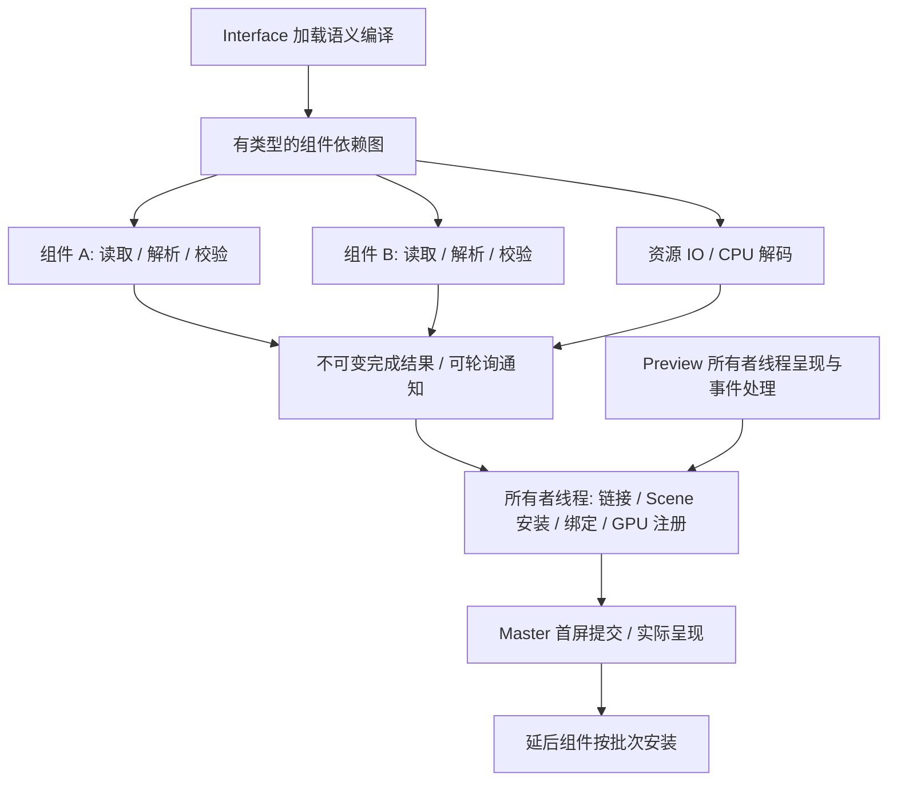

# Preview、Master 与 DSL 组件并行加载

日期：2026-09-27。状态：**第一步已提交 `99101cf`，第二步已提交 `f82ef5d`；
第三步组件图、统一调度与会话预算已实现，验证记录见第 10 节。
分阶段挂载、业务异步准备和真实 demo 的性能对照仍待第四至六步。**
本轮先提交代码规范化（`0aaca73`），再设计下一阶段。现有生产启动链继续以
[统一 Host](APP_HOST_RUNTIME.md)、[待命池](LAUNCHER_WORKER_POOL.md)和
[会话规范](SESSION_LAUNCH_RUNTIME.md)为实现依据。

## 1. 当前实现与最初构想

| 项目 | 当前代码 | 下一阶段目标 |
| --- | --- | --- |
| Preview 优先 | Music 有 Preview；另外四包没有。Host 等实际 presented 后加载 Music 业务 | 轻量 Preview 先显示，并在 Master 准备期间保持事件响应 |
| Preview/Master 分开 | 分开的 DSL 文件、同一个 surface/EGL，替换 Scene | 保持同一窗口，候选 Master 就绪后提交；延后区域逐步安装 |
| Master 准备 | MasterLoadSession 编译加载图，依赖就绪后在共享 TaskScheduler 准备/组合；旧单文件使用同一入口 | 分阶段 Scene 安装与稳定区域挂载 |
| 资源加载 | 尺寸检查与解码迁入共享调度器，执行前预留配额；首屏必需图就绪后安装 | 分阶段 GPU 上传与安装时间预算 |
| 前端/业务解耦 | Host 管理前端，业务 `.so` 仅使用窄 C ABI；二者在同一 PID | 保留接口边界；耗时业务初始化必须异步，不能阻塞前端 |
| 独立后台进程 | 没有单独的业务进程；应用实例之间才是独立进程 | 若需要进程隔离，另行实现业务消息端点与进程生命周期 |
| 预热 | 提前 spawn/exec Host，准备字体、调度器句柄和主题；有任务才创建线程，分配时不再 exec | 优化应用准备关键路径；是否预热 GPU 由分段测量决定 |
| Master 已显示 | 本地 HostUiState 区分具体加载代数的提交与真实 presented；FirstPresented 在 Music 中仍指 Preview | 多组件 critical 首屏与资源/业务的聚合就绪 |

当前 Music 顺序为：

```text
PrepareFrontend → Bind → 同步读取/解析轻量 Preview → Wayland configure
→ EGL/Ganesh 初始化 → Preview 成功像素提交 → 派发 Master 纯 CPU 准备
→ 事件循环继续处理 Preview / 主题 / 控制 / 实际 presented
→ critical Master Prepared 且 Preview 实际 presented → 必需图片就绪
→ 所有者线程安装 critical Master
→ 同步 dlopen/create → BackendReady → 后续 Pump 提交、实际呈现 Master
→ 启用 deferred 纯准备（第四步接入区域挂载）
```

入口为 `prism/host/app_host.cpp` 的 Bind/Pump/StartBusiness，UI 安装为
`prism/runtime/client_application_scene.cpp` 的 InstallScene，业务入口为
`prism/host/module_session.cpp` 的 Start。第一步将原来的完整树转换拆为纯
PrepareComponent 和所有者线程 LinkComponent/InstallScene；图片资源只在链接时申请。
第二步由 LoadSession 派发读取和纯准备；第三步 Host 统一改用 MasterLoadSession +
TaskScheduler。LoadSession 作为单单元适配器也使用同一调度器，已删除其私有线程；
链接、Scene 安装及平台对象仍归所有者线程。

后台纯准备期间 Preview 继续响应；所有者线程的链接、Scene 安装、dlopen/create 仍可能
产生停顿，不能将第二步解释为任意业务加载均不阻塞。BackendReady 仅表示业务通知，
不证明 Master 已提交或呈现。无 Preview 的包同样异步准备，完成后在 Pump 中打开窗口
并加载业务，BackendReady 仍可早于首次 configure。

Preview 的“轻量”指不依赖应用业务模块、数据库、网络、媒体解码器和 Master 资源。
它仍使用统一 SDK、字体、主题、Skia 和 Wayland 呈现链；不是一套无第三方依赖的绘制器。
待命池预热也不等于应用 Master、字形 atlas、GPU 或业务模块已经准备完成。

## 2. 加载单位与线程归属

加载单位是有稳定身份的页面区域/组件，如导航、播放控制、曲库、设置页。
组件内部的小控件一起准备，避免按节点派发任务带来的调度、同步和内存开销。



| 工作 | 所属线程/边界 |
| --- | --- |
| 文件读取、词法/语法解析、静态 schema 校验、依赖验证 | 工作任务，输入与结果归该任务独占 |
| 组件间符号链接 | 不可变值处理；采用声明顺序，与任务完成顺序无关 |
| 图片 IO/CPU 解码 | 工作任务；解码器明确可并行，任务有独立解码状态 |
| ResourceId 分配、资源表状态、live Scene、绑定、输入、布局 | Host/UI 所有者线程 |
| 当前字体 shaping | 所有者线程；现有 FT_Face 会修改字号，不能并行调用同一实例 |
| 当前 EGL/Ganesh、图片 GPU 注册、DisplayList 回放、Wayland | 现有所有者线程；加载任务不持有这些对象 |
| 模块 create/action/tick、现有 Host API | Host 事件线程；耗时工作通过结果队列返回 |

未来如独立渲染线程，应通过已有不可变绘制契约交接。组件加载设计不改变当前
GPU/Wayland 归属，也不要求并发修改 Scene 或递归并行布局。

## 3. DSL 加载声明

下列是**第三步已实现的 DSL v2 加载语义**：支持加载图编译、组件准备与 critical
组合；deferred 的稳定区域挂载按第四步实现，当前只保存准备结果。
沿用通用调用、参数、列表和子节点语法，在独立语义编译器中识别加载声明，
不新增第二套文本 parser，不把加载属性塞进 Skia 或每个控件的绘制属性。

入口 `master.prism` 示例：

```prism
Interface(version: 2, layout: "ui/layout.prism") {
    Binding(name: "playback_icon", type: "string", initial: "play")
    Binding(name: "playback_progress", type: "number", initial: 0)

    Component(id: "navigation", source: "ui/navigation.prism", phase: "critical")
    Component(id: "transport", source: "ui/transport.prism", phase: "critical")
    Component(id: "library", source: "ui/library.prism", phase: "deferred")
}
```

`ui/layout.prism` 示例：

```prism
HStack(spacing: "@content_gap") {
    Slot(component: "navigation", width: 64)
    VStack(spacing: "@content_gap") {
        Slot(component: "transport", height: 160)
        Slot(component: "library", flex: 1) {
            Text("Preparing library", foreground: "@mutedText")
        }
    }
}
```

### 语义约束

- `Interface` 是加载描述，不是视觉节点；layout 是必需的首屏布局单元。
- `Component.id` 在一个 Interface 内唯一；source/layout 路径相对包根，沿用当前
  路径、文件类型和资源根校验。组件文件是普通视觉 DSL，首版不允许递归声明 Interface。
- `phase=critical` 表示首次 Master 所需组件；`deferred` 不阻塞首次 Master。
  v2 首版 critical 组件引用的图片默认必需，达到可绘制状态后才进入首屏提交；deferred
  区域使用 Slot 占位。资源级 optional/fallback 后续单独扩展，不默认为已经支持。
- `after: ["component_id"]` 可声明准备依赖：前置组件到达 Prepared 后才派发后继。
  无真实准备依赖时不填写；视觉位置和相邻关系不构成加载依赖。挂载后继时，其前置组件
  必须已经安装。critical 依赖 deferred、循环、自引用和未知 ID 在派发前拒绝。
- `Slot` 是稳定的挂载位置及加载占位；每个组件恰好对应一个 Slot。尺寸/flex 属于 Slot，
  占位不能触发业务动作，完成后保留父级与其他区域的身份、状态。首版不做重复实例化。
  布局和 painter order 由 Slot 的声明位置决定，不由异步完成顺序决定。
- `Binding` 提前声明跨组件业务状态的类型和初值。现有 `$slot` 名称及 C ABI 保持，
  Host 保存已校验的当前值；未挂载的组件安装时读取最新值。相同 binding 可以被多个
  组件使用，目标属性类型必须兼容；未知或错误类型不能静默接受。
- 线程数、内存和执行时间预算归平台配置；DSL 声明依赖与展示策略，不指定线程号、
  任意函数、动态库、shell 命令或 GPU 操作。
- 首版 deferred 在 critical Master 已呈现后启用；同轮完成结果批量安装，避免每个
  资源/属性单独构建提交。按用户打开页面触发的 `on-demand` 单独扩展，不预先伪造支持。

旧单文件视觉 DSL 编译为一个 critical 单元，进入相同加载、准备和安装管线；
Preview 仍采用受限的单文件视觉 DSL。v2 有明确版本，不把旧 `.prismb` 当成新格式。
旧 runtime 不支持 v2 时明确失败；runtime ABI 1 不自动代表具有该 DSL 能力，发布包
需要依赖支持 v2 的平台版本。业务 C ABI 和启动消息不会因 DSL 版本自动升级。

## 4. 准备结果与所有者线程安装

新增独立值契约，目标归属为 `prism/runtime` 的加载实现及无平台对象的公共头：

- `LoadPlan`：布局单元、组件 ID、源位置、阶段、依赖边、绑定声明和资源策略。
- `PreparedComponent`：不可变的组件模板、符号资源引用、绑定使用、大小统计和诊断。
- `LoadCompletion`：实例、UI 加载 generation、源内容版本、组件 ID、结果或类型化错误。
- `LoadSession`：依赖状态、任务队列、取消、预算、完成通知与安装进度。

Blueprint 含真实 ResourceId，ParseBlueprint 的兼容入口在链接阶段调用资源申请；它不能
直接在线程池中通过绑定现有 Impl/Scene 来编译。纯编译接口产出符号 URI/局部资源键，
由所有者线程链接为真实资源句柄。工作结果不携带 live NodeId、Scene 指针、renderer、
FT_Face、模块实例或借用的源字符串。

同一实例、同一内容版本的重复资源合并为一次准备；实际 ResourceId 与 GPU 资源仍归
该实例，不跨实例共享上下文。主题 token 在安装时使用最新快照，不能把准备期间的旧
主题烘焙进结果。viewport 同样在安装/布局时取当前值。

安装流程：验证 generation/依赖与预算 → 链接资源和绑定 → 构造候选区域 → 校验整体
节点/效果限制 → 提交候选 → 合并 dirty/damage → 请求一次更新。首次 Master 失败保留
Preview；延后区域失败保留其他已安装区域。加载中的既有绑定更新进入 Host 状态表，
不能因为界面尚未挂载而丢失，也不能对每次绑定立即提交半初始化画面。

整体预检涵盖现存区域、待安装批次和当前主题材料展开后的结果。多文件组合的深度、
节点及表面效果上限均以链接后的最终结果为准。取消检查同样应用于 GPU 注册前后，
失败候选释放自己申请的临时资源，不扰动仍在显示的界面。

## 5. 首屏、呈现与业务就绪

```text
Preview 提交 → 开始 Master 纯 CPU 准备
      │                       │
      └→ PreviewPresented     └→ CriticalPrepared + 必需资源可绘制
                  │                    │
                  └────────┬───────────┘
                           ▼
           快速业务 create / 绑定准备 + 候选 Master 安装
                           ▼
                 MasterSubmitted → MasterPresented
                           │                │
                  BackendReady 可独立发生  └→ 启用 deferred
```

Master 纯准备可与 Preview 的呈现等待重叠；派发不能先做大段同步文件解析。
现有“Preview 呈现后才加载应用业务模块”的门槛保留。初始化 create 必须快速返回，
耗时媒体、网络或数据库任务独立异步执行；业务未就绪时 Master 使用明确的可用占位状态。

内部状态区分 PreviewPresented、CriticalPrepared、MasterSubmitted、MasterPresented、
CriticalResourcesReady、BackendReady、DeferredComplete。Prepared 仅证明 CPU 编译结果
可用，不代表图片已解码或 GPU 注册完成；资源状态单独推进，不在 UI 线程阻塞等待。
对外 FirstPresented 仍表示第一次实际呈现，
BackendReady 保持现有业务含义；新增外部状态需同时设计 worker/public 协议版本、
能力与 InstanceState/Dock 消费规则，不能仅追加一个枚举导致旧接收端断开。

MasterPresented 必须由包含该 UI generation/提交标识的 presentation feedback 证明；
discarded、Swap、frame callback、旧 Preview feedback 均不能替代。应用可交互就绪
由 critical Master 的实际呈现与所需业务状态共同判定；延后内容不纳入首屏完成条件。
本地 HostUiState 的 master_presented 只证明指定加载代数确已呈现，不聚合图片必需性
与业务状态；现有 Dock ready 不应解释为严格的 MasterReady。

没有 Preview 的应用也走同一异步管线；首屏等待时继续处理控制与退出，不在 Bind 内
串行加载全部 Master。平台不为每个组件创建独立 Wayland surface 或业务进程。

### 业务执行边界

当前 dlopen 包含动态链接及模块静态构造，create 可执行任意模块代码。把整个
ModuleSession::Start 丢给工作线程会违反现有 Host API 的线程约束，不能作为解决方案。
本阶段保留 `.so` 适配，提供明确的异步结果通知/所有者线程转交；create/action/tick
只做短时状态转移，模块静态构造也不得执行耗时 IO、等待或业务初始化。第二步的响应
保证只覆盖 Master CPU 准备；任意慢 dlopen/静态构造仍会阻塞 Host。快速 create 不会
消除这一问题，进程外 watchdog 只能终止阻塞实例，不能维持它的 UI 响应。第五步必须
验证模块初始化契约；无法满足时需要另行设计可审计的加载适配或独立业务进程。

若最终要求 UI 与业务也分进程，应在同一状态/动作语义下增加独立业务消息端点，定义
启动、绑定、动作、Ready、取消、退出与失败。消息采用 typed 值和明确 wire 编码，
不能传递现有 C ABI 的指针。这是单独的进程隔离实现，不是 `.so` 的另一个称呼；
也不要求把任何业务 UI 树交回 WM。

## 6. 调度、内存、取消与失败

- 使用有界工作池和可轮询完成通知，接入既有 Pump；没有工作时睡眠，不增加固定轮询。
  第三步已迁入图片准备和旧 LoadSession，已删除两者的私有加载线程。
- Pi 首轮从每实例最多 2 个活动准备任务开始，并设置会话级总并发预算。launcher 管理
  实例配额，Host 管理组件依赖；取得配额不得阻塞事件线程。多个应用同时启动时也必须
  验证总 CPU/内存，不能用“每个 Host 只有两线程”代替全系统上限。
  第三步会话默认总活动任务 2、工作与保留结果合计 256 MiB、保留结果上限 192 MiB。
  launcher 持有共享预算句柄，worker 认证后使用；未绑定待命 worker 不运行加载任务。
- critical 优先；在首屏已呈现后调度 deferred，按实例公平分配。任务不能在池内同步
  等待同池的依赖任务；依赖完成由调度器重新判定可派发节点。
- 执行前预留源/AST/结果/解码内存，完成队列有背压。解码预算包括正在执行、等待安装
  和已缓存像素，不能只检查最终缓存；上传预算与已有 GPU cache 单独计量。
- 建议初始图限制为 128 个组件、每文件 1 MiB、合计源码 8 MiB。现有深度 64、节点
  8,192、surface 效果区域 8 等限制需在整个链接结果上累计检查，不能每文件重新获得
  一份额度。第三步已实施这些上限；材质展开后的效果约束仍由当前主题下的 Scene
  校验，第四步补完整候选预检和事务，数值不代表性能实测。
- 所有者线程每轮按任务数量、上传字节及耗时预算取结果；初始建议 CPU 安装预算 2ms。
  必须在单位之间让出事件处理；候选 Scene 构造也要可分段。单个 layout、shaping 或
  GPU 调用仍不能被时间预算抢占，需独立测量；超预算时先拆组件/限制批量，不声称已
  实现节点增量布局或分块 DisplayList 缓存。
- 加载取消增加 UI generation、停止排队和依赖后继，迟到结果只释放；保持结果/资源
  引用活至最后使用结束。关闭先停止任务交付，再完成线程与模块生命周期清理。
  使用可协作取消，不强杀线程；launcher 的进程外退出上限继续有效。
- critical 失败报告启动失败，保留 Preview 到退出；deferred 失败局限于对应 Slot 的
  错误占位/显式重试。类型化错误包含文件、行、组件和阶段，不能用日志文字猜状态。

## 7. 实施顺序与验收

第零步已完成现状核对与规范。第一步已提交 `99101cf`，结果记录在第 8 节；第二步
已提交 `f82ef5d`，记录在第 9 节；第三步记录在第 10 节，第四至六步尚未实现。

| 步骤 | 实现内容 | 必须证明的结果 |
| --- | --- | --- |
| 1. 准备/安装契约 | 纯 DSL 编译、符号资源、PreparedComponent、加载代数；旧单文件归一 | 不引用 live Scene/平台；错误保留旧界面；旧 DSL 含义不变 |
| 2. 异步 Master | LoadSession、完成 FD、Host 状态机、提交身份与内部 MasterPresented | 慢准备时 Preview 仍处理输入/主题/退出；实际呈现识别正确 |
| 3. 组件图与资源调度 | Interface/Component/Slot/Binding、依赖图、有界池与会话预算、迁入图片准备 | 独立任务确实重叠；循环/缺失/错类型拒绝；多 Host 总量有界 |
| 4. 分阶段安装 | critical 事务、deferred 挂载、保留绑定/稳定身份、整体效果与资源约束 | 首屏不等延后区；结果批量提交；迟到、失败与主题切换正确 |
| 5. 业务异步准备 | 快速 create 契约、通用完成通知、结果回到所有者线程、取消与 destroy | 慢业务不阻塞 UI；工作线程不调用现有 Host API；退出无悬挂 |
| 6. 应用与实机测量 | 一个多区域真实 demo，打包与相同场景串行/并行对照，再迁移其余适用包 | 真实 V3D 的 Preview/Master 延迟、响应、峰值内存及失败率可复现 |

第一步拆分纯准备与所有者线程安装，后续工作任务只执行纯准备阶段。
第二步可以先用一个 Master 单元证明可响应加载；第三/四步才引入真正多组件与渐进展示。
生产最终使用一个加载管线；保留单文件输入兼容，不保留第二套同步 Master 启动实现。

### 测量与测试

分开记录请求/分配、公共字体准备、Preview CPU 准备、configure、EGL/Ganesh、Preview
提交/呈现、Master 单元排队/读取/解析/链接、Scene 安装/首次布局、业务 create/Ready、
Master 提交/呈现、deferred 完成。记录 UI 事件处理最大停顿及 p95/p99、输入到呈现、
CPU、PSS/峰值内存、温度/频率、错误与取消回收。

对照相同内容与资源的串行调度（并发 1）和并行调度，而非保留两份实现；同时比较
pool=0 与已预热 Host、单应用和多应用启动。分开报告 critical 首屏与全部内容完成；
不能仅靠推迟内容宣称并行加速，也不保证每个小界面都会提速。

单测通过可控任务屏障证明重叠、依赖顺序、预算背压、失败传播与取消代数，避免用
短 sleep 猜并发。集成覆盖加载期间 resize/主题/输入/关闭、慢业务、discarded 与迟到
feedback、多实例、资源复用及旧单文件行为。真实呈现延迟保留呈现时钟/flags与本地
单调日志时间的区别。所有 fixture、探针与基准继续在 `tests/`，不进入 deb。

新增生产文件遵守 [代码规范](CODING_STYLE.md)：每文件不超过 800 物理行，具名任务、
线程入口与完成处理，typed DTO/错误，阶段间明确空行。已有渲染按需调度、损伤历史和
GPU 呈现门槛继续回归；本阶段不扩展动画、节点增量布局或分块缓存。

## 8. 第一步检查点：实际接口与安装边界（99101cf）

当前接口位于 `runtime/prepared_component.hpp`、`runtime/ui_load.hpp` 和
`sdk/client_application.hpp`：

```cpp
PreparedComponent PrepareComponent(std::string_view source, ComponentSource source_info = {});
Blueprint LinkComponent(const PreparedComponent &, ResolveImage resolver = {});

UiLoadId ClientApplication::BeginUiLoad();
void ClientApplication::CancelUiLoad();
bool ClientApplication::OpenPrepared(UiLoadId, const PreparedComponent &, LoadDiagnostic *);
bool ClientApplication::ReplaceUiPrepared(UiLoadId, const PreparedComponent &, LoadDiagnostic *);
```

命名空间分别为 `prism::runtime` 与 `prism::sdk`，SDK 的诊断参数默认空指针。
Begin/Cancel/OpenPrepared/ReplaceUiPrepared 只在前端所有者线程调用；任务独占源字符串，
只调用纯 PrepareComponent。调用者将令牌与该次准备结果关联，安装前回到同一所有者
线程。SDK 不自行创建准备线程；下一步 LoadSession 才负责派发、完成通知与 Host 接入。

PreparedComponent 持有共享的 const 数据，不借用源字符串；可跨线程交接及复用。
资源为 ImageReference→URI 表中的局部索引，不是 ResourceId；同一次链接中相同 URI
只调用一次 resolver，不同实例分别链接到自己的资源表。主题引用保留名称，安装时
读取最新快照。`ComponentSource` 提供 component_id/source_path/source_version；version
是调用者提供的来源标识，当前未实现自动内容指纹、AOT 或跨实例缓存。

准备阶段限制源码 1 MiB、语法深度 64、展开后节点 8,192，并校验组件、属性、值、
枚举、绑定及显式模糊引用的候选区域上限。材质名称本身不能在无主题的工作任务中
推断是否需要模糊；主题解析后的实际区域限制仍由运行时检查，完整挂载预检在后续
分阶段安装实现。Prepared 也不等于图片解码就绪。

UiLoadId 是非零 owner/generation 纯值，不使用对象地址作为身份。新一轮 Begin 使旧
代数失效，Cancel 使当前代数失效，Close/前端失败同样撤销；代数和 owner 溢出明确
失败、不回绕。UiLoadState 的 Current 是新鲜度检查；SDK 对整份 UI 成功安装另外
记录令牌，拒绝重复安装同代。失败候选可在当前代重试，成功后的 UI 不受取消准备影响。

过期或跨前端结果在资源申请前拒绝。有效候选先链接、构造 Scene、应用当前 viewport
并关联缓存图片，成功后替换 live Scene、重置提交损伤历史并合并请求更新。失败保留
原 Scene、绑定与窗口。安装不在工作线程创建字体、调用 shaping、绘制或提交 Wayland。

这一阶段的事务保护 **live Scene 与提交状态**。链接过程中已申请的图片任务仍由现有
ImageResources 持有，不支持候选失败后的任务取消或资源逐出；资源取消与在途预算
在后续资源调度阶段实现。不能将当前“保留旧 Scene”解释为资源队列也已回滚。

旧 Open/ReplaceUi/ParseBlueprint 仅为同一 Prepare→Link→Install 管线的便捷入口，
不再维护另一套语义转换。该检查点的 Host 显式使用 BeginUiLoad→PrepareComponent→
OpenPrepared/ReplaceUiPrepared，并携带 Preview/Master 来源路径；仍在同一事件线程
同步调用。第一步没有改变 Preview/业务顺序、待命池、C ABI、公开启动消息或生产 deb。

LoadFailure 继承 runtime_error 以兼容旧调用者，诊断同时提供 stage、来源、行和消息。
词法/语法错误使用结构化 CompilerError 转交，不从 what 文本提取行号。Scene/平台
安装错误缺少精确属性位置时使用 line=0，不虚构源码定位。

### 本轮验证结果

2026-09-27，在 Pi 4B ARM64 上完成以下门槛：

| 门槛 | 结果与覆盖 |
| --- | --- |
| GLES 构建与 CTest | 构建成功，41/41 通过；覆盖工作线程纯准备、源码生命周期、展开节点上限、结构化诊断、符号资源链接及加载令牌 |
| 纯准备链接边界 | prepared_component_test 只链接 DSL/schema/syntax 和标准运行库；符号检查未发现 Scene、ClientApplication、Wayland、ImageResources 或 Skia/Ganesh 依赖 |
| 真实 V3D 准备/安装 | 两个前端复用同一准备结果并独立加载图片；旧代、跨实例、取消、重复安装拒绝；主题失败与连接失败可同代重试；失败候选保留现有 Scene |
| 既有 SDK 提交 | GLES/Wayland probe 的 --verify-submission 通过，覆盖提交缓存、局部修复及多前端既有行为 |
| Host 与待命池 | app_host_probe 与 launcher_pool_probe 通过；Preview 呈现顺序、业务生命周期、错误与取消回收保持现有契约 |
| 代码规范 | 201 个生产文件、51 个测试文件检查通过；最大生产文件 715 行，满足 800 行上限 |

验证证据保存在忽略目录 `dist/validation/prism-master-preparation/`：
`ctest-final.log`、`style.log`、`pure-boundary.json`、`native-gates.json`、
`runtime-gates.json` 及对应 probe 日志。测试与 probe 只在 `tests/`，不进入生产 deb。
本轮使用隔离的 headless WM 和真实 V3D；没有重打 deb、替换显示器会话或重启生产服务。
这些结果证明第一步的行为与边界，不作为并行加载提速或 Master 呈现延迟的结论。

复现命令（构建并行度为 2，运行门槛依次执行）：

```sh
cmake --build build-gles --parallel 2
ctest --test-dir build-gles --output-on-failure
python3 tests/probes/prepared_ui_probe.py build-gles --evidence dist/validation/prism-master-preparation
python3 tests/probes/app_host_probe.py build-gles
python3 tests/probes/launcher_pool_probe.py build-gles
python3 tools/check-code-style.py
```

下一步实现 LoadSession、可轮询完成通知和 Host 异步 Master 状态机，并将提交/实际呈现
绑定到具体加载代数。该步先使用一个 Master 单元，证明慢准备期间 Preview 仍响应输入、
主题切换与关闭；组件依赖图和多区域并行在第三步接入。

## 9. 第二步：单单元异步 Master

### 加载接口与工作量边界

`runtime::LoadSession` 接受 `LoadRequest {load, path, source}`，工作线程持有字符串、
来源和取消状态，仅读取文件、调用纯编译器。结果是 `LoadCompletion`：令牌、来源、
optional PreparedComponent/LoadDiagnostic、read_us/prepare_us。结果不借用源码；
安装前由 Host 比较加载令牌。当前 version 仍为来源标签，没有文件内容 hash 或磁盘缓存。

工作线程在首次 Submit 惰性创建；每实例一个活动准备任务，最多两个已接受但未消费的
请求，包含排队、已发布和工作线程等待发布的结果。第三个请求返回 Busy；没有无限队列。
eventfd 使用 NONBLOCK/CLOEXEC，生产与消费在互斥保护下发布/取走结果，通知本身不作为
完成内容。Host 在既有 Pump 中合并该 FD，没有定时探查未来结果。

源码必须是普通文件，打开与读取在工作线程完成；使用非阻塞打开并检查文件类型，拒绝
FIFO/目录、空文件、缺失文件和超过 1 MiB 的源。逐块读取及编译前后检查 stop_token。
当前 parser 内部不被抢占；Cancel 拒绝其迟到结果，Stop 取消、停止交付并 join，析构
最后关闭 FD。
不强杀线程，不承诺慢文件系统 read 或任意自定义编译器能立即中断。

PrepareFunction 是可选的纯 CPU 编译器适配接口；默认唯一实现仍是 PrepareComponent。
HostConfig 的 prepare_component 只转交同一 LoadSession，适配器不得引用 live 前端/
平台对象或借用源文本，并须配合取消。测试使用具名适配器与可控屏障，生产没有 sleep、
延迟环境变量、测试分支或另一条启动链。

当前图片线程仍按已有实现运行；资源取消、执行前内存预留、跨 Host 总并发/预算、
组件依赖调度均属第三步。这一阶段的两请求上限不等于全会话配额或完整内存预算。

### Host 状态与失败生命周期

有 Preview：Bind 同步准备受限的轻量 Preview 并打开窗口；首次成功像素提交的具名
观察者只派发 Master 任务。完成 FD 在派发前已加入等待源，准备可与 Preview 呈现等待
重叠。候选 Prepared 且该 preview_load 实际 presented 后，所有者线程才安装 Master
并调用业务 dlopen/create；主题和 viewport 在安装时读取当前值。

无 Preview：Bind 只排队同一 Master 任务；窗口尚未打开时 Pump 直接 poll 完成 FD 与
调用者控制/退出 FD。完成后用 OpenPrepared 安装，报告 RuntimeReady、启动业务。
BackendReady 仍可早于 configure/FirstPresented，公开启动消息与协议版本保持原含义。

HostUiState/GetUiState 是本地 C++ 观察接口，记录 preview/master 令牌、准备/安装/提交/
呈现状态、读取与准备耗时、Master 提交身份及 typed master_diagnostic。MasterPresented
不是公开 wire 里程碑；没有扩大 InstanceState 或把 Dock ready 改为 strict MasterReady。
启动 10 秒 deadline 覆盖该代 Master 实际 presented 与业务 Ready。

调用者控制/主题/信号 FD 的可读、挂断与错误优先返回外层处理，再安装已完成的 Master；
不由 Host 消费借用 FD。已经持有候选时安装前再次检查调用者事件；纯 POLLOUT 不阻止
安装，避免持续可写通道导致饥饿。内部 LaunchClient 的主题事件由 Host 在安装前消费。

首次 Master 准备/安装失败为启动终态：报告 Failed，Pump 返回 false，旧 Preview 的
Scene 与窗口保留到 Close，worker/launcher 按既有失败生命周期退出。没有新增失败实例
继续运行的协议；deferred 局部错误将在第四步设计。Close 先取消 UI、解除提交观察者，
再停止并 join 加载任务，最后销毁业务与前端；重复 Close 安全。

### 像素提交与实际反馈

平台 PixelSubmissionId 只标识成功像素提交；State、None、失败不推进。presentation-time
feedback 在 Swap 前关联候选提交，成功提交及 SDK 映射确认后才交付反馈。Swap 失败
清理候选；discarded 或 frame callback 不冒充 presented。待反馈表固定 8 项，满时先
让出像素提交、等待反馈，避免静默失去新代首屏证据。

SDK 保存当前与前一安装代的 UiPresentationState，以及固定容量的 submission→load
映射。收到旧 Preview feedback 只更新旧代；已淘汰代无法标记当前 Master。当前代首屏
被 discarded 时通过同一按需提交路径重试，不让旧反馈撤销新提交的 frame callback。
Close/终态失败清理追踪。旧 PresentedCount/PresentationCount 含义保持。

这一步证明 Master **纯准备**期间的响应；链接、Scene 构造、字体 shaping、GPU 注册和
dlopen/create 仍可占用事件线程。图片必需性、业务与 critical 的聚合就绪尚未实现。

### 本轮验证

2026-09-27，在 Pi 4B ARM64 完成统一 GLES 构建、最终测试增量确认及以下门槛：

| 门槛 | 结果与范围 |
| --- | --- |
| CTest | 43/43 通过；新增 LoadSession 屏障/生命周期和 UiPresentationTracker 代数/反馈纯状态测试 |
| 真实 Wayland 协议 | withheld/乱序反馈按 ID 归属；旧 discard 不退休新 frame callback；8 槽背压及释放后自动继续；None/State/prepare 或 Swap 失败不发布新的成功 ID |
| 真实 V3D 异步 Host | 9 场景通过：有/无 Preview 的可控准备、默认编译器 1,000 个静态 Text、同时就绪控制优先、Semantic/Syntax/Read 失败、两种 Close 取消 |
| V3D SDK 准备/提交 | 两实例共享准备结果并分别链接图片；新安装代不使用旧全局计数证明呈现；提交观察者只在映射确认后触发；状态变更不产生 UI 像素 ID；连接失败回滚、同代重试和关闭清理 |
| 既有 SDK 渲染 | --verify-submission 通过，保留按需提交、局部修复、资源和多实例行为 |
| 生产 Host/待命池 | app_host_probe/launcher_pool_probe 通过；Preview 与业务顺序、无 Preview 的 Ready 顺序、ABI/崩溃/超时、取消和会话回收维持原协议 |
| 依赖与规范 | load_session_test 符号检查无 Scene、ClientApplication、Wayland、ImageResources 或 Skia/Ganesh；205 个生产文件、55 个测试文件规范通过，最大生产文件 715 行 |

Host 屏障测试将工作任务确定保持在纯准备阶段，证明 Preview 的实际反馈、主题安装、
借用控制 FD 和退出回收继续工作。控制优先场景使候选与调用者 FD 同时就绪，并在外层
处理主题后才加入 Master 必需 token，成功安装证明读取最新快照。成功安装后使用真实
注册的业务请求/订阅与主题广播，逐项等待新提交的真实反馈；未放宽生产消息过滤。

本轮证据目录为 `dist/validation/prism-master-async/`：`build-verified.log`、`ctest.log`、
`style.log`、`pure-boundary.json`、`native-gates.json`、`async-master.log`、
`prepared-ui/native-gates.json`、`runtime-gates.json` 和对应日志。初轮业务消息测试未先
注册请求/订阅，被 SDK 正确忽略；仅修正测试后通过，初始证据保留在 `initial-native/`。

复现命令（逐项运行，构建并行度 2）：

```sh
cmake --build build-gles --parallel 2
ctest --test-dir build-gles --output-on-failure
python3 tests/probes/async_master_probe.py build-gles --evidence dist/validation/prism-master-async
python3 tests/probes/prepared_ui_probe.py build-gles --evidence dist/validation/prism-master-async/prepared-ui
python3 tests/probes/app_host_probe.py build-gles
python3 tests/probes/launcher_pool_probe.py build-gles
python3 tools/check-code-style.py
```

测试均在隔离的 headless WM 使用真实 V3D，没有重新打 deb、替换显示器会话或重启
生产服务。屏障是正确性验证，read_us/prepare_us 包含测试适配器的等待，不能用来报告
启动提速或输入延迟。实际鼠标/键盘延迟、安装/shaping 的最大停顿、总 CPU/峰值内存
及串行/多组件调度对照仍在后续实机测量阶段；不以这轮功能门槛替代性能结论。

下一步是 Interface/Component/Slot/Binding 的有类型加载图与有界资源调度：先定义
组合单位、依赖及总限制，再接入每实例和会话预算；图片准备迁入统一调度。分阶段
critical/deferred 安装和业务异步准备按第四、五步继续。


## 10. 第三步：组件图、共享工作池与会话预算

第二步在本轮开始提交为 `f82ef5d`。本轮沿用同一启动入口接入以下契约，旧单文件
不需要改 DSL；Interface v2 采用第 3 节语法。所有测试/fixture/probe 留在 tests。

### 已实现边界

- `CompileLoadPlan` 复用 syntax parser，把 Interface/Binding/Component 编译成 typed
  LoadPlan。拒绝重复/未知字段、未知组件、重复依赖、自引用、循环、critical 依赖 deferred、
  声明/初值/目标类型错误。路径先做词法校验；工作任务 canonical + regular-file 校验。
- `PrepareLayout` 独立接受 Slot；每个声明必须恰好一个 Slot。Slot 保留 Box 几何，
  占位不能包含动作或交互控件。`ComposeCritical` 按布局位置组合，完成顺序不改变绘制
  顺序。普通视觉 PrepareComponent 仍不接受加载声明。
- `MasterLoadSession` 在事件线程协调依赖；入口只读共享 lexer 的根标识符，legacy
  经纯准备适配器后直接由 IR 构造 plan，避免重复解析，也保持原有准备/诊断时序。
  文件读取、纯准备、critical 组合都是工作
  任务。没有任务在池内等待依赖。缺少 Preview 的包使用同一入口。
- Preview 成功像素提交后派发；其真实 presented 后才安装候选。critical 图片和占位
  中可见图片统一预载，Ready 后才进入 Master 安装；读取/纯编译错误保留源文件、行、组件和阶段，资源失败归属当前 Master 的资源阶段；
  候选安装前的失败保留 Preview 到退出。完整安装预检/事务仍在第四步。BackendReady 与 MasterPresented 仍独立。
- Master 实际反馈后才启用 deferred 准备。准备结果和局部诊断保存在加载会话，失败
  后继明确得到依赖错误；本轮不挂载 deferred，不把整棵 Scene 替换称作增量安装。
- critical 完成已交付后取消加载，仍会终止 deferred 派发；迟到结果丢弃，不重复交付
  critical 完成，也不因后来的 presentation feedback 重新启动已取消任务。
- Host 保存声明的当前 Binding 值，按类型验证；已挂载目标投影到 Scene，尚未挂载
  目标保存最新值。第四步在实际挂载时使用该值表，并补稳定身份与安装事务。

### 调度与预算实现

每个 Host 的图准备和 ImageResources 注入同一个 TaskScheduler：最多 2 工作线程，
首次提交才创建；全部排队、运行、未消费完成合计最多 128。消费者有独立 TaskChannel，
每个 channel 默认最多 2 活动任务；旧 LoadSession 适配器仍保留 2 未消费/1 活动的接口，
其 FD 只通知实际完成，关闭容量进度通知以保留原有契约。
完成 FD 表示结果或容量进度，TakeCompletion 可以为空。队列 Busy 保留有界描述重试，
容量释放唤醒消费者，不使用固定轮询；Closed/Invalid/预算失败明确返回错误。

launcher 创建共享 memfd 预算，通过 `posix_spawn` 的 FD4 交给最终 Host（私有控制 FD3
不变，原描述符先复制到 >=10 防碰撞）。worker 在父进程凭据认证后校验句柄的版本、
大小、seal、creator 后 Attach。独立 Host 使用同一预算类的本地 Create。公开与私有
启动消息编码不增加配额消息，也不让 WM 接触 DSL、线程池或组件树。

预算区使用 process-shared robust mutex 和 Linux futex sequence 等待。停止信号推进
序列并唤醒，回收只在 waitpid 确认退出后执行 DropProcess。崩溃持锁时从固定租约表
重建计数；不用不能完整保证任意 SIGKILL 恢复的共享 condition_variable。最多 128
等待租约、2,048 全部租约，以 PID/slot/serial 识别，防 ABA 和 fork 子进程误释放父租约。
同优先级按 owner 最近授权次序公平，owner 内 FIFO；关键组件 > 图片资源 > deferred。
这是非抢占调度，已进入预算等待/执行的任务仍可能使后到关键任务短暂等待。

工作线程在读取/编译/解码前 Acquire，事件线程不等待任务配额。Finish 释放活动槽并
缩减为实际结果的容量估计；PreparedComponent/PreparedLayout、完成结果和缓存通过
共享引用保留租约，最后使用者释放才归还。保留结果不能侵占 64 MiB 工作余量；没有
活动任务且保留结果已使请求无法执行时直接报预算压力，避免无期限等待。参数入口为
`--load-active-limit`、`--load-memory-mib`、`--load-working-headroom-mib`。

纯 DSL 任务预留 32 MiB，单文件 1 MiB，全图源码预检及实际累计均限制 8 MiB；严格
词法 token、语法 value/argument 各最多 65,536，最终组合最多 8,192 节点/深度 64/
8 显式潜在模糊区域。材质是否生成区域仍由当前主题安装时判断。声明初值也按每个
已准备目标的 PropertySpec 验证，不在编译阶段读取主题或字体/GPU。

PNG 先用 8 KiB 任务检查固定头和常规文件：编码文件最多 16 MiB，尺寸最多 4096×4096，
RGBA 最多 64 MiB。解码先预留 RGBA + 16 MiB 解码暂存估计，再进入 libpng；后端再次
核对尺寸和预留额度。实例已缓存/已排程像素合计最多 128 MiB，等待派发图片描述最多
128，缓存表最多 4,096。相同 URI 同实例合并；Skia 的生产 RegisterImage 持有不可变
像素与其租约，使用 SkData keeper，不再复制一整份 RGBA。候选取消、替换和退出注销
未使用的图像，迟到完成只释放；ResourceId/GPU 对象仍在所有者线程。

预算覆盖上述工作与 CPU 准备/图像数据，以自有容器容量及解码暂存估计计账，**不是
进程 RSS 的硬上限**。分配器开销、Scene 安装副本、字体 shaping、GPU/cache、业务内存
单独计量；当前工作池不自动计量第三方适配器任意闭包/任意额外分配。旧无尺寸检查的
Decoder 仅作为通用适配接口，执行前按其最大额度保守预留，生产 PNG 始终使用检查。
包文件仍遵守实例运行期不可变契约，修改资源需要新包/新加载；读取边界还检查打开后
的 FD 实际路径和读取前后 size/mtime/ctime。Host 的 read_us/prepare_us 是任务阶段
时长的累加，含屏障等待，不等于并行首屏的实际历时或 CPU 时间。

### 下一步

第四步将接入 critical 完整候选预检与事务、deferred 稳定区域挂载、当前值重新投影，
以及每轮安装/上传预算。尚未实现节点增量布局、分块缓存、业务异步 create 或独立业务
进程；本轮也不重新打包、替换显示器会话或用可控屏障报告启动提速。

### 本轮验证记录

2026-09-27，在 Pi 4B ARM64 上完成以下验证：

- 全量构建及最终取消边界的增量构建通过；完整 CTest **48/48**，最终运行 14.09 秒。
  新增组件图、图加载会话、共享调度、进程共享预算和图片调度五个测试。可控屏障证明
  独立组件重叠、依赖顺序、真实反馈后启用 deferred；覆盖已交付 critical 后取消、
  容量释放唤醒、跨进程活动总量、保留租约、持锁进程崩溃恢复及最后使用者释放。
- 真实 Host/V3D 启动验证 **12/12**：原有九个 Preview/Master/失败/取消场景，加上
  多组件 critical、依赖文件消失及必需图片失败。组件完成期间的控制优先级、Preview
  保留、声明绑定验证、真实 Master 呈现、deferred 仅准备和迟到结果边界通过。
- prepared-ui 与 SDK submission 两个真实 V3D 门槛通过；Host 的单 surface/就绪时序、
  ABI 失败与正常退出回归通过；预热池、FD4 预算继承、取消、崩溃回收、会话退出及
  launcher 异常死亡后的重新启动回归通过。
- 纯加载/组件图/语义编译符号检查通过；WM、launcher 未引用客户端前端、组件图或
  调度器，动态依赖未见 Qt。格式、goto 和行数门槛通过：222 个生产文件、60 个测试
  文件，最大生产文件 `prism/host/app_host.cpp` 为 754 行；`git diff --check` 通过。

```sh
cmake --build build-gles --parallel 2
ctest --test-dir build-gles --output-on-failure
python3 tests/probes/async_master_probe.py build-gles --evidence dist/validation/prism-master-graph --mode all
python3 tests/probes/prepared_ui_probe.py build-gles --evidence dist/validation/prism-master-graph/prepared-ui
python3 tests/probes/app_host_probe.py build-gles
python3 tests/probes/launcher_pool_probe.py build-gles
python3 tools/check-code-style.py
git diff --check
```

证据位于 `dist/validation/prism-master-graph/`：最终记录为
`build-final-cancel.log`、`ctest-final.log`、`native-gates.json`、`runtime-gates.json`、
`prepared-ui/native-gates.json`、`pure-boundary.json` 和 `style.log`。首次 native 验证发现
legacy 入口提前解析改变适配器时序，已修复并重跑；初始失败保留在 `initial-native/`。
旧 LoadSession 的容量通知兼容差异也已修复并由最终完整测试验证。

以上是隔离 headless 会话的正确性回归，测试结束回收 WM 和子进程；未重新打包、替换
已安装桌面或重启生产服务。并行屏障不构成启动性能结论，实际首屏、最大停顿和内存
对照仍按第六步进行。
