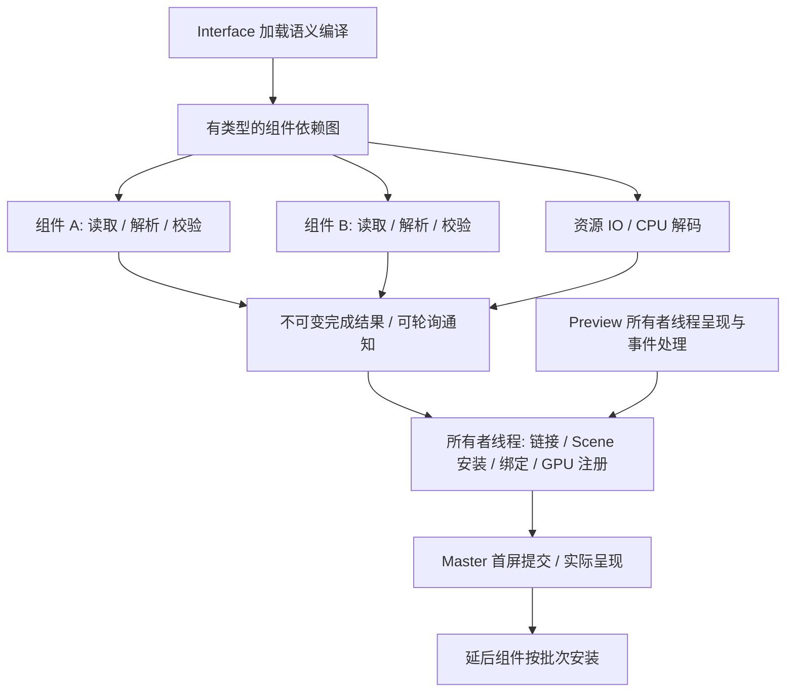

# Preview、Master 与 DSL 组件并行加载

日期：2026-09-27。状态：**第一步准备/安装边界已实现并通过验证；异步调度与
多组件加载图尚未实现。**
本轮先提交代码规范化（`0aaca73`），再设计下一阶段。现有生产启动链继续以
[统一 Host](APP_HOST_RUNTIME.md)、[待命池](LAUNCHER_WORKER_POOL.md)和
[会话规范](SESSION_LAUNCH_RUNTIME.md)为实现依据。

## 1. 当前实现与最初构想

| 项目 | 当前代码 | 下一阶段目标 |
| --- | --- | --- |
| Preview 优先 | Music 有 Preview；另外四包没有。Host 等实际 presented 后加载 Music 业务 | 轻量 Preview 先显示，并在 Master 准备期间保持事件响应 |
| Preview/Master 分开 | 分开的 DSL 文件、同一个 surface/EGL，替换 Scene | 保持同一窗口，候选 Master 就绪后提交；延后区域逐步安装 |
| Master 准备 | 读取、解析、Blueprint/Scene 构造在 Host 线程同步执行 | 独立组件在有界工作池准备，所有者线程安装结果 |
| 资源加载 | 图片在一个线程解码，完成队列最多一份；申请/注册在 Host 线程 | 资源按依赖与优先级准备，执行前预留内存预算 |
| 前端/业务解耦 | Host 管理前端，业务 `.so` 仅使用窄 C ABI；二者在同一 PID | 保留接口边界；耗时业务初始化必须异步，不能阻塞前端 |
| 独立后台进程 | 没有单独的业务进程；应用实例之间才是独立进程 | 若需要进程隔离，另行实现业务消息端点与进程生命周期 |
| 预热 | 提前 spawn/exec Host，准备字体、资源线程和主题；分配时不再 exec | 优化应用准备关键路径；是否预热 GPU 由分段测量决定 |
| Master 已显示 | 没有专属呈现里程碑；FirstPresented 在 Music 中指 Preview | 标识具体 UI 代数的 Master 提交与实际呈现 |

当前 Music 顺序为：

```text
PrepareFrontend → Bind → 同步读取/解析 Preview → Wayland configure
→ EGL/Ganesh 初始化 → Preview 提交 → Preview 实际 presented
→ 同步读取/解析 Master → ReplaceUi → 同步 dlopen/create → BackendReady
→ 后续 Pump 提交、呈现 Master
```

入口为 `prism/host/app_host.cpp` 的 Bind/Pump/StartBusiness，UI 安装为
`prism/runtime/client_application_scene.cpp` 的 InstallScene，业务入口为
`prism/host/module_session.cpp` 的 Start。第一步将原来的完整树转换拆为纯
PrepareComponent 和所有者线程 LinkComponent/InstallScene；图片资源只在链接时申请。
Host 当前仍在事件线程同步完成这些阶段，尚未派发后台准备任务。

因此，屏幕上保留 Preview 不等于前端继续响应；同步解析或 create 期间事件循环会停顿。
现有 BackendReady 仅表示业务通知，不证明 Master 已提交或呈现。无 Preview 的包在
Bind 内加载业务，BackendReady 可以早于首次 configure。

Preview 的“轻量”指不依赖应用业务模块、数据库、网络、媒体解码器和 Master 资源。
它仍使用统一 SDK、字体、主题、Skia 和 Wayland 呈现链；不是一套无第三方依赖的绘制器。
待命池预热也不等于应用 Master、字形 atlas、GPU 或业务模块已经准备完成。

## 2. 加载单位与线程归属

加载单位是有稳定身份的页面区域/组件，如导航、播放控制、曲库、设置页。
组件内部的小控件一起准备，避免按节点派发任务带来的调度、同步和内存开销。



| 工作 | 所属线程/边界 |
| --- | --- |
| 文件读取、词法/语法解析、静态 schema 校验、依赖验证 | 工作任务，输入与结果归该任务独占 |
| 组件间符号链接 | 不可变值处理；采用声明顺序，与任务完成顺序无关 |
| 图片 IO/CPU 解码 | 工作任务；解码器明确可并行，任务有独立解码状态 |
| ResourceId 分配、资源表状态、live Scene、绑定、输入、布局 | Host/UI 所有者线程 |
| 当前字体 shaping | 所有者线程；现有 FT_Face 会修改字号，不能并行调用同一实例 |
| 当前 EGL/Ganesh、图片 GPU 注册、DisplayList 回放、Wayland | 现有所有者线程；加载任务不持有这些对象 |
| 模块 create/action/tick、现有 Host API | Host 事件线程；耗时工作通过结果队列返回 |

未来如独立渲染线程，应通过已有不可变绘制契约交接。组件加载设计不改变当前
GPU/Wayland 归属，也不要求并发修改 Scene 或递归并行布局。

## 3. DSL 加载声明

下列是**待实现的 DSL v2 加载语义**，当前 parser/frontend 尚不能执行该接口。
沿用通用调用、参数、列表和子节点语法，在独立语义编译器中识别加载声明，
不新增第二套文本 parser，不把加载属性塞进 Skia 或每个控件的绘制属性。

入口 `master.prism` 示例：

```prism
Interface(version: 2, layout: "ui/layout.prism") {
    Binding(name: "playback_icon", type: "string", initial: "play")
    Binding(name: "playback_progress", type: "number", initial: 0)

    Component(id: "navigation", source: "ui/navigation.prism", phase: "critical")
    Component(id: "transport", source: "ui/transport.prism", phase: "critical")
    Component(id: "library", source: "ui/library.prism", phase: "deferred")
}
```

`ui/layout.prism` 示例：

```prism
HStack(spacing: "@content_gap") {
    Slot(component: "navigation", width: 64)
    VStack(spacing: "@content_gap") {
        Slot(component: "transport", height: 160)
        Slot(component: "library", flex: 1) {
            Text("Preparing library", foreground: "@mutedText")
        }
    }
}
```

### 语义约束

- `Interface` 是加载描述，不是视觉节点；layout 是必需的首屏布局单元。
- `Component.id` 在一个 Interface 内唯一；source/layout 路径相对包根，沿用当前
  路径、文件类型和资源根校验。组件文件是普通视觉 DSL，首版不允许递归声明 Interface。
- `phase=critical` 表示首次 Master 所需组件；`deferred` 不阻塞首次 Master。
  v2 首版 critical 组件引用的图片默认必需，达到可绘制状态后才进入首屏提交；deferred
  区域使用 Slot 占位。资源级 optional/fallback 后续单独扩展，不默认为已经支持。
- `after: ["component_id"]` 可声明准备依赖：前置组件到达 Prepared 后才派发后继。
  无真实准备依赖时不填写；视觉位置和相邻关系不构成加载依赖。挂载后继时，其前置组件
  必须已经安装。critical 依赖 deferred、循环、自引用和未知 ID 在派发前拒绝。
- `Slot` 是稳定的挂载位置及加载占位；每个组件恰好对应一个 Slot。尺寸/flex 属于 Slot，
  占位不能触发业务动作，完成后保留父级与其他区域的身份、状态。首版不做重复实例化。
  布局和 painter order 由 Slot 的声明位置决定，不由异步完成顺序决定。
- `Binding` 提前声明跨组件业务状态的类型和初值。现有 `$slot` 名称及 C ABI 保持，
  Host 保存已校验的当前值；未挂载的组件安装时读取最新值。相同 binding 可以被多个
  组件使用，目标属性类型必须兼容；未知或错误类型不能静默接受。
- 线程数、内存和执行时间预算归平台配置；DSL 声明依赖与展示策略，不指定线程号、
  任意函数、动态库、shell 命令或 GPU 操作。
- 首版 deferred 在 critical Master 已呈现后启用；同轮完成结果批量安装，避免每个
  资源/属性单独构建提交。按用户打开页面触发的 `on-demand` 单独扩展，不预先伪造支持。

旧单文件视觉 DSL 编译为一个 critical 单元，进入相同加载、准备和安装管线；
Preview 仍采用受限的单文件视觉 DSL。v2 有明确版本，不把旧 `.prismb` 当成新格式。
旧 runtime 不支持 v2 时明确失败；runtime ABI 1 不自动代表具有该 DSL 能力，发布包
需要依赖支持 v2 的平台版本。业务 C ABI 和启动消息不会因 DSL 版本自动升级。

## 4. 准备结果与所有者线程安装

新增独立值契约，目标归属为 `prism/runtime` 的加载实现及无平台对象的公共头：

- `LoadPlan`：布局单元、组件 ID、源位置、阶段、依赖边、绑定声明和资源策略。
- `PreparedComponent`：不可变的组件模板、符号资源引用、绑定使用、大小统计和诊断。
- `LoadCompletion`：实例、UI 加载 generation、源内容版本、组件 ID、结果或类型化错误。
- `LoadSession`：依赖状态、任务队列、取消、预算、完成通知与安装进度。

现有 Blueprint 含真实 ResourceId，且 ParseBlueprint 调用资源申请；它不能直接在线程池
中通过绑定现有 Impl/Scene 来编译。先拆出纯编译接口，产出符号 URI/局部资源键，
由所有者线程链接为真实资源句柄。工作结果不携带 live NodeId、Scene 指针、renderer、
FT_Face、模块实例或借用的源字符串。

同一实例、同一内容版本的重复资源合并为一次准备；实际 ResourceId 与 GPU 资源仍归
该实例，不跨实例共享上下文。主题 token 在安装时使用最新快照，不能把准备期间的旧
主题烘焙进结果。viewport 同样在安装/布局时取当前值。

安装流程：验证 generation/依赖与预算 → 链接资源和绑定 → 构造候选区域 → 校验整体
节点/效果限制 → 提交候选 → 合并 dirty/damage → 请求一次更新。首次 Master 失败保留
Preview；延后区域失败保留其他已安装区域。加载中的既有绑定更新进入 Host 状态表，
不能因为界面尚未挂载而丢失，也不能对每次绑定立即提交半初始化画面。

整体预检涵盖现存区域、待安装批次和当前主题材料展开后的结果。多文件组合的深度、
节点及表面效果上限均以链接后的最终结果为准。取消检查同样应用于 GPU 注册前后，
失败候选释放自己申请的临时资源，不扰动仍在显示的界面。

## 5. 首屏、呈现与业务就绪

```text
Preview 提交 → 开始 Master 纯 CPU 准备
      │                       │
      └→ PreviewPresented     └→ CriticalPrepared + 必需资源可绘制
                  │                    │
                  └────────┬───────────┘
                           ▼
           快速业务 create / 绑定准备 + 候选 Master 安装
                           ▼
                 MasterSubmitted → MasterPresented
                           │                │
                  BackendReady 可独立发生  └→ 启用 deferred
```

Master 纯准备可与 Preview 的呈现等待重叠；派发不能先做大段同步文件解析。
现有“Preview 呈现后才加载应用业务模块”的门槛保留。初始化 create 必须快速返回，
耗时媒体、网络或数据库任务独立异步执行；业务未就绪时 Master 使用明确的可用占位状态。

内部状态区分 PreviewPresented、CriticalPrepared、MasterSubmitted、MasterPresented、
CriticalResourcesReady、BackendReady、DeferredComplete。Prepared 仅证明 CPU 编译结果
可用，不代表图片已解码或 GPU 注册完成；资源状态单独推进，不在 UI 线程阻塞等待。
对外 FirstPresented 仍表示第一次实际呈现，
BackendReady 保持现有业务含义；新增外部状态需同时设计 worker/public 协议版本、
能力与 InstanceState/Dock 消费规则，不能仅追加一个枚举导致旧接收端断开。

MasterPresented 必须由包含该 UI generation/提交标识的 presentation feedback 证明；
discarded、Swap、frame callback、旧 Preview feedback 均不能替代。应用可交互就绪
由 critical Master 的实际呈现与所需业务状态共同判定；延后内容不纳入首屏完成条件。
目前尚无此内部聚合就绪接口，现有 Dock ready 不应解释为严格的 MasterReady。

没有 Preview 的应用也走同一异步管线；首屏等待时继续处理控制与退出，不在 Bind 内
串行加载全部 Master。平台不为每个组件创建独立 Wayland surface 或业务进程。

### 业务执行边界

当前 dlopen 包含动态链接及模块静态构造，create 可执行任意模块代码。把整个
ModuleSession::Start 丢给工作线程会违反现有 Host API 的线程约束，不能作为解决方案。
本阶段保留 `.so` 适配，提供明确的异步结果通知/所有者线程转交；create/action/tick
只做短时状态转移，模块静态构造也不得执行耗时 IO、等待或业务初始化。第二步的响应
保证只覆盖 Master CPU 准备；任意慢 dlopen/静态构造仍会阻塞 Host。快速 create 不会
消除这一问题，进程外 watchdog 只能终止阻塞实例，不能维持它的 UI 响应。第五步必须
验证模块初始化契约；无法满足时需要另行设计可审计的加载适配或独立业务进程。

若最终要求 UI 与业务也分进程，应在同一状态/动作语义下增加独立业务消息端点，定义
启动、绑定、动作、Ready、取消、退出与失败。消息采用 typed 值和明确 wire 编码，
不能传递现有 C ABI 的指针。这是单独的进程隔离实现，不是 `.so` 的另一个称呼；
也不要求把任何业务 UI 树交回 WM。

## 6. 调度、内存、取消与失败

- 使用有界工作池和可轮询完成通知，接入既有 Pump；没有工作时睡眠，不增加固定轮询。
  当前单图片线程在资源阶段迁入这一调度器，不长期保留两套互不受控的加载队列。
- Pi 首轮从每实例最多 2 个活动准备任务开始，并设置会话级总并发预算。launcher 管理
  实例配额，Host 管理组件依赖；取得配额不得阻塞事件线程。多个应用同时启动时也必须
  验证总 CPU/内存，不能用“每个 Host 只有两线程”代替全系统上限。
  会话总活动任务可先从 2 开始测量，配额租约在实例取消/退出时回收；此调度协议与
  参数都是待实现设计，未绑定待命 worker 不运行应用加载任务。
- critical 优先；在首屏已呈现后调度 deferred，按实例公平分配。任务不能在池内同步
  等待同池的依赖任务；依赖完成由调度器重新判定可派发节点。
- 执行前预留源/AST/结果/解码内存，完成队列有背压。解码预算包括正在执行、等待安装
  和已缓存像素，不能只检查最终缓存；上传预算与已有 GPU cache 单独计量。
- 建议初始图限制为 128 个组件、每文件 1 MiB、合计源码 8 MiB。现有深度 64、节点
  8,192、surface 效果区域 8 等限制需在整个链接结果上累计检查，不能每文件重新获得
  一份额度。数值是首版候选上限，实施时写入契约与测试，不是当前新增行为或性能实测。
- 所有者线程每轮按任务数量、上传字节及耗时预算取结果；初始建议 CPU 安装预算 2ms。
  必须在单位之间让出事件处理；候选 Scene 构造也要可分段。单个 layout、shaping 或
  GPU 调用仍不能被时间预算抢占，需独立测量；超预算时先拆组件/限制批量，不声称已
  实现节点增量布局或分块 DisplayList 缓存。
- 加载取消增加 UI generation、停止排队和依赖后继，迟到结果只释放；保持结果/资源
  引用活至最后使用结束。关闭先停止任务交付，再完成线程与模块生命周期清理。
  使用可协作取消，不强杀线程；launcher 的进程外退出上限继续有效。
- critical 失败报告启动失败，保留 Preview 到退出；deferred 失败局限于对应 Slot 的
  错误占位/显式重试。类型化错误包含文件、行、组件和阶段，不能用日志文字猜状态。

## 7. 实施顺序与验收

第零步已完成现状核对与规范。第一步已实现并验证，结果记录在第 8 节；第二至六步
仍为待实现，不能据此将当前 Master 描述为异步或并行加载。

| 步骤 | 实现内容 | 必须证明的结果 |
| --- | --- | --- |
| 1. 准备/安装契约 | 纯 DSL 编译、符号资源、PreparedComponent、加载代数；旧单文件归一 | 不引用 live Scene/平台；错误保留旧界面；旧 DSL 含义不变 |
| 2. 异步 Master | LoadSession、完成 FD、Host 状态机、提交身份与内部 MasterPresented | 慢准备时 Preview 仍处理输入/主题/退出；实际呈现识别正确 |
| 3. 组件图与资源调度 | Interface/Component/Slot/Binding、依赖图、有界池与会话预算、迁入图片准备 | 独立任务确实重叠；循环/缺失/错类型拒绝；多 Host 总量有界 |
| 4. 分阶段安装 | critical 事务、deferred 挂载、保留绑定/稳定身份、整体效果与资源约束 | 首屏不等延后区；结果批量提交；迟到、失败与主题切换正确 |
| 5. 业务异步准备 | 快速 create 契约、通用完成通知、结果回到所有者线程、取消与 destroy | 慢业务不阻塞 UI；工作线程不调用现有 Host API；退出无悬挂 |
| 6. 应用与实机测量 | 一个多区域真实 demo，打包与相同场景串行/并行对照，再迁移其余适用包 | 真实 V3D 的 Preview/Master 延迟、响应、峰值内存及失败率可复现 |

第一步拆分纯准备与所有者线程安装，后续工作任务只执行纯准备阶段。
第二步可以先用一个 Master 单元证明可响应加载；第三/四步才引入真正多组件与渐进展示。
生产最终使用一个加载管线；保留单文件输入兼容，不保留第二套同步 Master 启动实现。

### 测量与测试

分开记录请求/分配、公共字体准备、Preview CPU 准备、configure、EGL/Ganesh、Preview
提交/呈现、Master 单元排队/读取/解析/链接、Scene 安装/首次布局、业务 create/Ready、
Master 提交/呈现、deferred 完成。记录 UI 事件处理最大停顿及 p95/p99、输入到呈现、
CPU、PSS/峰值内存、温度/频率、错误与取消回收。

对照相同内容与资源的串行调度（并发 1）和并行调度，而非保留两份实现；同时比较
pool=0 与已预热 Host、单应用和多应用启动。分开报告 critical 首屏与全部内容完成；
不能仅靠推迟内容宣称并行加速，也不保证每个小界面都会提速。

单测通过可控任务屏障证明重叠、依赖顺序、预算背压、失败传播与取消代数，避免用
短 sleep 猜并发。集成覆盖加载期间 resize/主题/输入/关闭、慢业务、discarded 与迟到
feedback、多实例、资源复用及旧单文件行为。真实呈现延迟保留呈现时钟/flags与本地
单调日志时间的区别。所有 fixture、探针与基准继续在 `tests/`，不进入 deb。

新增生产文件遵守 [代码规范](CODING_STYLE.md)：每文件不超过 800 物理行，具名任务、
线程入口与完成处理，typed DTO/错误，阶段间明确空行。已有渲染按需调度、损伤历史和
GPU 呈现门槛继续回归；本阶段不扩展动画、节点增量布局或分块缓存。

## 8. 第一步：实际接口与安装边界

当前接口位于 `runtime/prepared_component.hpp`、`runtime/ui_load.hpp` 和
`sdk/client_application.hpp`：

```cpp
PreparedComponent PrepareComponent(std::string_view source, ComponentSource source_info = {});
Blueprint LinkComponent(const PreparedComponent &, ResolveImage resolver = {});

UiLoadId ClientApplication::BeginUiLoad();
void ClientApplication::CancelUiLoad();
bool ClientApplication::OpenPrepared(UiLoadId, const PreparedComponent &, LoadDiagnostic *);
bool ClientApplication::ReplaceUiPrepared(UiLoadId, const PreparedComponent &, LoadDiagnostic *);
```

命名空间分别为 `prism::runtime` 与 `prism::sdk`，SDK 的诊断参数默认空指针。
Begin/Cancel/OpenPrepared/ReplaceUiPrepared 只在前端所有者线程调用；任务独占源字符串，
只调用纯 PrepareComponent。调用者将令牌与该次准备结果关联，安装前回到同一所有者
线程。SDK 不自行创建准备线程；下一步 LoadSession 才负责派发、完成通知与 Host 接入。

PreparedComponent 持有共享的 const 数据，不借用源字符串；可跨线程交接及复用。
资源为 ImageReference→URI 表中的局部索引，不是 ResourceId；同一次链接中相同 URI
只调用一次 resolver，不同实例分别链接到自己的资源表。主题引用保留名称，安装时
读取最新快照。`ComponentSource` 提供 component_id/source_path/source_version；version
是调用者提供的来源标识，当前未实现自动内容指纹、AOT 或跨实例缓存。

准备阶段限制源码 1 MiB、语法深度 64、展开后节点 8,192，并校验组件、属性、值、
枚举、绑定及显式模糊引用的候选区域上限。材质名称本身不能在无主题的工作任务中
推断是否需要模糊；主题解析后的实际区域限制仍由运行时检查，完整挂载预检在后续
分阶段安装实现。Prepared 也不等于图片解码就绪。

UiLoadId 是非零 owner/generation 纯值，不使用对象地址作为身份。新一轮 Begin 使旧
代数失效，Cancel 使当前代数失效，Close/前端失败同样撤销；代数和 owner 溢出明确
失败、不回绕。UiLoadState 的 Current 是新鲜度检查；SDK 对整份 UI 成功安装另外
记录令牌，拒绝重复安装同代。失败候选可在当前代重试，成功后的 UI 不受取消准备影响。

过期或跨前端结果在资源申请前拒绝。有效候选先链接、构造 Scene、应用当前 viewport
并关联缓存图片，成功后替换 live Scene、重置提交损伤历史并合并请求更新。失败保留
原 Scene、绑定与窗口。安装不在工作线程创建字体、调用 shaping、绘制或提交 Wayland。

这一阶段的事务保护 **live Scene 与提交状态**。链接过程中已申请的图片任务仍由现有
ImageResources 持有，不支持候选失败后的任务取消或资源逐出；资源取消与在途预算
在后续资源调度阶段实现。不能将当前“保留旧 Scene”解释为资源队列也已回滚。

旧 Open/ReplaceUi/ParseBlueprint 仅为同一 Prepare→Link→Install 管线的便捷入口，
不再维护另一套语义转换。当前 Host 已显式使用 BeginUiLoad→PrepareComponent→
OpenPrepared/ReplaceUiPrepared，并携带 Preview/Master 来源路径；仍在同一事件线程
同步调用。第一步没有改变 Preview/业务顺序、待命池、C ABI、公开启动消息或生产 deb。

LoadFailure 继承 runtime_error 以兼容旧调用者，诊断同时提供 stage、来源、行和消息。
词法/语法错误使用结构化 CompilerError 转交，不从 what 文本提取行号。Scene/平台
安装错误缺少精确属性位置时使用 line=0，不虚构源码定位。

### 本轮验证结果

2026-09-27，在 Pi 4B ARM64 上完成以下门槛：

| 门槛 | 结果与覆盖 |
| --- | --- |
| GLES 构建与 CTest | 构建成功，41/41 通过；覆盖工作线程纯准备、源码生命周期、展开节点上限、结构化诊断、符号资源链接及加载令牌 |
| 纯准备链接边界 | prepared_component_test 只链接 DSL/schema/syntax 和标准运行库；符号检查未发现 Scene、ClientApplication、Wayland、ImageResources 或 Skia/Ganesh 依赖 |
| 真实 V3D 准备/安装 | 两个前端复用同一准备结果并独立加载图片；旧代、跨实例、取消、重复安装拒绝；主题失败与连接失败可同代重试；失败候选保留现有 Scene |
| 既有 SDK 提交 | GLES/Wayland probe 的 --verify-submission 通过，覆盖提交缓存、局部修复及多前端既有行为 |
| Host 与待命池 | app_host_probe 与 launcher_pool_probe 通过；Preview 呈现顺序、业务生命周期、错误与取消回收保持现有契约 |
| 代码规范 | 201 个生产文件、51 个测试文件检查通过；最大生产文件 715 行，满足 800 行上限 |

验证证据保存在忽略目录 `dist/validation/prism-master-preparation/`：
`ctest-final.log`、`style.log`、`pure-boundary.json`、`native-gates.json`、
`runtime-gates.json` 及对应 probe 日志。测试与 probe 只在 `tests/`，不进入生产 deb。
本轮使用隔离的 headless WM 和真实 V3D；没有重打 deb、替换显示器会话或重启生产服务。
这些结果证明第一步的行为与边界，不作为并行加载提速或 Master 呈现延迟的结论。

复现命令（构建并行度为 2，运行门槛依次执行）：

```sh
cmake --build build-gles --parallel 2
ctest --test-dir build-gles --output-on-failure
python3 tests/probes/prepared_ui_probe.py build-gles --evidence dist/validation/prism-master-preparation
python3 tests/probes/app_host_probe.py build-gles
python3 tests/probes/launcher_pool_probe.py build-gles
python3 tools/check-code-style.py
```

下一步实现 LoadSession、可轮询完成通知和 Host 异步 Master 状态机，并将提交/实际呈现
绑定到具体加载代数。该步先使用一个 Master 单元，证明慢准备期间 Preview 仍响应输入、
主题切换与关闭；组件依赖图和多区域并行在第三步接入。
