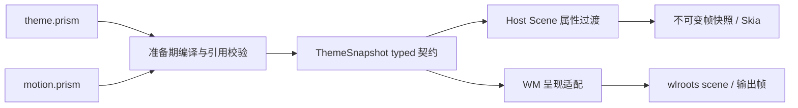

# Motion 文件与呈现适配规范

2026-10-04。本阶段实现独立 Motion 配置、主题分发、客户端引用、可重定向几何轨迹和
控制面板透明度开合，以及单输出单窗全屏/恢复的 native scene/buffer/装饰/鼠标适配；
不得通过逐帧修改 BSP 或发 configure 冒充该适配。

## 1. 文件与职责

`share/prism/motions/<id>/motion.prism` 定义独立运动参数。Theme schema 3 的根参数
`motion: "prism"` 引用该包；schema 1/2 保持旧格式及 WM 面板立即开合，已有客户端
字面量 Transition 继续生效。主题加载器在准备期读取、校验并解析全部引用，输出 ThemeSnapshot 中的 typed motion 集合，沿原有主题事务
交给 WM 和 Host。WM 不解析客户端 DSL；运行期不读 Motion 文件或执行脚本。



```prism
MotionSet("prism", version: 1) {
    Timing("spatial", durationMs: 240, easing: "easeInOutCubic")
    Timing("feedback", durationMs: 120, easing: "easeOutCubic")
    Transition("window.geometry", timing: "spatial")
    Transition("panel.visibility", timing: "feedback")
    Transition("control.feedback", timing: "feedback")
}
```

Timing 是命名时长曲线；Transition 是宿主声明的语义接口。MotionSet v1 无任意代码、
重复、关键帧、弹簧或对象查找；支持现有四条 easing，时长 0..10000 整数毫秒，零时长
立即归位。最多 64 个 Timing 和 64 个 Transition，引用和重复项严格检查。整包不超过
64 KiB；包 ID 与目录匹配，路径解析不得逃逸 motion 根。默认根是 themes 根的同级 motions。
`instant` 与 `subtle` 是可替换的独立包，不把动画模式混成材料主题。

客户端使用 `.transition(property: "opacity", motion: "panel.visibility")`，或继续使用
已有的 durationMs/easing 字面量形式；两种形式互斥。缺少命名接口必须在主题安装/Scene
准备时失败，不能静默选另一条曲线。主题切换原子验证后取消旧动画并归位。

## 2. 几何呈现契约

逻辑目标由所有者确认；呈现轨迹只消费起点与目标，不回写业务、焦点、BSP 或配置尺寸。
GeometryTimeline 将一个矩形作为同一代轨迹，四条边使用同一个时钟样本。新目标从当前
呈现值重定向；v1 duration 轨迹保证值连续，不承诺反向时速度连续，弹簧/速度衔接另行扩展。
拒绝非有限/非正尺寸。Sample 同时给出几何和终态，逆映射使用实际已提交
几何，不以实时采样替代上一帧呈现值。旧 buffer 可短暂映射到新几何，最终 buffer 交接、
圆角/阴影/模糊以及输入捕获要在 native 适配层形成一致提交。

## 3. 首个 native 适配：控制面板透明度

面板位置和感应区固定，仅整体透明度变化。打开等到目标尺寸的 buffer 可用再开始。
关闭立即撤销控制权限及原 surface 命中，保留有界的只读视觉副本淡出；副本只引用
wlroots buffer，不回读像素、不启动客户端、不接收输入。材料与阴影随同副本一起淡出。
再次打开同一位置时从当前透明度继续；不同位置或目标失效直接清理旧副本。

每个控制 surface 至多保留一份退出副本。隐藏、销毁、输出变化、主题替换及服务退出
均能清理；主动窗口操作允许淡出，身份撤销不依赖动画完成。慢帧按 CLOCK_MONOTONIC
直接求当下样本，无补帧；没有活动轨迹时不得继续 schedule_frame。正在变化的玻璃开场
仍可能重新采样背景，退出副本的玻璃是关闭时刻的静态内容，此限制要明确报告。

## 4. 实施顺序

1. Motion contract/compiler/package/theme transport；客户端命名引用；纯几何轨迹与测试。
2. 面板开合的 compositor opacity 适配、取消与反向；完整隔离 Host/launcher/WM 验证。
3. 单窗全屏/恢复：通用 native buffer 映射、呈现几何和逆映射输入、装饰/效果一致性。
4. 组级共同时间基准与共享边界，随后扩展面板位移/缩放与自定义多轨道。

所有测试在 tests，证据在 dist/validation；不把验证逻辑或延时加入生产运行链。

## 5. 当前包、接口与选择方式

| 语义接口 | 使用者 | 首版范围 |
| --- | --- | --- |
| `panel.visibility` | WM 的 SurfaceFade | 固定几何的控制面板透明度；关闭副本不接受输入 |
| `control.feedback` | Host 的 Visual/Scene | 交互背景色等已有可动画属性；控制面板与分隔线悬停已使用 |
| `window.geometry` | WM 的 SurfaceGeometry | 单输出单窗全屏/恢复；已提交矩形逆映射鼠标 |

默认 `prism` 包空间运动 240 ms、反馈 120 ms；`subtle` 为 160/90 ms；`instant` 为零。
它们是文件内容，不是引擎里的主题名称分支。Theme 根的使用示例：

```prism
Theme("glass", name: "Glass", schemaVersion: 3, motion: "subtle") {
    // 继续保留该主题已有的颜色、Palette、材料、Layout、Controls 与 Decoration 定义。
}
```

此片段仅展示根参数，不是完整主题。当前通过主题文件选择 Motion 包；Preferences
尚无单独的动效选择器。作者新增同结构 motion 包后，CMake 自动收集并安装；无需给 WM
添加主题名称判断。Theme schema 3 的 WM 安装检查要求 `panel.visibility`；客户端则
校验各自 Scene 使用的语义名。旧 schema 1/2 仍能解码，但不能承载命名 motion 引用。

## 6. 资源与输入约束

- 退出副本至多 256 个 buffer；无法保留完整内容时立即关闭，不留下部分副本。
- 副本复用 buffer 引用，原 surface 的身份、命中与控制 session 已撤销；原实例可以
  独立销毁，引用由副本淡出结束或取消时释放。
- 开场沿用固定控制区域；关闭后即使还有残影，新的点击也不得落到已关闭的面板。
- 材料与内容分别乘以相同透明度。首版不是把整个面板再渲染到离屏纹理后统一混合，
  因此重叠层的过渡合成与真正离屏组透明度仍有差异。
- 主题变更、surface unmap/销毁、输出变更和服务器退出有显式清理；零时长不申请持续帧。
- CPU/Paint 动画和 WM 合成透明度使用同一时间核心，但本阶段没有把所有客户端动画
  改成 GPU 保留层，也没有移动客户端 Scene 到 WM。

## 7. 验证方法

- `motion_contract_test`：参数/引用/包路径边界、三套 Motion、主题 schema 3 编解码。
- `theme_protocol_test`：schema 1/2 字节兼容与 schema 3 的现有 launch/control/worker 通路。
- `scene_transition_test`：命名曲线、失效主题回滚、零时长及旧字面量形式。
- `animation_geometry_test`：不均匀采样、反向连续、重置代数、非法矩形、提交坐标逆映射。
- `native_window_control_test`：真实 Wayland 鼠标和键盘、开合/反向/输入撤销/空闲停止。
  默认 Pixman；设置 `PRISM_TEST_GLES=1 WLR_RENDER_DRM_DEVICE=/dev/dri/renderD128`
  可在本机 V3D 执行含玻璃区域的同一验收；必须保留该设备确为 V3D 的证据。
- `group_session_probe.py --boundaries --windows`：独立 headless 会话内使用真实 Host、
  模块和 launcher，经虚拟鼠标验证组模式、分隔线和窗口控制，不接管已安装会话。

### 本次结果

2026-10-04 Pi 源码完整构建通过；CTest **78/78**。Pixman 原生输入门槛和 V3D/GLES
含玻璃区域的 buffer 淡出门槛均通过：同位置反向、残影不拦截点击、主题失败保留原状态、
成功替换清理副本、零时长、动画结束后实际帧提交停止增长。完整隔离会话的组沉浸、
分隔线和窗口控制通过，退出码 0，相关进程全部回收。

格式/行数/goto 检查通过（336 个生产文件、103 个测试文件；最大生产文件 638 行）；
WM 符号检查未包含客户端 ParseBlueprint 或 Theme/Motion 编译器。
证据目录：`dist/validation/motion-v1-20261004/`。最终结果以 `build-verified.log`、
`ctest.log`、`native-gles.log`、`session/group-session.json` 和 `style.log` 为准。
初轮的 Idle 轨迹启动问题已修正；初轮失败日志保留，包含旧错误信息断言及观察未呈现
buffer 的测试修正记录。本次为源码与隔离验证交付，已安装的远程桌面没有重新打包替换。

## 8. 单窗全屏/恢复呈现适配

布局与呈现分别持有状态。全屏请求仍只改变一次目标布局，configure 沿现有合并通路
发送；动画只改变 scene 的 buffer 目标矩形。每帧先恢复 wlroots 所有的原始节点参数，
再从当前提交的 XDG geometry 映射到候选呈现矩形；新 buffer 可在相同轨迹中接替旧 buffer。
所有被临时修改的节点必须监听销毁，surface commit、重新布局和退出前恢复。

鼠标命中、隐式抓取及表面局部坐标使用最后一次成功输出提交的矩形和源几何；失败提交
不能推进输入基线。scene 候选在下一帧可重试。窗口隐藏/销毁、主题/输出切换或目标被
其他布局操作覆盖时撤销过渡并恢复标准 scene 路径。首版限单输出单个全屏过渡；改变另一个
窗口时先收束已有过渡。本阶段验收范围仅鼠标，触屏过渡输入另行接入。

玻璃区域由独立呈现参数映射到当前屏幕位置再采样，服务端边框/阴影使用同一时钟的
装饰插值；客户端自己画进 buffer 的圆角与内容仍由客户端负责。尺寸变化会导致效果
缓冲重新分配，此版本优先建立正确性，不宣称已有尺寸分档缓存。轨迹完成后若目标
buffer 尚未提交，保留终点映射并等待提交事件，不忙循环、也不逐帧 resize。

每个窗口最多临时保存 512 个 scene 节点；超限或无法确定 buffer 尺寸时恢复标准路径，
立即呈现目标。仅修改原生节点的目标矩形，不做像素回读或逐帧客户端重排。

`native_geometry_motion_test` 覆盖中间帧、逆映射和鼠标隐式抓取、反向、configure 不随
帧增长、结束后空闲、工作区隐藏、主题归位及销毁清理。失败提交使用适配器级注入验证，
不声称注入了真实 DRM 提交故障；成功提交作为输入基线，不等同物理扫描输出的时间戳。

### 单窗阶段验证结果（2026-10-04）

完整构建、CTest **79/79**、代码规范检查及 `git diff --check` 通过。338 个生产文件、
104 个测试文件，最大生产文件 638 行。新增原生测试在 Pixman 和 **V3D 4.2.14.0 / GLES**
均通过；真实 Host/launcher/WM 隔离会话的组模式、分隔线、窗口控制、退出和进程回收
通过。证据：`dist/validation/fullscreen-motion-v1-20261004/` 的 `build.log`、`ctest.log`、
`native-gles.log`、`style.log` 和 `session/group-session.json`。

初次原生测试发现清除 opaque region 不能传空指针，已改为显式空 pixman region；
初次失败和定位日志保留。没有做物理显示器视觉验收、帧耗时性能结论或 deb 部署，
当前安装的 VNC 会话未替换。下一步是组级共同时间和共享边界。

## 9. 组几何协调核心（2026-10-04）

本步实现独立 `GroupGeometryTimeline`，尚未替换 WM 的单窗适配器，也未给组模式添加
可见动画。下一环节把 BSP 权威快照转换为下述边界图，再让多个原生 surface 消费同一
候选帧并共同确认输出提交。此核心不引用 wlroots、客户端 Scene 或布局引擎。

### 9.1 边界图与共同采样

- `GroupEdge` 表示带稳定 ID、X/Y 轴和位置的一条边。稳定身份由调用者从布局拓扑
  建立，不能仅按坐标相等合并：同坐标的两个独立分割线不一定是同一边界。
- `GroupMember` 持有窗口稳定身份及左/上/右/下四个边引用。引用可带固定整数偏移，
  用于保留间距；例如两窗引用同一 X 分割线，左窗右边偏移 -4，右窗左边偏移 +4，
  则全程保持 8 个逻辑像素的间距。
- 整组只有一个 ScalarTimeline 和一个时间样本。所有边从同一次已提交快照向目标
  插值；每条边只四舍五入一次，随后由边坐标求各窗口宽高，不分别取整窗口的宽和位置。
- T 形分割的上下两窗共用同一 Y 边，左右共用同一 X 边，因而交汇处不会因逐窗采样
  时间不同产生裂缝。只保证调用者明确共享的边界关系，不以这个核心替代 BSP 的合法
  拓扑、包含关系、最小尺寸或重叠校验。
- 首版按 WM 当前整数逻辑坐标工作，不宣称覆盖多输出混合 DPI 的物理像素接缝。

### 9.2 生命周期与提交

```cpp
GroupGeometryTimeline motion(clock);
// baseline 必须对应所有者当前已呈现的布局，Reset 不是输出提交操作。
motion.Reset(baseline);
motion.Retarget(target, duration, now);
auto frame = motion.Prepare(frameTime);
// 所有 surface、效果和输入候选必须使用同一个 frame。
// 仅在所有者确认整组输出事务成功后调用：
motion.Accept(frame.serial);
```

生产调用者必须检查上述 bool 返回值。示例仅解释顺序；当前 WM 尚未调用此接口。
Prepare 生成拥有自身数据的值快照。Accept 只接受最新候选的 serial，一次确认整组；
失败提交不调用 Accept，继续使用 Submitted 作为输入基线并保留重试需求。旧候选、
已确认候选及重定向/Reset 前的候选均不能再次确认。快照 serial 与轨迹 generation
分别表达候选提交身份和运动代数。

快速反向从最后成功提交的整组坐标开始，不从已经计算但尚未提交的未来帧开始。
末帧即使已到终点，在 Accept 前仍需要提交；确认终点后 NeedsFrame 为 false。
零时长也遵守这条提交规则。没有追赶补帧或每帧布局/configure。

Reset 表示所有者已完成取消或立即归位后的新基线；不能先 Reset 再等待一次可能失败
的输出提交。多输出部分成功、异步呈现反馈及原生 buffer 交接由后续 WM 适配解决，
不能用本接口的同步 Accept 冒充物理扫描完成。

### 9.3 拓扑与预算

最多 1024 条边、256 个成员。ID 必须非零且唯一，坐标有限且绝对值不超过 10,000,000，
轴类型和引用必须有效，窗口在整数坐标下保持正尺寸。输入顺序会标准化，不影响身份。
Retarget 仅允许边位置变化：成员、边身份/轴和固定间距必须相同。增删窗口、改分割轴、
主题间距变化等会被拒绝，调用者须完成标准布局及成功呈现后 Reset；不猜测新旧拓扑
的对应关系。非法输入与无效时长不得破坏旧轨迹、候选或已提交快照。

该阶段仅提供协调数学与提交契约，没有增加新 motion 语义名，也没有逐帧发布布局
权威快照。后续 native 集成要统一处理多 surface 的取消、源 buffer、效果层和鼠标，
随后才能开放组过渡的主题参数。

### 9.4 本步验证

相关目标构建通过，时间线、单窗几何、组几何测试 **3/3** 通过；包含 T 形共享边、
固定间距、非均匀采样、稀疏/密集一致性、提交失败、反向、延时、零时长、旧帧拒绝、
非法输入回滚及重置。代码规范检查通过（340 个生产文件、105 个测试文件，最大 638 行）。
证据：`dist/validation/group-geometry-core-20261004/`。本步未运行原生组动画验收，
因为 WM 集成尚未实现；没有以纯几何测试替代 GPU 或实际显示验证。
