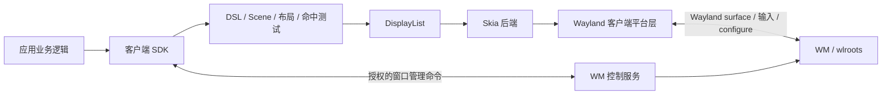

# 第二步：进程契约与模块边界

此文是迁移实现的接口规范。现有 `prism_core` 仍是过渡期单体库；本文件中的 `prism::contracts` 类型已经是独立、无图形系统依赖的 C++ target，但尚未接入生产渲染。不要把这些 C++ 对象直接当成 IPC 二进制格式。

## 进程边界

- **客户端进程**拥有 DSL AST、持久 Scene、`NodeId`、绑定状态、布局、命中测试、文字排版、DisplayList、资源、Skia 上下文和 Wayland buffer。应用业务只调用状态、动作、窗口和资源接口；不需要持有 `wl_*`、`Sk*` 或 `Vk*` 对象。
- **WM 进程**拥有输出、seat、焦点、窗口几何、窗口角色、装饰及客户端 surface 的合成。WM 不读取应用 DSL、`$slot`、DisplayList 或客户端图片资源。它通过 Wayland 传递 configure、输入与 buffer 生命周期事件。
- **WM 控制服务**只承载窗口管理与经授权的 shell 功能。普通状态变化与 UI 动作均留在客户端进程。现有 `StateDiffPacket` / `EventPacket` 将在切换时删除或限制为旧版演示用途，不能复用为新的绘制协议。

业务可见的 SDK 面限定为 `OpenWindow(WindowSpec)`、`SetState(slot, value)`、`OnAction(name, handler)`、`LoadResource(uri)`、`CloseWindow(window)` 和事件循环控制。`WindowSpec` 包含角色请求与首选逻辑尺寸；shell 角色请求可能返回拒绝。`SetState` 只改变客户端 Scene，`OnAction` 由客户端命中测试触发。`GetSurface()`、`GetMasterTree()`、`GetPreviewTree()`、原始 Wayland 对象和 Skia 对象属于内部诊断或实现细节，不能保留在最终业务 API。

## 本地值契约

公共头文件位于 `prism/include/prism/contracts/`，由无外部链接依赖的 `prism_contracts` target 暴露。

| 类型 | 所有者与规则 |
| --- | --- |
| `WindowId` | 客户端运行时内的窗口身份；0 无效，进程存活期间不复用。WM 以 Wayland surface 身份管理自己的窗口记录，不假定两侧 ID 数值相同。 |
| `NodeId` | 客户端 Scene 的 index + generation；删除后复用槽位必须增加 generation，失效的异步引用必须被拒绝。热更新不能把裸指针当身份。 |
| `ResourceId` | 客户端资源表中的图片或字体身份；0 无效，进程存活期间不复用。DisplayList 只携带句柄，资源加载与释放由客户端管理。 |
| `LogicalPoint` / `LogicalRect` / `LogicalSize` | surface 局部逻辑坐标，单位不是像素。布局和命中测试只使用这套坐标。 |
| `BufferSize` | 实际提交给 Wayland 的整数像素宽高；不能从逻辑尺寸直接推断。 |
| `WindowMetrics` | 同时保存逻辑尺寸、buffer 像素尺寸及有效缩放比例。platform 层负责验证正数、有限值、尺寸上限和协议协商结果。 |
| `WindowRole` | `Toplevel`、`Desktop`、`TopBar`、`Dock`。普通应用使用 xdg-shell toplevel；shell 角色由 WM 授权和安排。 |

缩放和尺寸变化的顺序是：platform 收到 configure / output scale → 决定逻辑尺寸与 buffer 尺寸 → 确认协议 serial → 更新 `WindowMetrics` → runtime 重排并提交匹配尺寸的 buffer。对于 fractional scale，必须使用目标 Wayland 协议协商 viewport 与 buffer；仅对 `logical × scale` 四舍五入不能保证协议正确。configure 给出 0 尺寸时，由客户端选有效初始尺寸。旧 buffer 在 compositor 释放前不能复用或销毁。

## 输入与绘制契约

`events.hpp` 定义 platform → runtime 的规范化窗口事件。指针坐标为 surface 局部逻辑坐标；按键物理码采用 USB HID usage，由平台适配器转换；文本输入与按键事件分开。`time_ns` 是单调时间域，Wayland 32 位毫秒时间戳的回绕处理属于 platform 层。configure、焦点和关闭事件不经 WM 自定义状态差分通道。runtime 命中测试后再产生业务动作；WM 不做控件命中测试。

第三步的诊断客户端在事件到达时读取单调时钟，键盘仅覆盖常见物理键映射；未知键使用 0，文本输入尚未实现。后续接入正式 SDK 前必须完成键位与文本输入语义，不能将这份局部映射当成完整输入法支持。

`display_list.hpp` 定义 runtime → renderer 的有序、进程内绘制命令。颜色输入是 straight-alpha sRGB；几何和 glyph 原点使用逻辑坐标。文字在客户端完成排版与 shaping，renderer 收到 glyph id、位置、字号和字体资源句柄。clip 与 transform 指令必须平衡；无效列表由 renderer 拒绝。renderer 自行转换为 Skia 对象，DisplayList 与 Scene API 不出现 Skia/Vulkan/Wayland 类型。buffer 提交由 platform 层完成，DisplayList 本身不跨进程、不通过 WM IPC 发送。

命令按出现顺序绘制；后续命令覆盖先前命令。`PushTransform` 的 6 个数按 `[a,c,tx,b,d,ty]` 表示局部到父坐标的 2×3 仿射矩阵；`PushClipRect` 在当前变换下建立裁剪。push/pop 嵌套顺序必须合法，帧末两个栈都必须清空。资源句柄在整帧提交完成前保持有效。

首版命令覆盖矩形、圆角矩形、图片、glyph run、裁剪和仿射变换；路径、阴影、滤镜及色彩管理在第四步按实际样例扩展。`DisplayList::generation` 用于识别客户端新旧帧，不能替代 Wayland 的 buffer release 或 frame callback。

## 窗口角色与控制权限

普通应用只能请求 `Toplevel`。Desktop、TopBar、Dock 使用单独的 shell surface 角色与 WM 管理的锚点、独占区域和输入区域；角色请求必须由 compositor 根据可信连接身份或启动服务授予，不能信任客户端自行填写的 `app_id` 或窗口标题。launcher、通知和应用激活命令走经授权的 WM 控制服务；普通控件状态和动作留在客户端。控制协议需要独立版本号、请求关联 ID、错误码和权限检查，不与现有 `ipc::PROTOCOL_VERSION` 的共享内存布局混用。

当前 `prism-ipc.sock` 接受文本命令，没有连接身份校验与逐命令授权，因此**不能**直接作为 shell 角色或其他特权操作的授予依据。第三步在开放 shell surface 前必须先定义并实现可信启动凭证或等效身份关联，并明确拒绝普通客户端的特权请求。

当前 `action` 命令经 WM 分发到应用，`set_mode`、`set_layout`、`focus` 等命令也由同一 socket 接受。切换时按下表收束，不让旧命令名称决定新权限：

| 请求类别 | 新边界 |
| --- | --- |
| 查询输出、窗口和工作区 | WM 控制服务；只读请求可授予普通本地调用方。 |
| 激活自身窗口 | 首选 Wayland 标准激活流程；若走控制服务，必须绑定请求者与目标 surface 并检查激活凭证。 |
| 修改输出模式、布局或其他窗口 | 仅可信控制端；每个命令单独授权并返回明确错误。 |
| 创建 Desktop/TopBar/Dock 角色、调整独占区域 | 仅已授权的 shell 客户端。 |
| UI `$slot` 更新与 `player:toggle` 等动作 | 完全在客户端 SDK 内，不经 WM 控制服务。 |

## CMake 依赖门槛

目标方向：`prism_contracts` ← 客户端 DSL / runtime / platform / renderer；WM 只依赖它需要的窗口管理值与 wlroots，不链接 DSL、Skia 或 ImGui。`prism_contracts` 可通过 `cmake -S prism/contracts -B build-contracts -G Ninja` 独立配置、编译和测试，证明其公共头不需要 Wayland/wlroots/Skia/ImGui 的构建配置。

现有 `prism_core` 同时编译 WM、DSL、软件渲染和 ImGui，暂不能对它启用“WM 不链接 DSL/ImGui”的硬门槛。第三、四步的新模块必须依赖独立契约 target，不能反向依赖 `prism_core`；第五步删除旧路径并拆分单体 target 时启用最终链接与 include 检查。此过渡只存在于迁移分支，不作为双渲染路径发布。

## 接下来的验收

第三步先完成一个**不读取 DSL** 的普通 Wayland 客户端，验证首次 configure/ack、buffer 提交、resize、关闭、键盘与指针。它通过上述事件和尺寸契约与客户端 runtime 对接；shell 角色待授权机制就绪后再开放。第四步再实现 Scene → DisplayList → Skia，不让 WM 获得应用树。

第四步的首个实现检查点见 [CLIENT_SCENE_RUNTIME.md](CLIENT_SCENE_RUNTIME.md)：`prism_client_scene` 独立于旧单体和平台，尚未接入 Skia。
