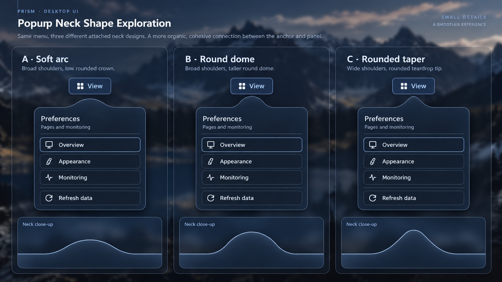

# 界面系统视觉参考

图01—05来自用户提供的「Prism · 文本、层次与间距评审提案」，分别对应控件、
轻量浮层、文件任务、反馈和任务面板运动。它们补充 Concept B，具体实现状态见
[界面系统计划](../../INTERFACE_SYSTEM_PLAN.md)，不能从图片推断尚未提供的接口。

## 图02连接颈修订：C方案

用户认为旧平顶像被截断，又指出 v25 的直斜边三角过于尖锐。经三种参考稿比较，
2026-10-06明确选择 **C：圆润收尖，指向更明显**。

- 保留宽肩，肩部与面板顶部平滑衔接；收尖过程全程曲线，顶部为圆弧。
- 指向明确，避免平顶、小圆角拼接长直斜边或独立箭头覆盖正文。
- 方正主题使用直线三角；无颈部和空间不足时的 detached 规则保持。
- 参考稿用于确认轮廓意图，其放大比例、菜单文案和装饰不作为新的控件尺度。
  真实菜单维持现有紧凑布局，主题的64×20连接颈是可调整的默认值。
- 正文、肩部和顶端形成一个闭合 Contour。绘制、阴影、模糊遮罩和命中共享该
  轮廓；具体实现见[轮廓契约](../../SURFACE_CONTOUR_CONTRACT.md#圆润三角颈v25)。

参考稿由内置 imagegen 生成，输入为图02与 v25 实际菜单截图。生成要求是：保持同一
烟灰玻璃菜单和视角，比较低圆弧、圆顶、圆润收尖三种形状；每种均使用连续肩部与
圆弧顶部，附放大轮廓。用户选择C只确认设计方向，最终实机外观需单独确认。
