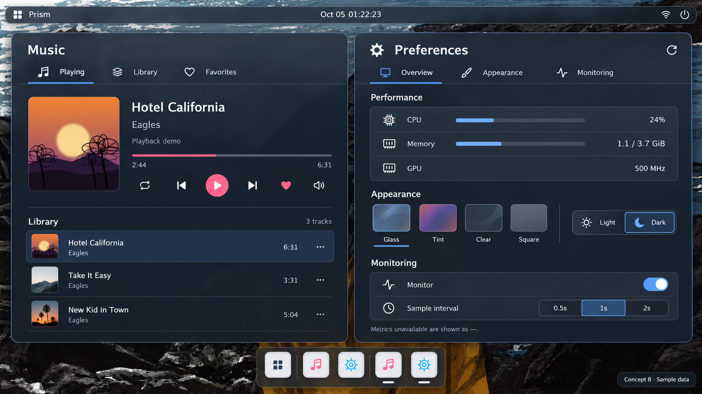

# Concept B：已确认的 demo 视觉基准

**当前修订**：首版实现被用户指出明显偏差，参见
[逐项视觉还原与验证](FIDELITY_REVIEW.md)。下面的首版尺度与验证保留为演进记录，
不代表用户已认可首版实现；确认的是参考图。

2026-10-05，用户确认第二张效果稿，作为 Music 与 Preferences 的实现方向。

图中读数、曲目时间与监控比例是示例数据；运行界面使用业务模块真实状态。
这是视觉参考，不是要作为整页位图放入应用。

## 落地规则

- 石墨色玻璃沿用系统材质与明暗 token；不硬编码深色覆盖 Light/Clear/Square。
- 标题、带文字导航、短分区标题建立阅读顺序。常见播放动作使用图标。
- Performance 三行共用浅底色，轻分隔；数据行按内容定高，不均分窗口高度。
- Appearance 四种材质预览与名称、选中横线；明暗选项带名称。
- Monitoring 提供监控开关与 0.5s/1s/2s。未知指标用业务模块已有占位。
- Music 封面与曲目元数据并排，播放动作成组；曲库有曲名、作者、时长和播放入口。
- 正常与紧凑窗口保持相同文字和状态语言。尺寸不足时通过导航分区，保留必要文字。

## 实现尺度

根 padding 引用主题（当前14）；标题使用 font_heading，正文14、辅助11。
导航36；控件通常32；局部间距4/6/8，独立分区12。矮窗的曲库播放入口32×28，
仅为当前鼠标使用范围，不作为触摸目标规范。
Preferences 高度至少510时展示三个分区，较矮时导航访问分区；低于270采用紧凑行。
Music 高度540及以上展示完整封面与曲库，较矮时收缩封面；低于300使用文字摘要。
宽度360以下保留文字导航，省略导航图标和次要缩略图；440以下省略性能条与完整大封面。
宽度560及以上将材质预览与明暗选择并排。Glass 的窗口 tint 在主题包统一加深，
减弱壁纸对文字的干扰；Light 单独调整，其他材料保留各自透明度。

尺寸条件由通用 DSL 处理，见 [接口契约](../../DSL_VIEWPORT_CONDITIONS.md)。
应用模块只发布状态与动作；WM 不添加应用专用布局或渲染代码。

## 验收

同时检查正常截图、窄窗/矮窗截图、所有可见动作命中、主题与明暗。
布局边界测试不能替代与确认稿的视觉对照。生成稿的纹理与运行材质可以不同，
但文字层级、浅分组和内容密度必须一致。当前任务不自动替换正在使用的 VNC 会话。

## 本轮实现验证

- 相关 CTest 9/9：DSL、Scene、状态、动画、输入快照、视口条件、应用包、业务工作与布局。
- 布局门槛覆盖四材质×两配色×六尺寸，检查可见控件边界和中心命中；窗口切换取消隐藏
  分支的输入捕获与动画，已提交输入快照保持不变。
- 隔离 V3D 会话真实截图：1280×720 双窗的 dark/light，1024×600 的双窗、三窗、四窗。
  虚拟鼠标实际切换曲库、Appearance、Monitoring，并检查对应截图。
- 最终证据：`dist/validation/concept-b/verified/`；初次启动/截图失败记录仍保留在其父目录。
  初轮遇到已有桌面模块20ms入口预算超时，隔离 probe 显式支持一次恢复；截图改为无压缩
  PNG 以避免 Pi 压缩超过测试期限。最终运行无模块启动失败。
- C++ 格式、800行门槛、diff 空白检查通过。截图与 probe 不进入生产包。

本轮已实现和本地验证，尚未重新打 deb 或替换当前 v21 VNC 会话；发布需应用与新 Host 配套。
