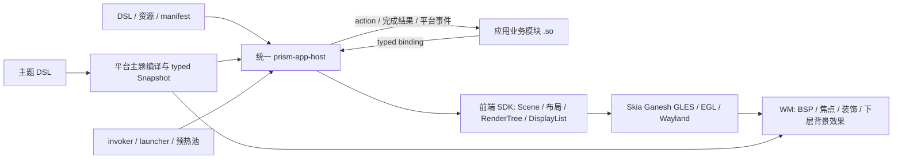

# Prism 第三方应用开发指南

文档原有发布基线：2026-09-27 的 `0.1.0-13`；源码能力核对至 2026-09-29。本文是
[`prism-app-ui` SKILL](../SKILL.md) 的开发参考，也是第三方开发者和其他 AI 的交接规范。
源码新增的动画接口需要用相应版本的 Host/SDK 构建和运行；不能假定旧版已安装包可用。
未来扩展以更新后的契约和源码为准。

## 目录

1. 产品目标与职责边界
2. 当前能力和版本
3. 从需求到 UI 契约
4. 应用包与 manifest
5. DSL 前端、binding 与 action
6. Preview/Master、组件图与并行加载
7. 业务 C ABI 与生命周期
8. 耗时业务、typed JSON 与取消
9. 主题、配色与输入
10. 完整 Counter 示例
11. 开发运行、验证和交付
12. 性能设计与扩展方向
13. 开发任务交接范例

视觉布局、材质、图标、文字与窄窗示例见
[视觉设计规范](visual-design.md)。完整可编译示例在 [assets/starter](../assets/starter/)。

## 1. 产品目标与职责边界

第三方应用共享 Prism 的前端能力、主题语言和启动管理。应用决定内容、业务规则和
状态；平台决定如何准备、布局、绘制、呈现、管理窗口与回收实例。统一风格依靠公共
接口和主题，而应用仍保留自己的内容结构。



| 层 | 负责 | 第三方应用接入方式 |
| --- | --- | --- |
| 业务模块 | 业务状态、命令、数据准备与错误处理 | C ABI，发布 typed binding，处理具名 action |
| 应用 DSL | 内容结构、布局约束、组件、主题引用与动作标识 | 包内 `.prism` 文件 |
| 前端 SDK | 语义编译、属性、布局、文字 shaping、输入、通用图元与控件 | 通常由 Host 统一调用 |
| 渲染后端 | DisplayList 回放、客户端内容和局部阴影 | 框架通用能力，不按应用 ID 分支 |
| Host | Preview/Master、加载、资源、主题、surface 与模块生命周期 | 平台统一程序 |
| launcher | 注册包、待命 Host 分配、启动事件、实例管理和退出回收 | 请求 app_id，不发送任意命令 |
| WM | 真正窗口树、configure、焦点、BSP、外围装饰、跨 surface blur | 接收 surface 与类型化平台请求 |

普通应用包使用现有 Host。业务 `.so` 仅包含领域逻辑和必要业务依赖，不创建自己的
Wayland/EGL/Skia 前端、不运行第二个 SDK 主循环。若框架缺通用控件或渲染能力，先
设计并实现通用接口，再由应用 DSL 引用；增加一个应用不要求在 WM 写该应用分支。

当前业务模块与前端在同一 Host PID；不同应用实例由不同 Host 进程承载。业务独立
后台进程是尚未实现的扩展，不能把 `.so` 的 worker 线程称作独立进程或沙箱。

原生 Wayland 应用可以作为普通 surface 进入 WM；本文统一 DSL/Host 开发路径针对
接入 Prism 框架的应用。自维护 UI 的原生客户端不自动获得 DSL 主题和 Host 优化。

## 2. 当前能力和版本

不同版本字段分别描述不同边界：

| 标识 | 当前值 | 含义 |
| --- | --- | --- |
| 文档发布基线 | `0.1.0-13` | 原有运行时能力基线；并非当前安装版本声明 |
| 动画/交互源码 | Paint Transition + 连续手势 | `.transition`、InteractionTarget/Visual、受限 `.state` 与 `.gesture`；发布包是否包含以实际构建为准 |
| manifest `format_version` | 整数 `1` | 应用目录包结构 |
| manifest `runtime_abi` | 整数 `1` | 业务 C ABI；可选尾字段靠 struct_size 协商 |
| Interface `version` | 数字 `2` | 多区域加载声明 |
| Theme `schemaVersion` | `2` | 材料与独立 Palette；旧 v1 主题仅 dark |
| 应用 `version` | 应用自定非空字符串 | 当前不强制 SemVer；建议遵循清晰的版本约定 |

**当前可使用：** HStack/VStack/Card、Text、Image、Icon、Button、IconButton、Separator、
Progress、Toggle、InteractionTarget、Visual、typed binding、visible、主题材料与 token、light/dark、组件加载图、
critical/deferred、稳定 Slot、Host work、取消、one-shot tick 与平台启动/主题事件。

**当前能力边界：** 没有可直接使用的 Slider 拖动、TextInput、Scroll、Repeater/List
动态列表、任意自定义向量文件控件、完整无障碍语义 API。动画源码支持 Progress.value、
Text/Icon/IconButton/Progress/Toggle 的 foreground，以及 Visual 的背景、局部平移/缩放/
整体 opacity 时长过渡；固定 InteractionTarget 向装饰子树提供局部状态。通用 `.gesture`
支持 Begin/Update/End/Cancel 与 dragging，业务通过可选 `on_gesture` 尾部消费。
系统布局控制仍需受信任 Shell 权限，普通应用只能处理自己的本地交互。当前组沉浸及
恢复功能优先鼠标与键盘，触屏系统操作延期。交互节点整体变换、关键帧/弹簧 DSL、
GPU 保留层或 WM 视觉动画仍未提供。
`0.1.0-13` 基线包不包含动画 DSL。Image 当前解码
PNG；内建 Icon 使用框架向量图标，与任意 SVG 文件加载是不同接口。真实 Music 的
三行曲库是应用固定行和 binding，不是通用动态列表实现。

节点增量布局、DisplayList 分块缓存、GPU 待命预热、业务独立后台进程也未完成。
当前已经有按需提交、效果缓存及 buffer 修复，性能设计仍要控制实际状态更新和工作量。

这些边界决定实现选择。例如表单编辑器需先补通用文本输入，长列表需先设计滚动和
列表接口；不能在示例中写一个尚不存在的 DSL 节点并当作可运行能力交付。

## 3. 从需求到 UI 契约

先列出页面区域，再定义状态和操作。表中的 binding 是业务值，action 是业务命令，
主题引用表达视觉角色。控件位置或具体颜色通常不由业务状态传递。

例如一个计数工具：

| 区域 | 内容/操作 | binding / action | 阶段 | 视觉角色 |
| --- | --- | --- | --- | --- |
| Header | 应用图标和标题 | 静态内容 | critical | text / accent |
| Controls | 当前值、增加与重置 | 字符串数值、increment/reset action | critical | card / control |
| Detail | 简短状态与范围说明 | status 字符串 | deferred | mutedText |

复杂应用可进一步规划：

| 状态 | 界面行为 | 业务与加载行为 |
| --- | --- | --- |
| empty | 可理解的空态及可用入口 | 无数据不是系统出错；就绪语义由业务定义 |
| pending | 稳定区域、简短说明，主导航保持可用 | 数据任务排队/运行；避免重复提交 |
| error | 具体、可恢复的说明和重试入口 | 保留可用内容；不报告虚假的成功 |
| ready | 当前数据和确认后的操作状态 | 业务实际可用，适时报告 Ready |

空态、错误态和 loading 区域也需要窄窗设计。重试中的按钮状态、旧结果是否仍有效、
取消后如何恢复都在业务契约中写清。选择视觉分页不等于重新创建业务模块。

## 4. 应用包与 manifest

推荐结构：

```text
counter_app/
├── manifest.json
├── counter.so
├── preview.prism
├── master.prism          Interface v2：状态和加载图
├── layout.prism          稳定外部结构和 Slot
├── ui/
│   ├── header.prism
│   ├── controls.prism
│   └── detail.prism
└── assets/
    └── ...               可选图片或业务数据；目录必须存在
```

模块文件名由 manifest 指定，不强制命名 `backend.so`。完整 Counter 模板使用的
模块、binding 和路径，以模板实际文件为准。

一个合法 manifest：

```json
{
  "format_version": 1,
  "runtime_abi": 1,
  "app_id": "counter_app",
  "name": "Counter",
  "version": "0.1.0",
  "ui": "master.prism",
  "preview": "preview.prism",
  "module": "counter.so",
  "assets": "assets",
  "window": { "width": 640, "height": 400 }
}
```

| 字段 | 要求 |
| --- | --- |
| `format_version`、`runtime_abi` | 必填，整数 1 |
| `app_id` | 必填；1..128 字节，首字符 ASCII 字母，后续字母/数字/`_-.` |
| `name`、`version` | 必填，非空 UTF-8 字符串，遵守 manifest 字符串边界 |
| `ui`、`module`、`assets` | 必填，包根下的相对路径 |
| `preview` | 可选；存在时为普通文件 |
| `window` | 可选；存在时 width/height 都为 1..4096 整数；默认 640×400 |

window 是初始建议/回退尺寸；BSP 的非零 configure 会决定实际尺寸。普通应用不得
依赖一直获得 manifest 尺寸，也不要自己保留 Topbar/Dock 的屏幕空间。

manifest 最大 64 KiB、深度不超过 16，拒绝重复键、未知字段、错类型、空/NUL 字符串。
路径拒绝绝对路径、`..`、反斜杠，解析后不得经符号链接逃出包根；UI/module 为普通
文件，assets 为目录。包正常运行时资源保持稳定，不依赖当前工作目录。

`exec`、`shell_role`、`theme`、`permissions` 等没有出现在当前 manifest schema 的字段
会被拒绝。普通 app_id 也不授予 Shell 权限；Topbar/Dock/Desktop 是平台可信角色。
包校验不等于签名校验、权限隔离或对业务原生代码的安全沙箱。

## 5. DSL 前端、binding 与 action

### 5.1 三种文件各自表达什么

- `master.prism` 声明 Interface v2 的 binding 和 Component。
- `layout.prism` 定义外部结构、尺寸约束、稳定 Slot 与占位内容。
- `ui/*.prism` 每个提供一棵普通视觉树，使用声明过的 binding 和主题引用。
- `preview.prism` 提供轻量普通视觉树，不依赖业务模块完成初始化。

普通视觉树仍可直接作为旧单文件 Master，由 Host 归一到同一加载管线。新多区域
应用优先使用 v2；不要把 Interface 根直接传给低层 SDK 的普通视觉 parser。

### 5.2 typed binding

```prism
Interface(version: 2, layout: "layout.prism") {
    Binding(name: "status", type: "string", initial: "Preparing")
    Binding(name: "progress", type: "number", initial: 0)
    Binding(name: "busy", type: "bool", initial: true)
    Binding(name: "result_color", type: "color", initial: #83B9FFFF)
    Component(id: "body", source: "ui/body.prism", phase: "critical")
}
```

这是说明四种 binding 的加载声明片段，需要相应 layout/body 文件后才构成包。
颜色 binding 用于真实业务颜色数据，例如取色器的结果；普通 UI 前景和强调色优先
使用主题 token，保证全局材质及配色切换。

引用方式：

```prism
Card(material: "card", padding: 8) {
    VStack(spacing: 6) {
        Text($status, font: "@font_caption", foreground: "@mutedText")
        Progress(value: $progress, height: 4,
                 foreground: "@accent", background: "@progressTrack")
            .transition(property: "value", durationMs: 180, easing: "easeOutCubic")
    }
}
```

`$status` 是运行期业务值；`"@font_caption"` 和 `"@accent"` 是主题引用。binding 类型
必须匹配目标属性，初值必须匹配声明。Text 的内容用字符串 binding；业务数字的显示
由业务格式化成字符串，数字 binding 用于 Progress、尺寸等实际数值属性。
Progress 使用 0..1，Toggle 的 checked 使用 bool。不会将 arbitrary JSON 对象自动
映射成节点树，也没有 DSL 字符串插值、业务表达式或 script handler。

上述 `.transition` 仅用于包含动画 v1 的源码构建：首次安装直接显示 binding 初值；
之后业务发布新的 `$progress` 目标值时，SDK 按单调时间计算呈现样本。业务继续发布
有类型的数值，不逐帧写 binding，也不为动画安排 `schedule_tick`。属性名必须是
当前组件允许过渡的属性；`durationMs` 是 `0..10000` 的整数字面量，`easing` 可为
`linear`、`easeInCubic`、`easeOutCubic`、`easeInOutCubic`。三个命名参数都必需，
非法值在准备阶段拒绝。主题切换会取消当前轨迹并直接取新目标；完整约束见
[动画运行时与 DSL 契约](../../../ANIMATION_RUNTIME_SPEC.md)。

Binding 名称统一使用 `[A-Za-z_][A-Za-z0-9_]*`，保证声明与 `$name` 的词法规则一致。
当前图像使用静态资源路径，如 `Image("cover.png")`；路径相对 manifest 的 assets
目录。公开 binding 的四种类型不包含 ResourceId，不能写 `Image($cover_uri)` 来
假设运行期字符串自动变成图片；动态资源能力需要扩展并维护通用契约。

### 5.3 action

```prism
IconButton("refresh", "data:refresh", width: 32, height: 32, padding: 7,
           material: "control", foreground: "@accent")
Toggle(checked: $monitoring, action: "monitor:toggle", width: 34, height: 18,
       foreground: "@accent", background: "@progressTrack")
```

这里 `$monitoring` 需要在 Interface 中声明。控件把动作交给模块，模块验证操作并
更新 binding。action 是应用自定稳定字符串，SDK 不通过名字理解业务。
Toggle 点击不代表业务已确认切换；网络、设备或平台请求的最终状态应来自完成结果。

当前源码的普通控件在有效按下并释放后才派发 action；拖出释放、取消、隐藏或区域卸载
不会激活。Enter/Space 在释放时激活，重复键事件不重复派发，Tab/Shift+Tab 切换焦点。
hover/pressed/capture 是 SDK 局部状态，不通过业务 tick 或 binding 模拟；同一个 action
可以出现在多个控件中，SDK 使用 NodeId 分别管理状态。第二阶段 `.state` 允许 Visual
子树显式读取最近 InteractionTarget；规则不发送给业务，示例见视觉参考第 5.3 节。

`visible: $show_page` 控制整棵子树的测量、绘制、输入及背景效果。隐藏不等于卸载
业务模块或擦除 binding；在内容恢复时仍使用当前状态。低 alpha 不能代替隐藏或
取消输入，否则留下不可见命中区域。

## 6. Preview/Master、组件图与并行加载

### 6.1 轻量 Preview

Preview 只包含应用识别和必要预览提示，例如：

```prism
Card(material: "window", padding: "@window_padding", clip: true) {
    VStack(spacing: 8, align: "center", justify: "center") {
        Icon("grid", width: 32, height: 32, foreground: "@accent")
        Text("Counter", font: "@font_title", foreground: "@text")
        Text("Preparing workspace", font: "@font_caption", foreground: "@mutedText")
    }
}
```

Preview 不能为了显示开屏内容先读完整数据库、建立网络连接或加载全部 Master 资源。
它仍依赖统一字体、Skia、EGL 与 Wayland，不是没有第三方依赖的第二套绘制器。
Host 当前同步读取/准备轻量 Preview，因此其文件与内容应保持简单。

### 6.2 划分加载区域

按准备职责和页面区域拆分组件，例如导航、主控制、曲库、详情面板；不按每个小图标
创建一个任务。critical 是可操作首屏需要的区域，deferred 是首屏之后可挂载的区域。

```prism
Interface(version: 2, layout: "layout.prism") {
    Binding(name: "status", type: "string", initial: "Preparing")
    Component(id: "header", source: "ui/header.prism", phase: "critical")
    Component(id: "controls", source: "ui/controls.prism", phase: "critical")
    Component(id: "detail", source: "ui/detail.prism", phase: "deferred")
}
```

对应布局示例：

```prism
Card(material: "window", padding: "@window_padding", clip: true) {
    VStack(spacing: 6) {
        Slot(component: "header", height: 28)
        Slot(component: "controls", flex: 1)
        Slot(component: "detail", height: 24) {
            Text("Preparing details", font: "@font_caption", foreground: "@mutedText")
        }
    }
}
```

上述 header/controls/detail 是三个普通视觉文件；完整可运行版本见模板。一个组件
对应 layout 中一个 Slot；Slot 包装节点在挂载后保留，组件替换占位子树。显式固定
约束能稳定外部空间；没有固定约束时内容 intrinsic 尺寸仍可影响布局，不能宣称
任何组件挂载都绝对不改变几何。占位中不放需要业务交互的 Button/Toggle。

`after: ["header"]` 表示准备/安装的真实依赖，不是绘制层级、组件列表顺序或业务
数据任务依赖。没有依赖就省略 after。当前图拒绝未知依赖、重复/自依赖、循环，以及
critical 依赖 deferred。依赖关系完成不会自动把数据从一个组件“注入”到另一个。

文件 source/layout 路径相对**包根**，不是相对 master 文件目录。Slot 只在加载布局
语义层解析，组件视觉文件不声明新的 Interface/Slot。当前组件最多 128 个，单个
加载源最多 1 MiB、实际源码累计最多 8 MiB；细节以匹配版本的加载契约为准。
最终组合界面最多 8192 节点、深度最多 64，单个 surface 的背景效果区域上限为 8；
按实际展开的材料计算，不为每个小控件声明模糊区域。

### 6.3 线程与启动顺序

```text
待命 Host CPU PrepareFrontend / 当前主题确认
→ 分配真实实例并 Bind
→ Preview configure、图形初始化、像素提交
→ 派发 Master 纯准备；Preview 继续处理事件
→ Preview 实际呈现 + critical 准备就绪
→ 所有者分轮申请资源/上传/构造/预检、事务安装 critical
→ 快速加载业务模块，create 提交需要的业务 work
→ Master 提交并实际呈现
→ deferred 准备与区域安装
业务 work 完成 FD → 所有者消费结果、更新 binding → 实际业务 Ready
```

业务完成与 Master 呈现不强制先后相同。纯准备包括源码读取、解析和静态校验；
当前 live Scene、文字 shaping、布局/输入、GPU 注册、EGL 与 Wayland 都归所有者。
工作线程不能修改对象、借用 FT_Face 或同时操作当前 Ganesh 上下文。

并发数量与内存配额由平台共享调度器管理。应用声明可拆分的任务和资源边界，不自行
为每个组件创建线程。`HostConfig.task_workers` 和 launcher `--load-active-limit`
是平台配置，不是每个业务模块需要写进 manifest 的字段。

失败安装保留可用旧内容，取消或过期 UiLoadId 不安装；关闭时先撤销交付并结束任务。
deferred 加载失败使用对应诊断及保留内容，不把准备成功、区域安装或全局 Ready
自动当作该区域像素已经呈现。

## 7. 业务 C ABI 与生命周期

公共头：[`app_module.h`](../../../../prism/include/prism/contracts/app_module.h)。
纯便捷函数：[`module_support.hpp`](../../../../prism/include/prism/app/module_support.hpp)。
模块导出 `prism_app_module_v1()`，返回版本化 `PrismAppModuleV1` 表。

| 入口/回调 | 调用线程 | 实现要求 |
| --- | --- | --- |
| create | Host 所有者 | 建状态、复制短期借用数据、发布初值、提交耗时任务；失败返回 nullptr |
| on_action | Host 所有者 | 验证 action、更新业务、发布 binding，及时返回 |
| on_tick | Host 所有者 | 需要时处理一次性计时，再决定是否续订 |
| on_theme/launch/instance_event | Host 所有者 | 依据实际平台确认更新状态 |
| work | 共享 worker | 复制输入、CPU/IO、有界结果；不接触实例/Host API |
| on_work_completed | Host 所有者 | 验证状态和结果，再更新实例/界面 |
| destroy | Host 所有者 | Host 管理的任务已取消/join；释放实例，不能继续发布状态 |

Host 最后才卸载 `.so`，模块代码生命周期覆盖所有 work、结果清理及回调。
业务原生库的线程、句柄和其他资源仍需模块自己按契约结束，不能让它们在 dlclose
之后调用已卸载代码。

### 7.1 借用与 capability

`PrismStringViewV1` 是 UTF-8 指针＋长度，可能没有结尾 NUL。set_binding 会复制值；
action 和事件的 view 只在该次回调有效。`init.host` 有效到 destroy 返回；新增
`init.assets_root` 只借用到 create 返回，需要长期读取资源时先复制绝对路径。

可选字段要同时检查**完整字段边界**与非空指针。例如业务确实需要 work 时：

```cpp
bool SupportsWork(const PrismHostApiV1 *host)
{
    return host &&
           host->struct_size >=
               offsetof(PrismHostApiV1, cancel_work) + sizeof(host->cancel_work) &&
           host->submit_work && host->cancel_work;
}
```

使用资产目录前同样检查：

```cpp
bool HasAssetsRoot(const PrismAppInitV1 *init)
{
    return init &&
           init->struct_size >=
               offsetof(PrismAppInitV1, assets_root) + sizeof(init->assets_root) &&
           init->assets_root.data && init->assets_root.size;
}
```

先用 `prism::app::ValidHost(init)` 校验基础前缀，再按应用实际依赖检查尾部。简单
Counter 不需要 work；Music 依赖资产目录和异步 work，缺能力时明确拒绝创建。
同 ABI v1 不代表所有可选能力存在，不能直接读取旧表尾部或临时退回阻塞初始化。

### 7.2 发布状态与 Ready

```cpp
bool Publish(const PrismHostApiV1 *host, std::string_view count_text)
{
    return prism::app::Text(host, "count_text", count_text);
}
```

这里 key 必须与应用声明匹配，值来自已经验证的业务状态；模板有完整实现。
Host set_binding 返回 0 表示接受，相同值也可成功但不请求重画。此语义与底层 Scene
是否发生变化的返回语义不同。模块应处理拒绝，并把关键初始化拒绝作为创建失败。

`prism::app::Ready(host)` 只在业务实际可操作时调用。无需 IO 的内存计数工具可在
初始化后 Ready；依赖曲库等数据的应用在成功完成后 Ready。它不是“模块已创建”、
“Master 已显示”或“所有 deferred 页面可见”的同义词。
Ready 只报告一次；之后的刷新状态用 binding 更新，不重复发送 BackendReady。

| 观察 | 证明什么 |
| --- | --- |
| 请求非零 / Accepted | 平台接受排队 |
| SurfaceConfigured | 收到实际 configure |
| Swap 成功 | 提交调用成功；不证明显示 |
| FirstPresented | 对应首个真实呈现反馈；有 Preview 时是 Preview |
| BackendReady | 业务主动报告可用 |
| 本地 master_presented | 当前 Master 的提交实际呈现 |

Host 初始启动期限当前为 Bind 后 10 秒，launcher 还有进程外 watchdog。首次业务
数据失败如果不 Ready，只能在剩余启动期限内重试，期满进入失败回收；不能承诺这种
初始错误页永久保留。已经 Ready 后的刷新失败可以由业务保留已有可用内容并显示错误。

dlopen/入口查询和 create 默认各有返回后 20ms 检查；它们仍可能在所有者线程阻塞。
不能依靠该检查抢占不返回的静态构造。模块静态初始化和 create 均应避免耗时工作。

### 7.3 一次性 tick

`schedule_tick(context, delay_ns)` 使用单调时钟的相对纳秒延迟，返回 0 表示接受；
再次调用会替换现有到期时间。Host 调用 on_tick 前清除该次预约，不自动形成周期。
例如 1 秒为 `1'000'000'000ULL`，不是绝对时间戳；模块表需要提供 on_tick。

采样应用按实际需要续订，处理监控关闭和已有 pending work，避免重复任务叠加。
目前没有单独 cancel_tick 接口；暂停状态中的一次迟到 tick 检查状态后直接返回，
不再续订。后台采样计时也不应当作持续渲染或声明式动画接口。

### 7.4 代码风格

使用标准 C++、具名 C 回调和 RAII；异常在各 ABI 入口内处理。长期回调不写成捕获
lambda，JSON 使用 DTO，函数内按校验/准备/处理/发布留空行。自有生产 C/C++ 单文件
最多 800 物理行。项目风格接近 Qt 排版，接口和依赖使用 Prism 与标准库。

## 8. 耗时业务、typed JSON 与取消

### 8.1 输入/输出是值契约

UI 准备任务与业务 work 使用共享预算，但职责分开。应用的业务任务提交的是复制的
字节数据，不是 `this`、Scene 指针、Host API 地址或线程对象。

```text
所有者：DTO → 序列化请求 → submit_work
worker：反序列化 DTO → 有界 IO/CPU → 序列化结果 → result writer
所有者：完成 FD → on_work_completed → 结果 DTO → 实例状态 → typed binding
```

真实示例：Music 的 [Catalogue DTO](../../../../demos/demo_player/catalogue.hpp)、
[读取/序列化](../../../../demos/demo_player/catalogue.cpp) 和
[Player 完成处理](../../../../demos/demo_player/player.cpp)。这些文件作为可审计范例，
曲目数上限、文件名与行绑定属于 demo，不是框架给所有第三方应用规定的业务限制。

一组请求/结果 DTO 的形状：

```cpp
struct CatalogueRequest {
    std::string assets_root;
};

struct CatalogueResult {
    bool ok{};
    Catalogue catalogue;
    std::string error;
};
```

序列化/反序列化边界集中定义 `to_json/from_json`，业务函数操作 DTO。
可以在该边界用 `json.at("field")` 做严格字段校验；不要让业务层散落 JSON key 访问，
也不使用 find/substr 从文本“取字段”。序列化宏自身不保证未知字段、重复键、大小、
深度、路径和数值范围检查，这些仍由输入边界执行。

### 8.2 提交工作

模块表需要提供 `on_work_completed`，Host 能力检查通过后才能提交 work。只检查
submit_work 指针而没有结果回调，不构成完整异步接入。

下面摘自 Music 的实际提交方式，依赖其 DTO 和具名 `PrepareCatalogue`，不是独立
可编译文件；完整生命周期以源码为准。

```cpp
const auto request = nlohmann::json(CatalogueRequest{assets_root_}).dump();

PrismWorkRequestV1 job{};
job.struct_size = sizeof(job);
job.task_id = CatalogueTaskId;
job.priority = PRISM_WORK_CRITICAL_V1;
job.reserve_bytes = 1024 * 1024;
job.max_result_bytes = 16 * 1024;
job.input = {reinterpret_cast<const std::uint8_t *>(request.data()), request.size()};
job.work = PrepareCatalogue;

const auto submitted = host_->submit_work(host_->context, &job);
```

Host 在 submit_work 返回前复制 input，因此局部 request 可在返回后销毁。reserve
至少覆盖 `input.size + max_result_bytes + 64 KiB` 的运行时基础开销，再加实际 scratch；
根据真实任务估算，不能直接把 Music
的一 MiB 当作通用默认配额。max_result_bytes 给结果 writer 提供明确上限。
当前 work 输入至多 64 KiB、结果至多 8 MiB，默认最多 16 个未交付任务，未交付输入
合计至多 1 MiB；平台共享预算仍可能更早限制提交。

| 返回值 | 处理 |
| --- | --- |
| ACCEPTED | 标记 pending，等待实际完成；不在 owner 等 worker |
| BUSY | 清楚显示容量状态/提供重试，避免自旋或无界重复提交 |
| INVALID | 修复任务 ID、大小、capability 等契约问题 |
| CLOSED | 结束请求，不在关闭过程继续发布 |
| WRONG_THREAD | 修复调用线程，回到 owner |

任务 ID 在完成交付前占用；cancel 也不会立即允许复用同 ID。相同名字的新任务不能
接收旧任务迟到结果。完成 callback 先看 task_id、status 和应用 pending 代数，再
解码 result；失败/取消不按成功内容消费。

### 8.3 取消和资源

worker 可检查 is_cancelled，也可把 cancellation_fd 与自己的 IO FD 一起 poll；
取消 FD 不由模块 drain/close。取消前后检查大操作边界，IO 提供明确结束条件，避免
占满整个共享池。取消是协作式，不能抢占任意阻塞库函数。

result writer 在 max_result_bytes 内至多设置一次，复制输出；worker 不保留 context
或借用 view。重复设置、超限或无效结果会被标记失败；未写结果而返回 0 是空结果
成功，接收方仍要按自己的协议验证。返回非零作为 work 错误，或者返回 typed 业务失败结果，让 owner 决定
可恢复 UI；具体错误策略要固定在应用契约中。

Host 关闭先屏蔽前端动作/发布，再取消并 join 业务与 UI 任务，最后 destroy/dlclose。
这保证 Host 管理的任务不会晚于模块卸载，但原生模块仍对自己创建的资源负责。

资产根是资源位置，不是沙箱；路径、读取大小、普通文件类型、数据 schema 和文件
稳定性按业务资源边界检查。Music 示范 64 KiB 普通文件读取、重复 JSON 键检查、
bounded DTO 和取消；其他应用应给自己的业务数据定义对应边界。

## 9. 主题、配色与输入

窗口根遵循共享 `window` 材料，局部卡片用 `card`，按钮底座用 `control`；`@text`、
`@mutedText`、`@accent` 等语义 token 保持全局配色。窗口外围装饰归 WM；客户端
局部内外阴影归 SDK，根不叠加第二层外围边框与阴影。

glass/translucent/transparent/square 是材料主题 ID；light/dark 是独立维度。普通
应用接受 Host 已安装快照，不读取第二份主题 JSON，不根据当前主题 ID 硬编码颜色。
应用引用的每个 token/material 必须存在且类型相同；自定义语义 token 需要纳入所有
目标主题或配套主题包，不能假定 theme schema 自动提供应用品牌 token。

只有需要全局外观选择的应用才调用 SelectTheme/SelectColorScheme。请求 ID 非零
表示排队，最终选中态由 Current/Applied/Rejected 事件更新；Rejected 保留当前
已确认状态。当前热切换拒绝改变 Theme Layout，主题/配色状态重启按会话配置加载。

完全透明窗口是否接收输入由 `inputShape` 决定；透明不等于点击穿透。隐藏页面用
visible、圆角与 clip 使用通用轮廓；效果关闭、Square 和 light 下仍应清晰可用。
更多实际 DSL、token 和控件示例见 [视觉设计规范](visual-design.md)。

## 10. 完整 Counter 示例

[模板目录](../assets/starter/) 提供一个小型内存计数应用：

- Preview 只负责识别与准备提示。
- Header、主控制两个 critical 组件独立准备；说明为 deferred。
- 主按钮通过 action 更新实例数值，再发布字符串 binding。
- 业务初始化在内存中完成，快速 Ready；没有 IO，也没有伪造 work 或周期 tick。
- 纯 C ABI `.so`，具名 callback、异常边界、模块隐藏符号与导出入口。
- standalone CMake 创建可供 Host 使用的包；不加入 Prism 生产安装清单。

使用前准备匹配版本的 Prism 源码/公共头、C++20 编译器和 CMake。源码目录用于
头文件与纯契约参考，模块本身不链接前端 SDK、Skia 或 Wayland。

复制模板后，在源码仓库根执行，例如：

```sh
prism_source_dir="$PWD"
counter_source_dir=/tmp/prism-counter-source
counter_build_dir=/tmp/prism-counter-build

cp -R docs/skills/prism-app-ui/assets/starter "$counter_source_dir"
cmake -S "$counter_source_dir" -B "$counter_build_dir" \
    -DPRISM_SOURCE_ROOT="$prism_source_dir" -DCMAKE_BUILD_TYPE=Release
cmake --build "$counter_build_dir" --parallel 2
```

路径变量使用独立名字；示例目标目录应为空或为该应用自己的工作区。包产物在
`/tmp/prism-counter-build/share/prism/apps/counter_app/`。发布前核对实际模板的文件名、
assets 目录和 manifest，避免只复制 `.so` 漏掉 DSL/资源。

此命令只构建模板，不执行安装。当前 Prism deb 是完整桌面包，不是可单独通过
`find_package(Prism)` 自动发现的已发布开发 SDK；模板的 PRISM_SOURCE_ROOT 是源码
开发方式，不虚构系统 SDK 安装目标。

## 11. 开发运行、验证和交付

### 11.1 单包开发与生产启动

在已有且授权连接的开发 Wayland 会话中，可以运行：

```sh
prism-app-host --package /tmp/prism-counter-build/share/prism/apps/counter_app
```

这是直接 Host 开发路径；默认 socket 使用当前 WAYLAND_DISPLAY。它不经过待命池
和生产实例登记，不把该路径的运行表现当成 launcher 的启动优化结果；全局平台
服务可用性也应按会话环境实际确认。

生产包放在平台配置的 apps-root 下，目录名与 app_id 一致，由平台部署/注册。
默认安装布局为 `/usr/share/prism/apps/<app_id>/`，开发会话也可配置其他 apps-root。
已注册应用启动/激活：

```sh
prism-invoker counter_app
prism-invoker counter_app --new
```

默认 ActivateOrCreate，`--new` 申请新实例。应用内启动其他 app 使用 Host launch_app
及实际 on_launch_event，不能收到 Accepted 就声称新窗口已显示。所有 Shell 角色及
预热池、共享预算、会话 supervisor 的参数都归平台维护。

当前 invoker 成功等待首帧实际呈现（通常为 Preview）和业务 Ready，不保证 Master
或全部 deferred 已呈现。记录启动结果时分别观察这些事件，不能把进程返回 0 当作
复杂界面已经完全加载的证据。

第三方独立应用包可以有自己的构建/安装流程；示例的 install 规则由开发者明确执行。
编写文档、复制模板或构建不会自动修改正在运行的桌面，也不要求重打整个 WM deb。

### 11.2 分层验证

| 验证层 | 检查实际行为 |
| --- | --- |
| 包/ABI | manifest 与真实文件、路径/版本、入口导出、create/destroy、可选字段兼容 |
| 纯 DSL/加载 | Interface 与 Slot 对应、binding 类型、依赖图、critical 组合、deferred 候选 |
| 业务 | actions→实例状态→binding、失败/重试、Ready、tick 停止、work 取消和旧结果 |
| Scene/布局 | 主题展开、窄窗主操作与实际命中、隐藏子树、圆角输入与文字溢出 |
| Wayland/渲染 | configure/resize、同 surface 替换、真实提交/呈现、主题更新与关闭 |
| 启动链 | 实例激活/新增/取消、待命池、失败回收、普通角色与平台事件 |
| 外观 | 目标 Pi 输出与 BSP 窗口尺寸下图标/文字/阴影/透明效果和实际点击 |

主操作至少考虑当前基线的 482×420、244×420、482×204 逻辑尺寸，以及实际目标
设备；这些是现有桌面的参考测试点，不是所有设备固定窗口规格。新应用增加自己
真实需要的边界，避免只测试 maximized 大窗口。

检查四种材料主题与 light/dark；动作名相同而布局变窄时仍能命中正确目标。截图
可以验证外观，真实 input/业务测试验证交互；surface 已映射不能代替两者。

现有仓库依据包括 `tests/client_app_templates_test.cpp`、`tests/load_plan_test.cpp`、
`tests/module_work_test.cpp` 和 `tests/probes/`。它们不是现成任意应用命令行校验器，
按实际接口编写对应 app 验证。旧 `prism-compiler` 属于独立 AOT 工具，不能作为
Interface v2 的统一验证命令。

测试/fixture/probe 放开发者的 tests 或独立诊断目录，生产包只包含实际模块、DSL
与资源。这个 SKILL 和其模板也不加入 Prism deb。构建及 CPU 验证按需要运行，
Pi 的原生 GPU/性能探针串行执行，避免与构建或其他 GPU 测试互相争用。

### 11.3 交付文件与说明

交付应用包结构、声明/操作表、资源/依赖清单、验证结果、已支持的主题组合和真实
限制。按当前代码风格运行 formatter/检查；JSON 边界、短 callback 和任务生命周期
需要语义审查，不能只用正则证明。

说明真实业务功能。例如 Music 当前是曲库与模拟播放进度 demo，未输出音频；
Counter 是纯内存工具，不持久化数值。界面展示必须与实际业务能力一致。

## 12. 性能设计与扩展方向

### 当前应用可直接控制

- 初值设计可让首屏在业务准备前保持可理解，避免无值布局跳动。
- 独立区域并行准备；after 只表达真实依赖，deferred 分离非首屏内容。
- 大图/文件/解码/数据库初始化有明确限额和取消条件；避免 create 中同步完成。
- 相同值不重复发布；后台采样按业务实际需要设置一次性 tick，停止功能后不续订。
- 隐藏区域保持绑定但不产生无用布局/绘制，主操作保留稳定空间。
- 材质效果依照主题与通用接口；不要每个小控件都请求一份重叠的背景模糊区域。

TaskScheduler 配额、安装轮次和结果缓冲预算不是进程 RSS 或 GPU 内存硬限制；
单次驱动调用、整树预检和业务 callback 当前不能被轮次额度抢占。把处理拆分成
有意义的小阶段，并观察真实 owner 停顿，而非只统计任务数。

### 测量口径

记录 Preview 和 Master 的真实 presentation、BackendReady、deferred 安装、owner
Pump 处理尾延迟、CPU、采样 PSS 与退出回收。纯解析耗时、Swap 和 frame callback
不能替代用户看到完整界面的时间；hidden 区域安装后也不代表已经绘制。

串行/并行使用相同包与同一管线，仅改变并发设置。预热成本、系统缓存、输出环境、
后台负载与温频条件明确写入结果；数据采样工具属于 tests/probes，不能进入业务。

0.1.0-13 的小型 Music 对照未证明稳定的并行提速：首次 EGL 约 98–101ms、首次
Render 约 106–118ms，而 Ganesh 构造约 1ms。它们是首次调用墙钟，不是 GPU 运行
时间。并行设计提供复杂应用可拆分准备的能力；当前下一步先细分 EGL/Render
调用，不能把小 demo 数据当作所有第三方应用的启动保证。

### 通用能力扩展

当应用需要新控件，先写语义与边界，再按 Schema → typed 属性/Style → 布局/输入 →
RenderTree → DisplayList → 后端补齐通用实现和验证。控件 action 仍交给业务；新主题
效果通过材料/纯快照/平台能力扩展。应用 ID、主题 ID 不成为 renderer 分支条件。

复杂列表、编辑控件、关键帧/弹簧 DSL、GPU 保留层合成动画、增量布局或独立业务
进程需要各自设计，写清尚未实现的部分。优先明确接口和实际使用场景，随后扩展
这个 SKILL 的对应章节与示例。

## 13. 开发任务交接范例

给其他 AI/开发者的任务可以按以下格式编写：

```text
使用 $prism-app-ui，读取 SKILL 及本次需要的开发/视觉参考。

目标：创建 app_id 为 org.example.notes 的 Prism 应用包。
业务：展示只读笔记摘要、选择笔记、刷新数据；本次没有文本编辑功能。
内容：图标标题区、摘要列表区、详情区和刷新状态。
加载：Header 和主要详情布局 critical，附加统计 deferred；Preview 无数据库依赖。
主题：共享 window/card/control 与 text/mutedText/accent，适配四材质和明暗。
数据：定义有界 DTO、具名 work 与 owner 完成；Ready 在最小业务数据可用后通知。
约束：Host 管前端、BSP 窄窗保留主操作、C ABI 能力检查、无 Qt/ImGui/应用 WM 分支。
交付：包/CMake、binding/action/加载表、验证证据和能力限制。
遇到尚不存在的滚动/动态列表接口时，先提出通用接口方案，不伪造可运行语法。
```

需求表按实际产品改写。记事本例子提示新接口需求，不是声称当前已经有编辑器和
通用动态列表；Counter 模板才是当前完整可编译起点。

进一步依据：[项目文档汇总](../../../README.md)、
[Host](../../../APP_HOST_RUNTIME.md)、[模块与包](../../../APP_LAUNCH_CONTRACT.md)、
[加载](../../../MASTER_PARALLEL_LOADING.md)、[主题](../../../THEME_AUTHORING.md)、
[SDK](../../../CLIENT_APP_SDK.md)、[代码规范](../../../CODING_STYLE.md)。

### 即时输入手势补充（2026-10-04 源码）

普通模块可使用 `.gesture(action: "item:hold", threshold: 0)` 在真实鼠标按下时获得
Begin，然后接收 Update/End/Cancel；它会抑制同一目标的普通点击 activation。默认
非零阈值适合拖动，零阈值适合需要完整按下/释放序列的控制。请在 End 检查是否仍
落在原操作区域，移出时取消，不用客户端事件伪造系统输入凭据。WM WindowGesture
仅授予系统 LayoutControls 身份，普通第三方包不能申请该能力。
